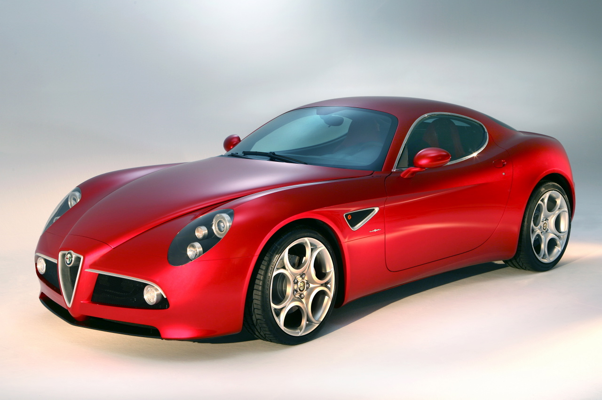
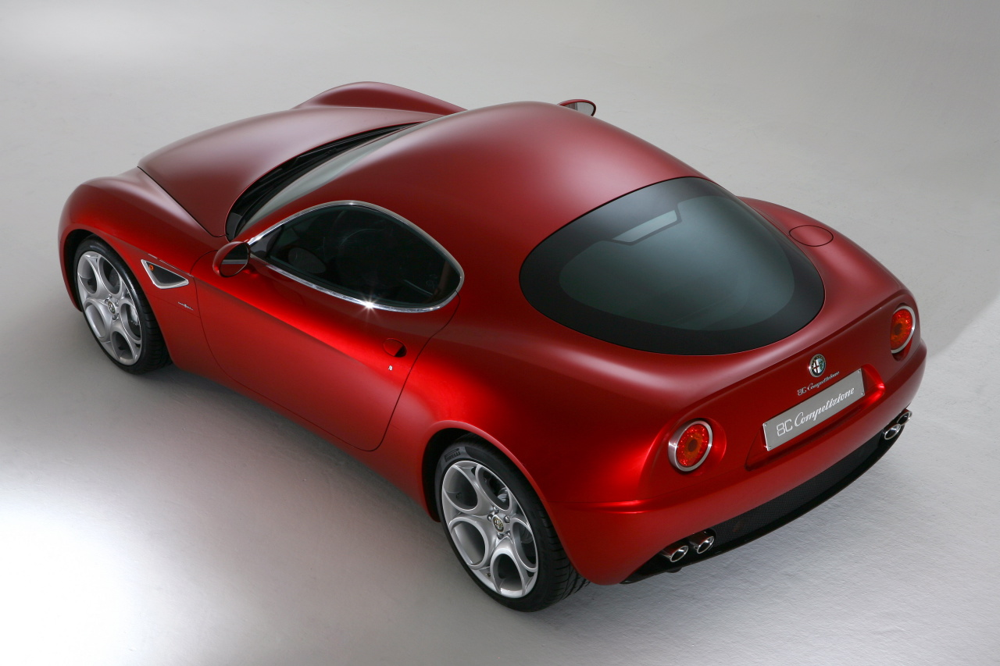
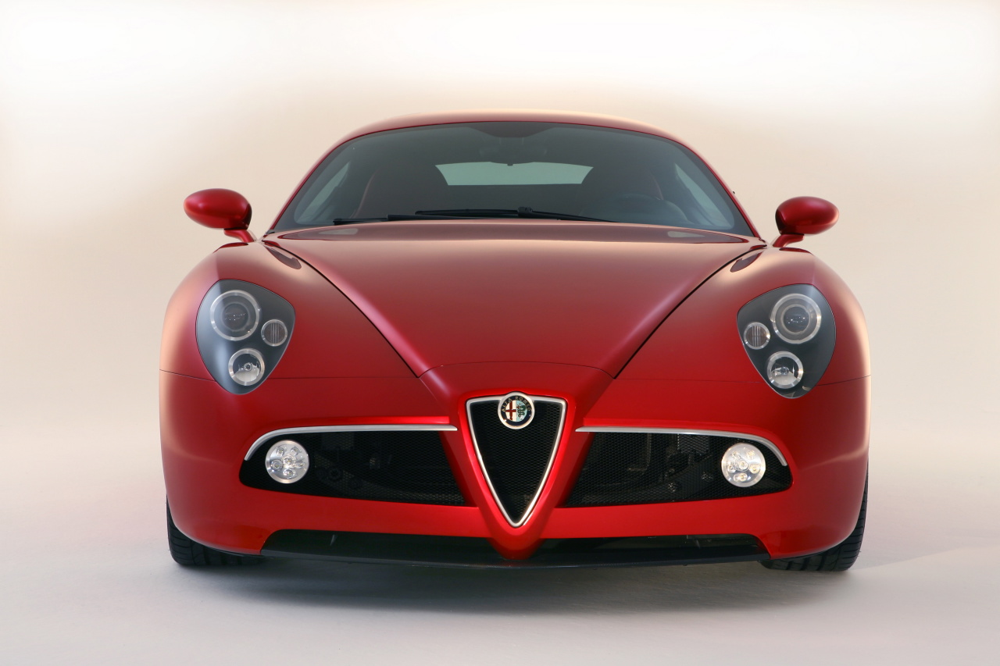
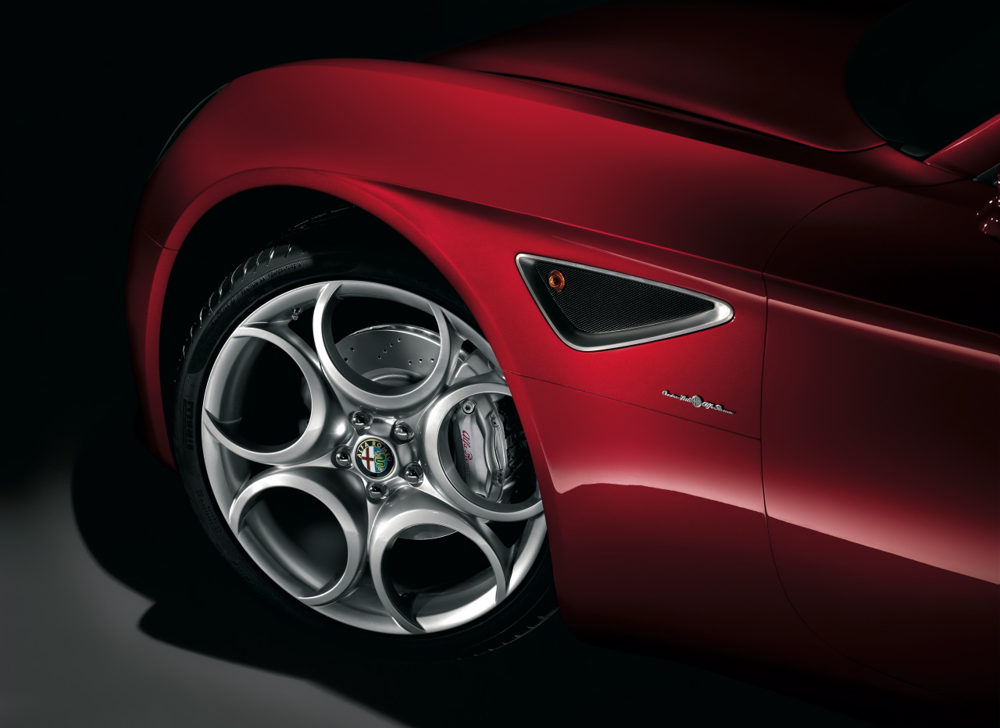
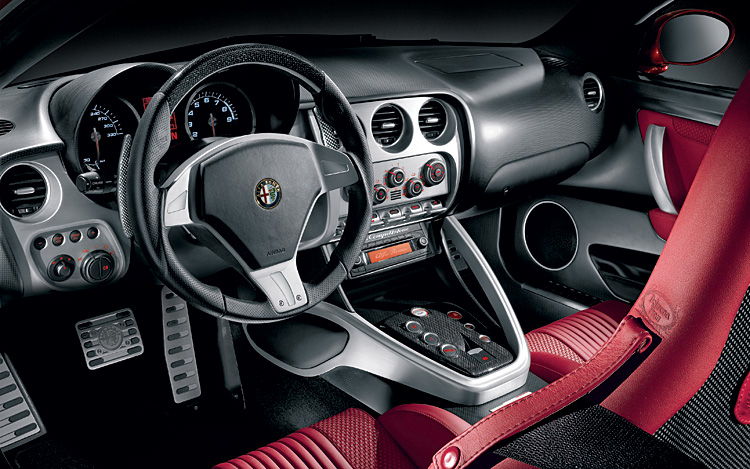
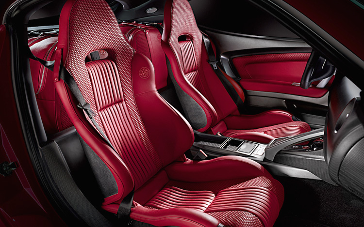
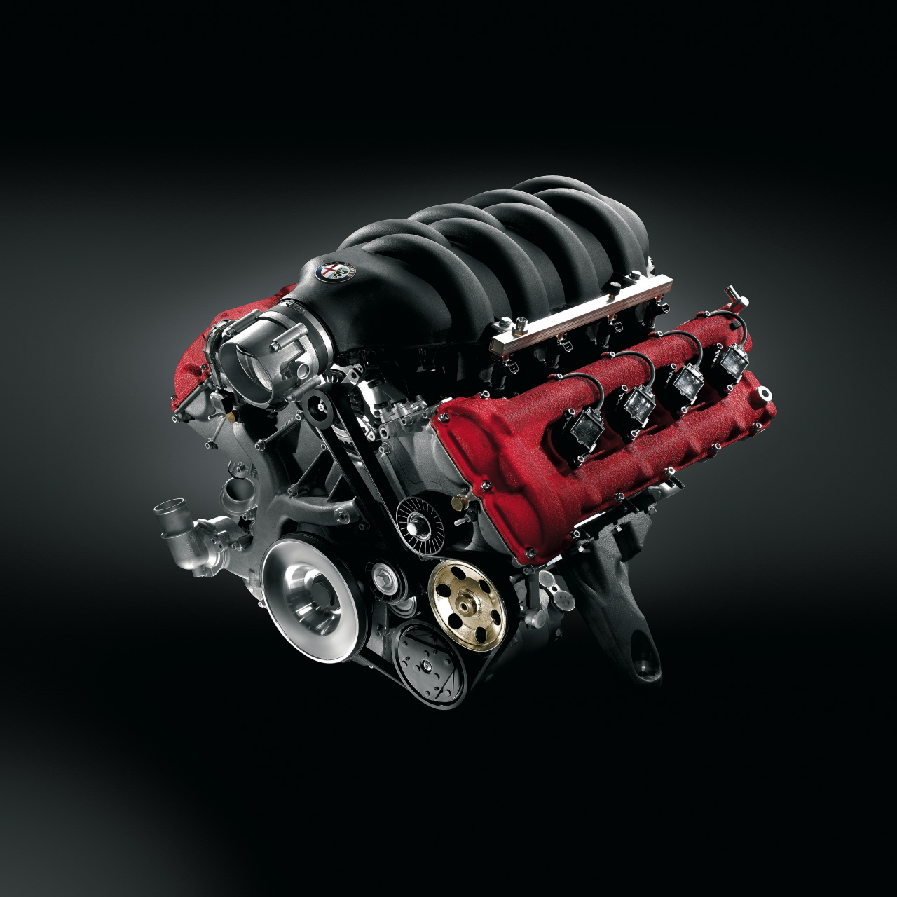

## Bir ömür sonra yeniden

İtalyan markanın tarihine bakıldığında 8C’nin Monza veya Le Mans 24 gibi kimi yarışlarda elde ettiği başarılar nedeniyle Alfa’ya kazandırdığı prestiji görüyoruz. Örneklemek gerekirse 1931 senesi İtalyan Grand Prix’inde ulaşılan birincilik ödülü ilk kayıt olarak karşımıza çıkıyor. Altın yıllar olarak gösterilen 1931’den 1938’e kadar sadece pistlerdeki başarılarıyla yetinmeyen Alfa Romeo 8C satın almaya gücü yetenleri caddelerde oyuncak olarak da kullandırdı. 1935 ve 36’da iki koltuklu spor model 8C 2900A kendi evindeki yarışlarda ilk üç sırayı paylaştı. Soffio di Satana (şeytanın nefesi)  adı verilen 8C 2900B ise 1938’deki Le Mans 24 saat yarışlarında yer aldı. O zamanlar için muhteşem sayılabilecek bir tasarıma sahip 8C 2900B savaşın başladığı ana dek sadece 50 adet üretilebilmişti. O sıralarda ortalıkta Ferrari görünmüyordu. Rosso corsa (ateş kırmızısı) adı verilen ve sonradan her iki otomobilde de kişiliğini bulan simge renk Ferrari’den önce sadece Alfa’nın gövdesinde parlıyordu. Ve otomobil 1930’lardaki ruhu ile tekrar canlandırıldı.

Fiat grubu ve yönetimin başındaki isim Sergio Marchionne firmanın bünyesindeki diğer markalar ile birlikte Alfa Romeo’yu pazardaki rekabete yeniden sokmak için oldukça fazla çabaladıklarını söylüyor. Tüm rakipleri tek tek inceleyen Marchionne, operasyonlardan sorumlu başkan olarak 2009’u işaret ediyor. Zira önümüzdeki yıl Alfa’nın Maserati ile birlikte sunumu gerçekleştirilecek. Önümüzdeki yıllarda yeni Alfa’lar ve Maserati’ler kardeş otomobiller olarak aynı platformu kullanacaklar. Yöneticiye göre büyük bir ihtimalle Ferrari’nin motorları Maserati’de kullanılabilecek. Bu durumda üç marka aynı firma içerisinde iyice harmanlanacak gibi gözüküyor.
Üretimine karar verildikten sonra 1,5 sene içerisinde tanıtılan 8C, Maserati Quattroporte’nin şasi boyutlarının değiştirilmesi ile yeniden yapılandırılmış. 500 adet satış rakamına ulaşması beklenen pazarda ilk hedef olarak Amerika belirlenmiş. Diğer Alfa’lar Spider ve Brera görüntü olarak heyecanlandırsalar da sıra performansa gelince bugüne kadar yapılan tüm testlerde rakiplerinden geride kaldılar. Bu geleneği ortadan kaldırmak 8C’ye düşüyor. Zaten modelin ismi otomobilin kalbindeki gücü anlamamıza yardımcı oluyor. Kaputun altındaki 4.7 litrelik motor 450 HP gücünde. Motorun hatırı sayılır gücü 0-100 km/s hızlanmasında açıkça görülüyor. 4.2 saniyelik hızlanma değeri 911 GT3 ile aynı. 293 km/s son sürate sahip motor 7000 d/d da 450 HP’ye ulaşırken 4650 d/d/ da ise 613 Nm çevirme gücü üretiyor. 8 silindirli 4691 cc’lik motor silindir başına 4 sübap (32V). Değerlere göz atıldığında otomobilin 911 GT3, GT2, Ferrari 4300 Scuderia, Aston Martin Vantage veya DB9 gibi otomobillere rakip olduğu ortada. Netice olarak 8C resminde göründüğü kadar güzel bir otomobil.

Üst düzey işçiliğe ve geleneksel Alfa yapılanmasına sahip iç mekan orada bulunmaktan keyif duyulacak bir atmosfer sunuyor. Alüminyum görünümlü panel ve göstergelerin yönleri sürücüye dönük ve çok şık. Tüm hız sayaçları geleneksel Alfa kokpit dizaynı ile son derece çekici duruyor. İtalyan tarzının sade güzelliği, iç mekandaki başarısı ve meziyeti ile bu otomobille birlikte yeniden sergileniyor. Monokok gövdedeki zarif hatlar aracın iç mekanı ile de bütünleşmiş. Manuel ayar yapılabilen koltuklarda karbon üzerine ince deri kaplanmış. Koltuklarda yükseklik ayarı bulunmuyor. Yan ve arka görüşlerin biraz sorunlu olması koltuk yapılanmasından kaynaklanıyor. Ancak sürücü koltuğu özellikle alçak sert ve destekleyici olarak konumlandırılmış. Orta konsol, kapı içleri ve direksiyonda kullanılan alüminyum işçiliğine diyecek yok. Kapı içlerindeki ve koltuklardaki karbon tasarım ve dizayn çekici görünüyor. Orta konsoldaki pek işlevsel görünmeyen alüminyum tutacaklar çok şık duruyor. Direksiyon yalnızca sürüş zevkine katkıda bulunmuyor. Sürüşe duyarlı direksiyon estetik açıdan da iddialı. Direksiyonun üzeri deri kaplanmış ve alüminyum alaşım kolların ortasında otomobilin logosu var. 6 ileri Cambiocorsa sıralı şanzıman direksiyondaki kulakçıklardan kontrol ediliyor. Arkadan itiş otomobilin şanzımanının arkaya konumlandırılması sayesinde ağırlık dağılımı 59/51 oranı elde edilmiş. Sürüşteki tatmin hissini sağlayan en önemli unsurlardan birisi ise tüm mekanik aksam ve malzemelerin ön-arka aksın arasına yerleştirilmesi. Otomobildeki monokok gövde yarış otomobilleri geliştirme ve üretim firması Dallara tarafından şekillendirilmiş. Rüzgar tünellerinde yapılan denemeler sonrası gövdenin iç ve dış yüzeyleri karbon-fiberle güçlendirilmiş. Kabin içerisinde ergonomik bir sorun yaşatmayan Alfa Romeo 8C Competizione sınırlı sayıda üretim planlaması nedeniyle neredeyse kusursuz olmak zorunda.

Start düğmesine basılması ile birlikte homurdanmaya başlayan motorun sesi 8C’nin sürücüsünü ‘sport’ modunu seçmek için tahrik ediyor. Sport modu için bir anahtarın kullanılması gerekiyor. Otomobildeki şanzımanın normal kullanımındaki vites geçiş süresi 0.4 saniye. Ancak kulakçıklarla da değiştirilen vites geçişi bu modda 0.2 saniye daha hızlı gerçekleşiyor. Bu durumda açılan egzos by-pass sübapları gaz hassasiyetlerini değiştiriyor. Otomobilin arkadan kayma isteği gaz pedalı tepkileriyle kontrol edilebiliyor. Gerektiğinde stabilite kontrol ve çekiş kontrol kapatılabiliyor. Çekiş kontrolü kapatıldığında arkadan kayma başlıyor. Ancak bu disiplindeki otomobillerin gözü kara sürücülere ihtiyacı olduğu gerçeği tekrar ortaya çıkıyor.

Bu güne kadar üretilenler içerisinde üzerinde en çok çalışılan model olan 8C’nin sakin sürüşler için tasarlandığı söylenemez. Alfa’nın rakipleri, otomobilin sürüş karakteri hakkında fikir sahibi olmamızı sağlıyor. Araçtaki 293 km/s’lik son süratin az bulunduğu söylense de estetik kaygılar aerodinamik çalışmaların önünde düşünülmüş ki otomobilin geleneksel çizgileriyle yeni tasarımı ortaya seyredilesi bir resim çıkarmış. Sadece bu durum bile aracın teknik verileri içerisinde sürtünme katsayısının olmayışını affettirebiliyor. Limitlerdeki kullanımlarda keskin virajlar fazla sorun yaratmasa da çekiş sistemlerinin yardımı yadsınamaz. Otomobildeki sert sürüş karakteri süspansiyonların son derece sert ayarından  kaynaklanıyor. Ferrari ve Maserati ile olan kan kardeşliği sürüş kalitesinin yanı sıra dış donanımda da göze çarpıyor. İlk fark edilen ise jantlar. Gerek tasarımın işlevselliği, gerekse yol tutuşa önemli katkısı olan jantlar ile hava kanalcıklı diskler görsel olarak bütünlük sağlıyor. Frenler arkada ve önde dört pistonlu ve sabit kaliperli. Tüm hava koşullarındaki etkin frenleme hava kanalcıklı büyük diskler ile gerçekleşiyor.

Alfa 8C’nin 500 adetlik üretiminin önemli bir bölümünün Amerika’da satılması planlanıyor. Markanın seçkin otomobili Fiat çatısı altında geleceğini aramağa devam edecek. Diğer iki marka Ferrari ve Maserati ise gerek güç, gerekse görsel olarak ellerinden gelen yardımı esirgemeyecekler

__Alfa Romeo 8C Competizione__

* Fiyat: 111,000 Sterlin (İngiltere)
* Motor: 4691 cc 32V V8
* Güç: 450 HP 7000 d/d
* Tork: 613 Nm 4650 d/d
* Aktarma: 6 İleri, sıralı, arkadan itiş
* 0/100 km/s: 4.2sn
* Maksimum hız: 293 km/s
* Ağırlık: 1490 kg
* CO2 Emisyonu: 377 gr/km
* Üretim Malzemesi: Karbon-fiber, çelik
* Satış Adedi: 500

