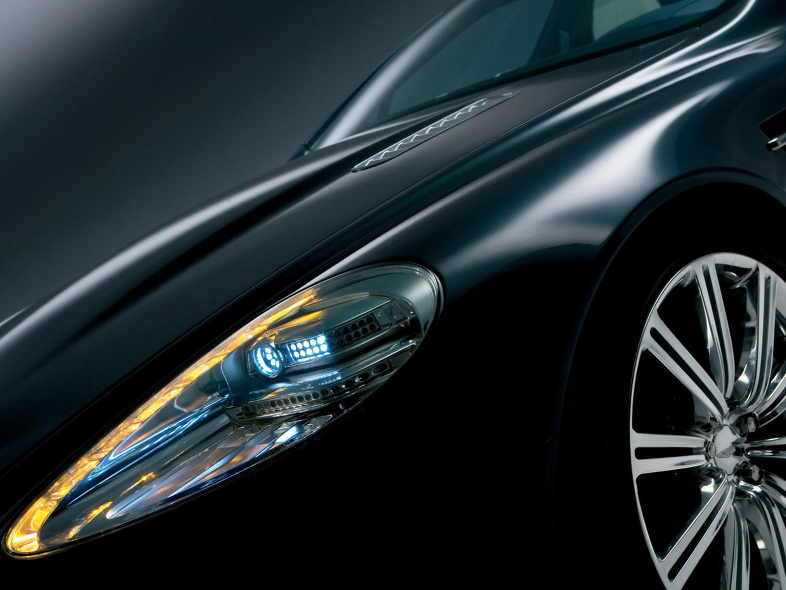

## Duygusal İngiliz

Porsche Panamera Turbo, Maserati Quattroporte Sports GT S ve Bentley Continental Flying Spur Speed gibi süper dört kapılıların, artık yeni bir rakibi var. Aston Martin Rapide.  Yeni dört kapılı otomobil de Bentley gibi İngiliz mühendisliğinin ürünü. Ancak, kapıs ayısının artması otomobilin zarif görüntüsünden ve spor tasarım çizgilerinden hiçbir şey kaybettirmemiş. En azından Aston Martin DB9 veya DBS kadar heyecanlandırıcı bir resim veriyor. Seyreden gözleri etkisi altında bırakan Aston Martin Rapide, sürücüsünden ilk puanlarını sürüş dinamikleri ve rahatlığı ile alıyor.  Hatta, orta hattaki şanzıman tünelinin genişliğine rağmen arka koltuklar dar gibi hissedilse de alışıldığında dışarı çıkma arzusundan dahi vazgeçiliyor.  Diz mesafesi, ancak uzun boylular için rahatsızlık yaratabilir. Sürüş için son derece istekli görünen otomobilde önde aksın arkasına alüminyum şasiye uzunlamasına yerleştirilmiş 5935 cc hacminde , V12 motor bulunuyor. Silindir bloğu ve üst kapağı alüminyumdan imal edilmiş DOCH motor, silindir başına dört olmak üzere toplamda 48 sübablı. Çok noktadan enjeksiyonlu ve elektronik motor kontrolüne sahip makinanın gücü ise 6000 d/d’da 470 HP olarak veriliyor. Motorun torkuna baktığımızda da etkileyici bir rakamla karşılaşıyoruz. 5000 d/d’da  elde edilen çevirme gücü 600 Nm’lik rakamı gösteriyor.

Motor değerleri Aston Martin’in  DB9’u ile aynı performansı gösteriyor. Gösteriyor göstermesine de; tam burada dört kapılı Rapide’in saldırganlığı bir M sedan’ın “sport” modundaki performansını anımsattığını söylemek doğru olur.  Zira, kapı sayısının fazla olması otomobilin safkan spor olmadığı anlamına gelmiyor.  Yol tutuştaki üstünlük ve sürüş pozisyonu 5.3 saniyede 0’dan 100 km/s ye  çıkabilen Rapide’i diğerlerine sıkı bir rakip yapıyor. 6 ileri otomatik şanzımanın motorla ahengi, sürücüyü eğlenmeye zorluyor. Ancak iki ve üçüncü vites oranları uzun ayarlanmış. Boyutu küçük üç kollu direksiyon yol üzerindeki tüm değişiklikleri sürücüsüne hissettirmeye ayarlanmış. 1950 Kg’lık kuru ağırlıktaki (Yakıt, motor yağı, şanzıman yağı, radyatör suyu, hidrolik vs olmaksızın) Rapide, kilitli difransiyele sahip ve tüm güç arka tekerleklere iletiliyor. Boyutlara baktığımızda ise beş metreden fazla uzunluk ve iki metreden fazla genişlik ile karşılaşıyoruz. Büyük bir otomobil ölçülerindeki Rapide, arkaya doğru alçalan coupe tavan çizgisi ile daha küçük görünüyor. 

Otomobilin kupası alüminyum paneller ve ön taraftaki kompozit malzemelerle birlikte şasiye monte edilmiş. Sinirli motorla birlikteki yapılanma, ön ve arkadaki süspansiyonların çift salıncağı, helezon yayları, adaptif amortisörleri ve viraj çubuklarıyla birlikte son derece verimli çalışıyor. Otomobilin güç/ağırlık oranına baktığımızda ise 240 HP/ton gibi hafife alınmayacak bir rakamla karşılaşıyoruz. ZF firması tarafından hazırlanan ve geliştirilmiş transaxle şanzıman çift kavramalı ve yumuşak geçişlere sahip. Touchtronic 2 olarak adlandırılan pedal ve çift kavramalı vites kutusu sorunsuz ve uyumlu davranıyor. Tüm bunlara otomobildeki alçak sürüş pozisyonunu da ilave edersek sürücünün tahrik olmaması imkansız. Ağırlığa rağmen otomobil son derece çevik. Virajları ise adeta yola yapışırcasına yutuyor.  Motor frenine ihtiyaç duyulduğunda ise anında cevap almamak imkansız. Bu arada Touchtronic şanzımanın pistte de başarılı olduğunu belirtelim. Zira, otomobil kontradan ya da lastiklerin dumanlanmasından hoşlanıyor. Ve amortisörler “Sport” konumunda iken DSC’nin “Track” moduna alındığında ise saldırgan bir GT içinde olduğunuzu hemen anlıyorsunuz.

Rapide’in kabini İngiliz işçiliği ve detaycılığının bir ürünü. Şık kabin bir o kadar da sade tasarlanmış. Her zaman otomobilin içinde olmanızı istetecek kadar zarif ve şık. Ön ve arkadaki açık renk deri koltukların yerleşimi son derece ergonomik. Ön koltuk başlarının arkasındaki TFT ekranlar arkadaki yolcuların Multimedya eğlencesi için monte edilmiş. Anton Martin’in ses sisteminde ise Bang & Olufsen Beosound markası görülüyor. Sound anlamındaki başarısını bildiğimiz marka, müzikal sitl seçiminde çeşitli olanaklar sunuyor. Opera’dan Black Eyed Peas’a kadar farklı tercihlere hitap eden sistem tweeter’den bas’a profesyonel bir hoparlör skalası ile birlikte sunuluyor. Rapide, diğer rakipleri gibi sürüş teknolojisi ile donatılmış değil.  Yani direkt enjeksiyon, turbo, dört tekerlekten çekiş, destek sistemleri ya da spor diferansiyel otomobilde bulunmuyor. Ancak, bu durum sürücü ile otomobil arasında homojen bir bağın oluşmasına neden oluyor. Bu açıdan bakıldığından Rapide, sürücüsü ile “hissi bağ” oluşturan süper lüks bir GT.

Otomobilin maksimum sürati 302 km/s olarak verilmiş. Ağır otomobil, soğutmalı çift katlı diskler ve ABS frenle durduruluyor. Diskler önde 390, arkada ise 360 mm çapında. Aston, V/H alüminyum şasisini BD9’a oranla 250 mm daha uzun tutmuş. Uzunluk sayesinde gövdede artan rijitlik frenajın dengesine olumlu katkı sağlamış. Yakıt tüketimine baktığımızda, her şeye rağmen makul rakamlarla karşılaşıyoruz. Minimum 9,6 lt, maksimum 15,9 litrelik tüketim, bu ağırlıktaki ve her an patlamaya hazır bir GT için makul seviyelerde. Yol tutuş ve frenajdaki önemli unsurlardan bir diğeri ise yumuşak hamurlu Bridgestone Potenza 5001 lastikler. Lastikler önde 245/40 R20, arkada ise 295/35 R20 ebatları ile sunuluyor. Lastikler gibi, jantların da ebatları farklı büyüklükte. Önde 8,5x20 inç jant, arkada ise11x20 inç jant bulunuyor. Bu farklı büyüklükteki lastik ve jantlar otomobilin görüntüsünü mükemmelleştiriyor.

Tipik İngiliz, logosuna yakışır şekilde hem geleneksel yarışçı özelliklerini hem de rakipler arasındaki sarsılmaz yerini koruyor. Rapide, gerek motor özellikleri gerekse tüm gücün ortaya çıkarılmasında lineer bir yapıya sahip. Otomobildeki şasinin kompakt yapısı sürücünün istediği tepkilere anında cevap veriyor. Ancak bir handikap var: Tüm bu olanaklar sadece gözü kara ve tecrübeli eller için mümkün. Kalite ve konfor herkes için olabilir ama sıradan bir sürücünün bu tansiyon artırıcı otomobilin direksiyonuna oturması için, ehliyetinden ziyade ehil olmasına ihtiyaç duyuluyor.

