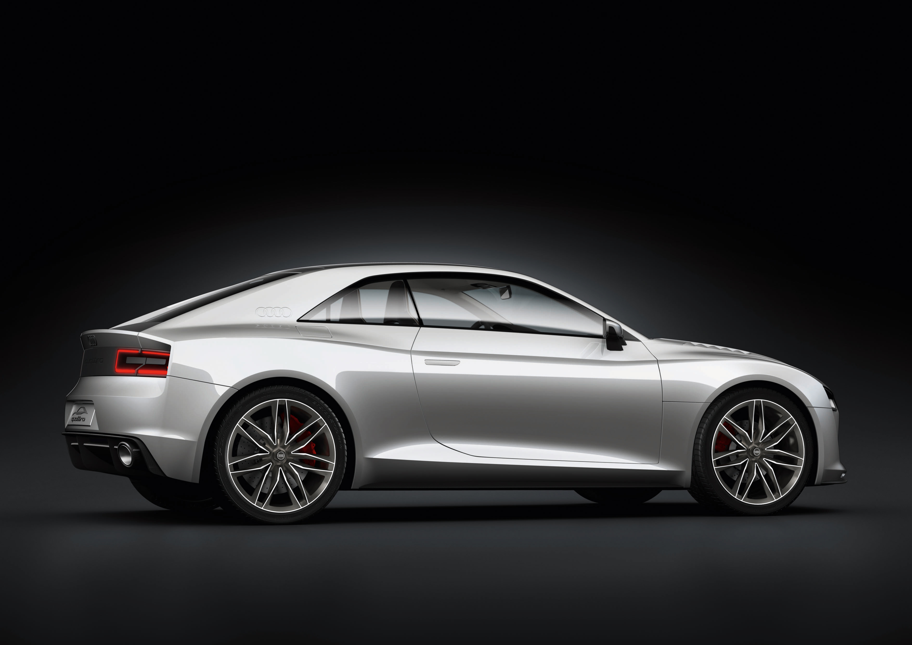
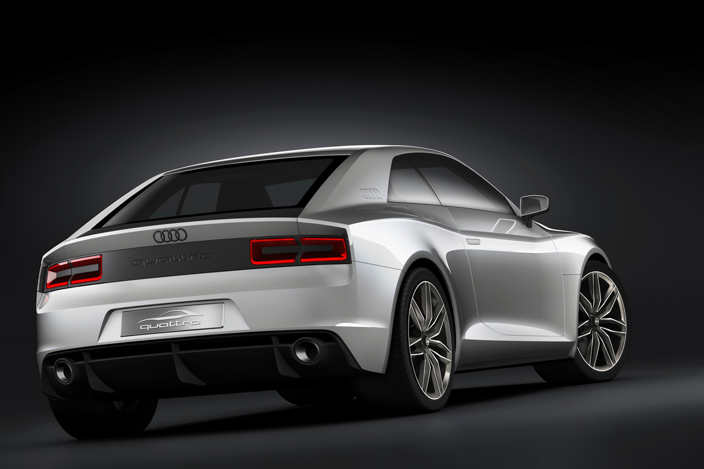
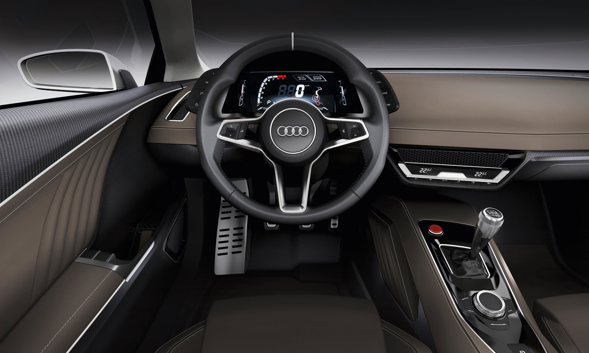
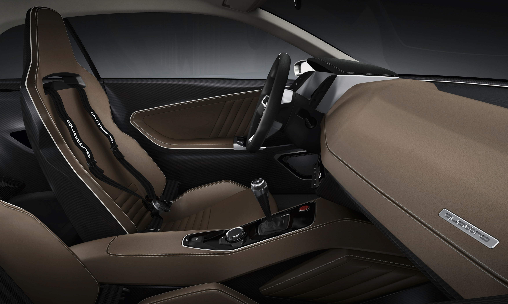

### Duayen daha fazla bekletmeyecek!

PQ 3010 kod adlı (Project Quattro, 30. Yıl, 2010) Quattro, Audi’nin 100. yılı için hazırlanmaya başlandığında, tasarımcılar tanıtım hedefi olarak 2009 yılındaki Pebble Beach organizasyonunu seçmişlerdi. Ancak, 30 yıl sonra yeniden yapılan otomobil bozulan ekonominin kurbanı olup gösteriye çıkamazken, yerine çevreci özelliği ile öne çıkan R8 E-tron için kutlama yapılıyordu. 30 sene sonranın Quattro’su selefine kıyasla çok başka bir yerde olmalıydı. Nitekim Audi’nin baş tasarımcısı Wolfgang Egger: “Quattro son derece modern bir otomobil. Safkan spor bir otomobil haline gelmesi için çok uğraştık. Detaylara harcadığımız zaman ve mühendisliği özellikle belirtmek isterim. Yeni doğan sportif coupe hafif, güçlü ve son derece arzu edilebilir hale geldi. Sadece karakteristik dört çeker sistemi ile değil, markanın içerisinde başka bir marka gibi algılanması ile de öne çıkacak.” diyerek merakları gideriyordu.

Quattro, RS5 platformu üzerinde çalışılarak şekillendirilmiş. En az RS5 kadar cevval olan otomobil, 305HP gücündeki WRC şampiyonu eski efsaneden birçok yönü ile ayrılıyor. 5 silindir, 2480 cc hacimli motor önde uzunlamasına yerleştirilmiş. Günümüz mühendisliğinin başyapıtlarından birisi durumundaki motor TT RS’de kullanılanla aynı, ancak daha hızlı. Motor 408HP güç üretebilmek için ayarlanmış. 4 tekerlekten çekişin duayeni otomobilde benzinli turbo motor tercih edilmiş. Maksimum hızın 295 km/s olarak verildiği göz önüne alındığında, akla otomobilin ağırlığının ne kadar olduğu geliyor. Otomobilin çevikliğine etki eden faktörlerin başında 1300 kilogramlık ağırlık ilk sırada yer alıyor. Ancak tasarımcılar önümüzdeki yıllarda ağırlığın daha da düşürüleceğinden söz ediyorlar. 408HP gücü 5400-6500 d/d arasında üreten motorun torku ise 1600-5300 d/d arasında 480 Nm olarak verilmiş. Tork başına 513HP güç alınan otomobilin güç/hacim oranı ise litre başına 164HP görünüyor. Yakıt tüketimi makul seviyelerde sayılabilir. Karma 8.5 litre/ 100 km. Tek turbolu motorun akselerasyonu 0-100 km/s için sadece 3.9 saniye. Motor sarsıntısını önlemek için krank mili önüne amortisör yerleştirilmiş. 6 ileri manuel şanzıman yeni yapılanması ile geçiş kayıplarına son vermiş. Özellikle 2500 d/d’dan sonra delirmeye başlıyor. R8’in 10 silindiri kadar atak olan motorun son hızı ise 250 km/s ile (cut-of) sınırlandırılmış.

Quattro’daki kompakt yapı son jenerasyon inovasyonlardan izler taşıyor. Düşük ağırlık ve orta diferansiyeldeki 40:60 oranlı güç dağılımı mükemmel çekiş sunuyor. Optimal yol tutuşa izin veren süspansiyon sistemi ise RS5 ile benzerlik gösteriyor. Nitekim performans departmanından Stephane Reil, bundan böyle müşterilerin sadece performansa değil, güç/performans ve hafifliğe öncelik vermeleri gerektiğini düşünüyor. Quattro’nun gelecekte karbon-fiber kullanımının artmasıyla 100 kilogramın altında bir ağırlığa düşürüleceği söz konusu.

Quattro Concept, dış tasarım itibariyle öncelikle duygulara hitap ediyor. Görünen resim geçmişi hatırlatmasına rağmen tamamen futuristik çizgilere sahip. Eski çizgileri anımsatan detaylar arasında, A sütununu veya şişkin çamurlukları derhal algılayabiliyoruz. Bunun dışında her şey yeni. Öndeki dikdörtgen şeklindeki farlar, markanın dört halkası ve dört adet hava girişinin kombinasyonu aerodinamik form içerisinde tasarlanmış. Karbon-fiber, otomobilin dışındaki bileşim noktalarında sıkça kullanılmış. Ön ızgara alüminyumdan imal. Alüminyum uzay kafesi gövde ve şaside de kullanılmış. 20 inç alaşım jantlar ve 275/30 R20 Dunlop Sportmaxx lastiklerin kombinesi son derece sportif. Arkadaki spoyler, dikdörtgen çizgili stoplar ve köşelerdeki egzos çıkışları çok şık. Titanyum grisi ve Suzuki grisinin renk harmonisi Concept’in dış görüntüsüne çok yakışmış.

İç mekandaki yerleşim dört koltuklu selefinden farklı olarak iki koltuklu. Son derece sade görünen iç mekan üretim aşamasında MMI sistemi ile birlikte sunulacak. Deri kaplı koltukların yerleşimi ve sürüş pozisyonları ideal seviyede. Sparco marka yarış koltuklarının sütlü kahve renk tonu süper. Arkada ise sadece kask, takla barı, yangın söndürme tüpleri ve emniyet kemerlerinin monte edildiği küçük bir bölüm bulunuyor. Fonksiyonel direksiyon daire biçiminde tercih edilmiş. Hakiki bir yarış otomobili hissi, gerçek bir vites topuzu ile tamamlanmış. Frenler destekli ve dozu iyi ayarlanmış. Karbon-seramik diskler ön ve arkada hava kanalcıklı olarak sunuluyor. Süspansiyonlar ise ön ve arkada çok kollu, helezonik yaylar ve viraj denge çubuklarına haiz. Quattro orijinaline mesaj göndermek için 6 ileri manuel şanzımanla donatılmış.

“Tasarımını ve konseptini seviyorum. Sürüşünün mükemmel ve keyifli olacağından eminim. Ama üretim için mecbur olan bütün mantıklı, ekonomik ve yasal zırvalardan nefret ediyorum.” AR-GE sorumlusu Michael Dick yeni oyuncağı için aynen bu cümleleri kullanıyor. Diğer bir kaygısı ise V8’den daha yüksek ve uzun olan motorun yaya güvenliği testinden nasıl geçeceği konusu. Ancak çalışmaların bitmesi için bolca vakit var. Sınırlı ve özel üretim sayısı şüphesiz otomobilin fiyatına yansıyacak. Ortada görülen çözüm ise otomobili RS5’e mümkün olduğu kadar yaklaştırmak ya da harcanan tüm emek, tasarım ve AR-GE çalışmalarını üretilecek yeni A5’e transfer etmek. Yine de üretim için ısrar ediliyor. Yetkililer yeni Quattro’nun hafif ve performanslı kompakt otomobiller için iyi bir başlangıç olacağını düşünüyorlar. Otomobil onay aldıktan 2 sene sonra yollarda görülebilecek.

