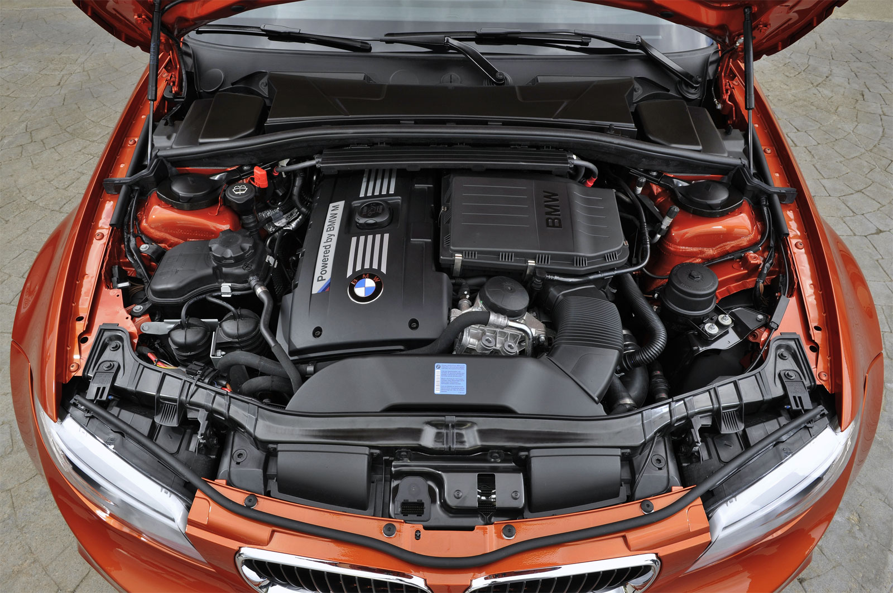

### Küçük boyuna rağmen M3’ü terletiyor

Özel kapasitelerle donatılmış küçük ve kompakt bir M’in üretilip üretilmeyeceği ya da sınırlı sayıda yapılacağı gibi dedikodular geride kaldı. Öyle ki, kendi segmentindeki bir çok otomobile (Porsche Cayman R, Nissan 370Z GT Edition, Audi TT RS) gözdağı veren tasarım ve donanımı ile birlikte beliren 1M Coupe, çekici özellikleri ile yeni tavırlar sergiliyor. Boyutları itibariyle ateşli bir hot-hatch görüntüsü veren otomobil, rakiplerine kıyasla sürücüsüne daha sadık bir sürüş sunuyor. Porsche Cayman R, küçük kilosu, mükemmel yol tutuşu, kusursuz ve homojen yapısı ile 1 serisi M Coupe ile baş edebilecek seviyede. Ancak, BMW’nin pist testleri sonuçları, dört kişilik koltukları ve fiyat avantajı otomobili yeni referans noktalarına taşıyor. En az abisi 420 HP’lik M3 E92 Coupe kadar yakışıklı olan otomobil, düzgün oranları ile taze görünüyor. 40.000 sterlinlik etiket için ise pantolon ceplerinin fazla derin olmasına gerek yok. Ancak 40.000 sterlinlik fiyat donanıma bağlı olarak 45.340 sterline kadar çıkabiliyor.

Otomobilde sıralı 6 silindir, twin turbo, 2979 cc hacminde ve önde uzunlamasına yerleştirilmiş motor görev yapıyor. 3 litrelik motor, 5900 d/d’da 340 HP güç üretiyor. 1500 ile 4500 d/d arasında ortaya çıkan 500 Nm’lik tork, 8 silindirli, 420 HP’lik M3’ten 100 Nm daha fazla. 1M Coupe’nin 0-100 km/s hızlanması 4.9 saniyede gerçekleşirken, M3 için bu süre 4.3 saniye. Fakat aradaki siklet farkı dengeleri eşitliyor. Kuru ağırlık 1M’de 1570 kg iken, atmosferik motorlu M3’de 1655 kg çekiyor. İki otomobilin de maksimum sürati 250 km/s’de (cut-off) sınırlandırılmış.

Otomobildeki 500 Nm, sürücüsüne müthiş bir gaz tepkisi sunuyor. Kısa dingil mesafesi, kombine virajlar yahut sert dalmalar gerektiğinde otomobili arkadan sabit açıyla kaydırabilmek için üstünlük sağlıyor. İhtiyaç duyulan yanal açılar istenilen her an gerçekleştirilebiliyor. Etli direksiyon simidi, destekli koltuklar ve küçük vites kolu M sportifliğini belli eden ilk işaretler. Üstelik bu yapı düşük devirlerdeki tork enflasyonu ve overboost’un birlikteliği sayesinde otomobili namlunun ağzındaki mermiye dönüştürüyor. Nitekim M3’teki atmosferik 8’in üst devirlerine ihtiyaç duymayan otomobil, orta devirlerdeki devasa çevirme gücü ile sürücü ve yolcuyu şok edebilecek seviyede. Otomobilin egsoz sesi diğer canavarlar gibi kudurmasa da, etkileyici bir homurtu içerisinde. Otomobilde müzik dinlemeyi sevenler için iyi bir haber.

1M’de MDM (M Dynamic Mode) adlı tek fonksiyonlu süspansiyon ayarı bulunuyor. Buton devreye sokulduğunda antipatinaj sistemi ve stabilite kontrol devre dışı kalıyor. Direksiyon üzerindeki M butonu ise gaz tepkilerini kısaltıyor. Ancak, diğer M modellerindeki gibi programlanmamış. Vites yolları kısa, debriyaj ise yumuşak bir kavramayla ayarlanmış. Normal veya Dynamic Mode’da diferansiyel, M3’ten inip 1M’e binen birisi için yetersiz gibi hissettirse de, hızlı tepkili bir sürücü M sürüşünü doya doya yaşayabilir. Çünkü geniş iz mesafesi ve kısa aks aralığı müthiş bir tutunma sağlıyor. Özellikle stabilite kontrolü devre dışı bırakıldığında otomobil, doğru direksiyon kontraları ya da gaz pedalı ile sağlıklı iletişim istiyor. Diğer taraftan, rahatsız etmeyen sert süspansiyonlar otomobili yolda diklemesine hareket ettirmiyor. Otomobil için yapılacak tek yorum, hissiz direksiyon ve frenlemelerin diğer M’lerdeki gibi alışkanlık istemesi. Geleneksel fren ve direksiyon yapısı kendisini bu otomobilde de gösteriyor. Yumuşak bir frenleme veya heel and toe anlarında sert bir dozla karşılaşılıyor.  Şehir içi trafiğinde ise alışkın olmayanlar adaptasyon süresine ihtiyaç duyabilirler. Alıştıktan sonra gerek direksiyon hissi, gerekse frenlemedeki sertlik önemini yitiriyor. Zira otomobilin sürekli ileriye doğru momentum içerisinde olması her şeyi unutturuyor.

1M Coupe’nin tartışılmaz yol tutuşu, otomobili son derece cazip kılıyor. Günlük kullanıma uygun yapısı, sadeliği ve hızlı gitme esnasındaki karakteristik sürüşü ile tam puan alıyor. Eğer derdiniz drift ise M3’teki kadar uzmanlığa gerek yok. Kontrollü tepkiler ve yarım tur, sabit açıyı bozmadan drifte izin veriyor. 1M oynamak ya da eğlenmek için biçilmiş kaftan. 6 ileri manuel şanzımanlı otomobil, arkadan itişli ve kilitli diferansiyele sahip. DSC ise kullanım sırasındaki stabiliteden ödün vermiyor. Önde ve arkada 360 mm çapında soğutmalı ve hava kanallı fren diskleri bulunuyor. Elektronik destek sistemlerini ise ABS, EDB, DBD ve CBC olarak sıralayabiliriz. Jantlar önde 9x19 inç, arkada ise 10x19 inç ebadında. Önde 245/35 R19 inç, arkada 265/35 R19 inç olarak lastik ebatları da farklı. Güç/ağırlık oranına baktığımızda ise otomobil ton başına 217 HP güç üretiyor. CO2 salınımı ise 224 g/km.

Yeni 1 serisi M Coupe, kendisine ödenen her kuruşu sonuna kadar hak eden bir otomobil. Akselerasyon, vites büyütme, hızlanma, hızlı daldığınız her viraj ve yapılan her drift ödediğiniz etiket fiyatını taksitle geri ödüyor. Akıllı tasarımı, sürekli öne doğru ataklığı, patlamaya hazırlığı ve dokunma hissiyle sürücüsünü kendine bağlıyor. Otomobildeki ağırlık ile kontrol tepkilerinin hassasiyeti, Alman mühendisliğinin örnek oranlamalarından biri olarak karşımıza çıkıyor. Limitlerde tedbirsiz veya yeteneksiz sürücülerin hata yapması ihtimali, gücü kontrolsüz hale dönüştürebilir. Zira bu makine küçük olmasına rağmen M normları içerisinde üretilmiş. Eğlence için usta eller gerekiyor.

