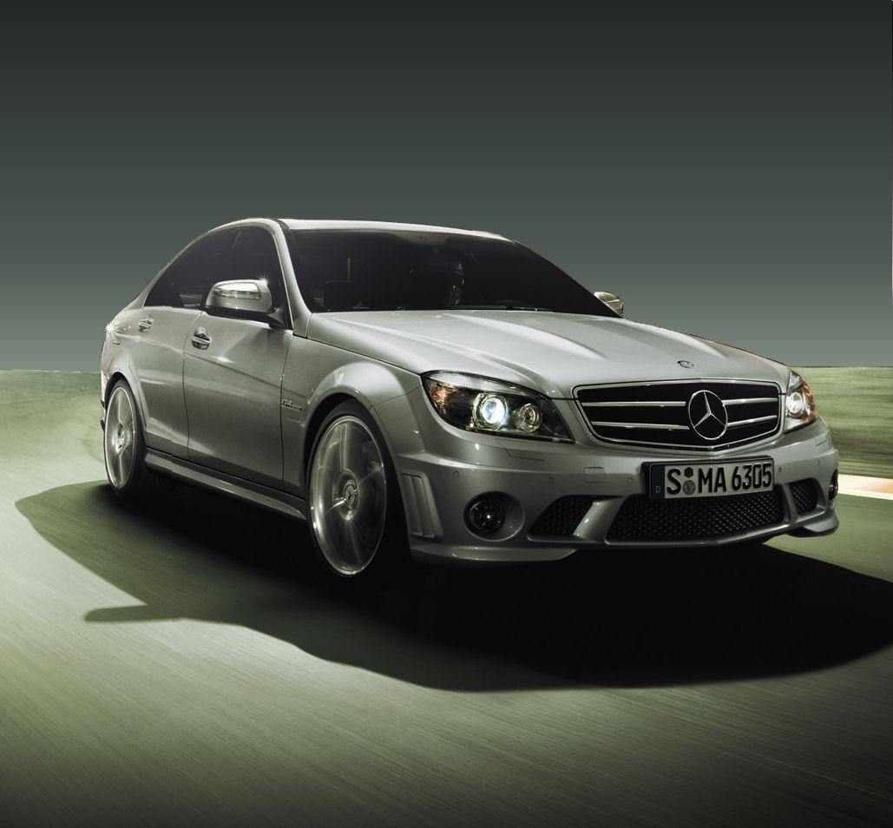
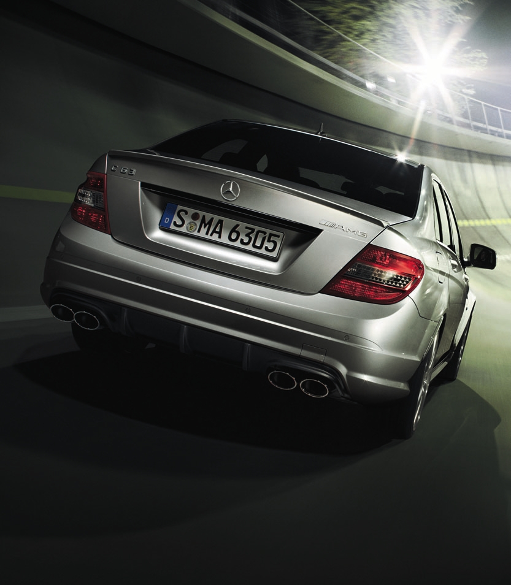
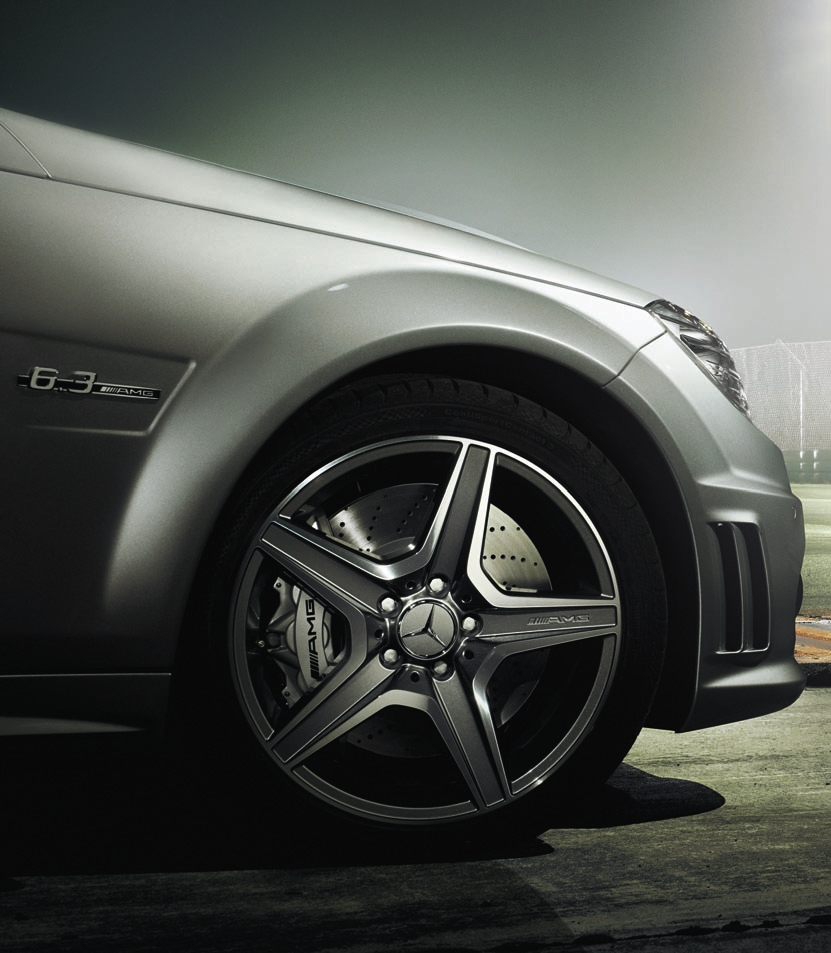
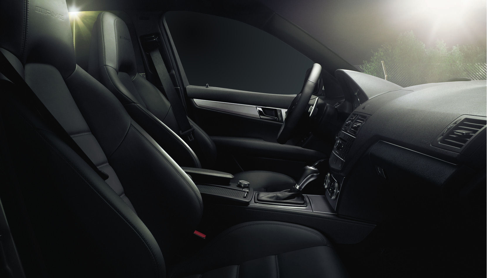
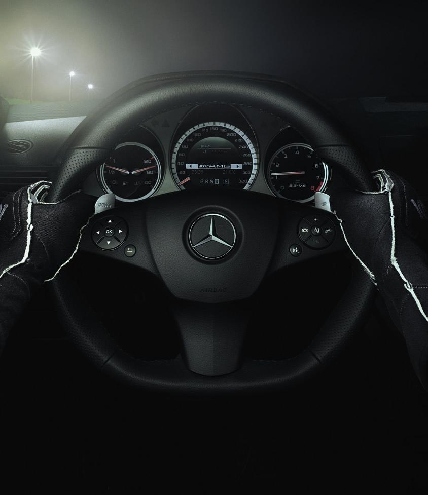
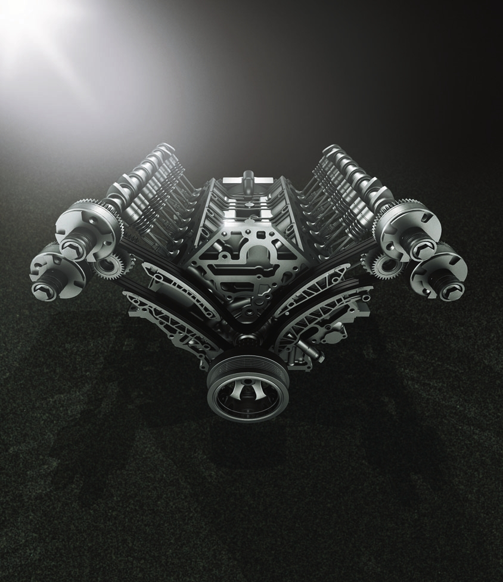

### 40 SENELİK TECRÜBE VE … “ZİRVE”

Bir performans otomobili ile sürücü arasındaki iletişim gerçekte tasarımcıların detaylara verdiği önem ve mühendislerin üretim esnasına gösterdiği özen sonunda ortaya çıkıyor. AMG mühendisleri önceki tecrübelerden “kalanlar” ile geleceğin teknolojisini bu otomobilde iyi harmanlamışlar. Markanın C sınıfında ürettiği kompresörlü V6 C32 ve daha sonra bu otomobilin yerini alan daha düşük performanslı C55 deneyimi Mercedes’in tuning bölümü AMG’yi, yeniden düşünmek durumunda bırakmış olmalı ki bu kez tüm sürüş bileşenleri bakımından müthiş bir otomobil yaratmışlar. En önemli rakip M3’ün teknik rakamları ile yapılan mukayesede AMG mühendislerinin kararlılığını görüyoruz. Otomobil yol tutuş, ilk kez sunulan üç modlu ESP sistemi, kabin içi kalitesi, direksiyon, dış görünüş ve performanstaki artıları ile mühendislerine şapka çıkarttırıyor. Daha fazlasını isteyenler Mercedes BRABUS veya LORINSER gibi pahalı tuning alternatiflere yönelebilir. Ancak, satış sonrası destek kolaylıkları, fiyat farkları ve ulaşılabilirlik hedef kitlenin tercihlerindeki kriterleri oluşturuyor.

Seçici tuning hastalarını dahi tatmin edebilecek bir yapılanmaya sahip AMG’nin kaputunun altındaki motorda sıra dışı teknikleri uygulanmış. 6.3 litre hacimli V8 motorda hareketli parçaların çoğu yeniden tasarlanmış. Motor, yapılan tadilatların sonunda 6800 d/d’da 457 HP gibi yüksek bir güce ulaşmış ki 600 Nm tork için, devir saatinde 5000’i görmek yeterli oluyor. Ortalama 500 Nm çevirme gücü ise sürekli olarak 2000-6250 d/d arasında kolaylıkla elde edilebiliyor. Kompresörü bulunmayan güç ünitesi, 1730 kg ağırlıktaki sedan bir otomobil için fazla güçlü bile sayılabilir. Nitekim AMG daha fazla devirle ortaya çıkan M3’e (1500 d/d daha fazla) kıyasla  maksimum performans değerlerinde önde görünüyor. İki otomobilin hızlanma sırasında ortaya koyduğu rakamlar Mercedes’ten yana. C63’ün 0-96 km/s hızı 4.5 saniye iken BMW M3 4.7 saniyeyi gösteriyor. Mercedes 0-160 km/s akselerasyonda da 9.7 saniye gibi bir zamanlama gösterirken M3 10.2 saniyede kalıyor. Bu kez ve ilk kez AMG M3’ü geride bırakıyor. Ancak BMW’nin silindir hacminin daha küçük olduğunu belirtmekte yarar var. Önde uzunlama yerleştirilmiş motorda silindir kafaları ve blok alüminyumdan imal edilmiş. Silindir başına dört sübap motorun sıkıştırma oranı 11.3:1 olarak veriliyor. Kesintisiz eğlenceli bir sürüş vadeden otomobilin güç/ağırlık oranı ton başına 264 Hp, tork ağırlık oranı 347 Nm, güç hacim oranı ise litre başına 74 Hp kapasiteli. Maksimum hız 250 km/s olarak sınırlı. Fakat AMG sport paketi (opsiyonel) ile satın alındığında C serisi bir otomobil için -298 km/s gibi- şimdiye kadar görülmemiş bir hıza erişiyor. AMG Sport paket 19 inç jantlar, daha sert süspansiyonlar ve sınırlı kaydırmalı diferansiyel ile birlikte sunuluyor. Gerçek olan şu ki bu kez C sınıfında ortaya çıkan en güçlü makine ile karşı karşıyayız.

Sert sürüş karakterli otomobilin motorundaki tüm güç standart olarak sunulan 7 ileri yarı otomatik şanzıman ile arka tekerleklere iletiliyor. Üretilen yüksek güç ve tork, kilitli diferansiyel bulunmamasına rağmen arka tekerleklere etkileyici ve eksiksiz olarak aktarılıyor. C63 kuru zemindeki yol tutuşu ile göz dolduruyor. 7 ileri şanzıman direksiyon simidinin arkasındaki alüminyum kulakçıklardan kontrol ediliyor. Şanzımanda üç farklı ayar var. Manuel mod tercihinde sürücü vites değiştirmedikçe vites yükselmiyor. Comfot modunda vitesler daha konforlu bir sürüş için oldukça yavaş değişiyor. Sport mod’un seçildiği durumda ise biraz cesaret gerekiyor. Mühendisler ilk kez bu şanzımanda vites düşürme sırasında motor devrini otomatik olarak yükselten sistem kullanmışlar. Motorun müthiş gücünün test edildiği Sport mod her türlü yol koşullarında otomobilin stabilitesini bozmuyor. Euro NCAP çarpışma testlerinden beş yıldız olan ve ön tampondaki yaya güvenliği yapılanması ile üretilen C63; ABS, EBD, EBA ve üç modlu ESP ile birlikte sunuluyor. Şu anda üretilen en iyi AMG şanzımandaki ve ESP’deki farklı seçenekler ile rakipsiz görünüyor. Yeni ESP otomobille oynama hissi yaratıyor. Manuel olarak kapatılabilen ESP sistemi kapatıldığında eğlenceli bir sürüş için imkân sağlıyor. Makul hızlara kadar ıslak zeminde dahi başarılı bir yol tutuşun ve yanlamaların yapılabildiği kapalı mod açıldığında otomobil keskin sürüş karakteri ile sürücüsüne güven veriyor. Sistem kapalı iken istenirse arka lastikleri yakabilecek kadar güç uygulamak mümkün. Zemin şartlarının değişkenlik gösterdiği her durumda ideal moda geçmek sürücünün seçimine kalmış. Sport modunda ise otomobil limitlerin zorlanmadığı son ana kadar ıslak veya kaygan fark etmeksizin yola yapışıyor. Zira, vites düşürme sırasında motor devri otomatik olarak yükseliyor. 

66 litre benzin ile 438 kilometrelik menzile sahip AMG alt tarafı düz ve nispeten daha ince bir direksiyona sahip.  Çok fonksiyonlu direksiyonun dönüş çapı 2.4 tur. Bu avantaj otomobili 10.8 metre dönüş çapına eriştirmiş. Sürüş tepkilerine duyarlı ve yolu okuyabilen direksiyon spor sürüş kalitesini hissettirmesi konusunda son derece başarılı. Nitekim çevrildiği anda anlık küçük değişikliklere hemen tepki verebildiği gibi, dengeli bir viraj kontrolü sağlıyor. Otomobil için geliştirilen süspansiyonlarda amortisör ve yaylar tamamen yenilenmiş. Yeni süspansiyonların yol tutuş ve hızlı girilen virajlara katkısı üst düzeyde. Önde ve arkada daha kalın yapılandırılan viraj çubukları, iz açıklıkları artırılarak monte edilmiş. Yüksekliği azaltılan AMG bozuk yollarda dahi son derece stabil hareket ediyor. Sürüş karakteri önde MacPherson, helezonik yaylar ve viraj denge çubuğu; arkada ise çok noktadan bağlantılı helezonik yaylar ve viraj denge çubuğu sayesinde sportif sürüşten ödün vermiyor. Otomobildeki aerodinamik yapı ön tamponlardaki soğutma amaçlı yan hava kanalları ile bütünlük teşkil ediyor. Arkadaki iki çift egzos ve ortaya çıkardığı ses etkileyici türden ve aracın kabiliyeti hakkında olumlu bir ön izlenim veriyor. Farların etrafındaki ince çerçeve gerçekten etkileyici. Bi-Xenon farların gece görüşü ise mükemmel seviyede. Gövde kitine uygun olarak seçilen  18 inç jantlar önde 235/40 ZR18, arkada 255/35 ZR18 ölçülerinde. Ancak sport paketteki jantlar 19 inç olarak sunuluyor. C63’ün koltukları ise hem sürücü hem de yolcular için neredeyse kusursuz tasarlanmış. Döşemeler Napa deri kaplı ve elektronik olarak her yöne hareket edebiliyor. Koltuklarda sportif sürüşlere uygun olarak yanal destekler kullanılmış.  Arka yolcular için rahat bir diz mesafesi var. Son derece konforlu koltuklarda opsiyonel seçenekler de bulunuyor. Otomobilin önünde, ızgaranın ortasına yerleştirilen marka yıldızı çok şık. Yıldızın yerleştirildiği ızgara, devasa motora daha fazla hava girişi için, daha büyük tutulmuş. Zaten sedan olan otomobilin bagaj alanı ise son derece yeterli. Ön konsoldaki gösterge panelinde bulunan kronometre, ancak Sport mod seçildiğinde beliriyor. AMG logosu ile üretilen en iyi performans otomobili olan C63 Münih’li üreticinin gururu ve övünç kaynağı olmayı hak ediyor. Otomobilin genel estetiğinden ödün vermeden bu kadar etkileyici bir sonuç çıkartan AMG’nin Black Series modeli ise bir başka test konusu.

Standart donanım
* Bi-Xenon Farlar
*	Otomatik Far ve Silecekler
*	18 inç jantlar
*	Elektronik Klima
*	MP3 ve iPod bağlantısı
*	Bluetooth telefon bağlantısı
*	Hafızalı ısıtmalı spor koltuklar
*	NAPPA deri döşeme
*	Sekiz hoperlörlü müzik sistemi
*	Katlanabilir arka koltuklar
*	Metalik boya

Opsiyonel Donanım:
*	AMG Performans Paketi : Kompozit diskler, AMG Spor süspansiyon, Sınırlı kaydırmali diferansiyel.
*	Park Sensörleri Ön, Arka
*	AMG sürücü Paketi: 298 km/s Maksimum hız.
*	Navigasyon Sistemi
*	19 inç Jantlar

