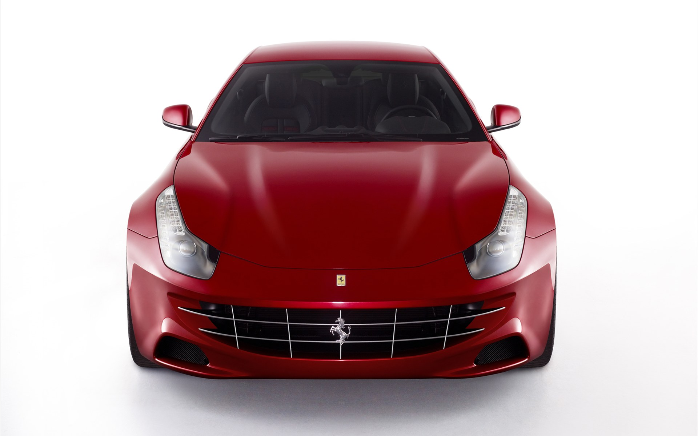
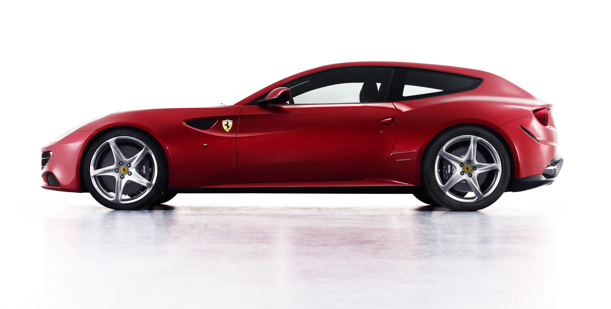
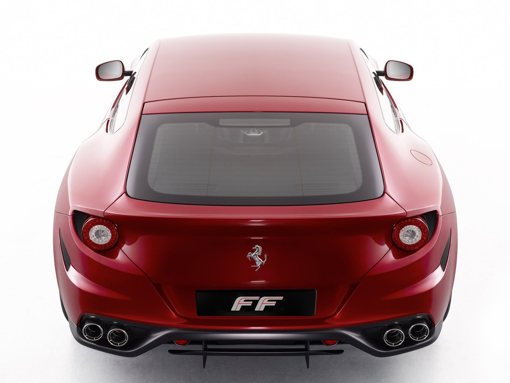
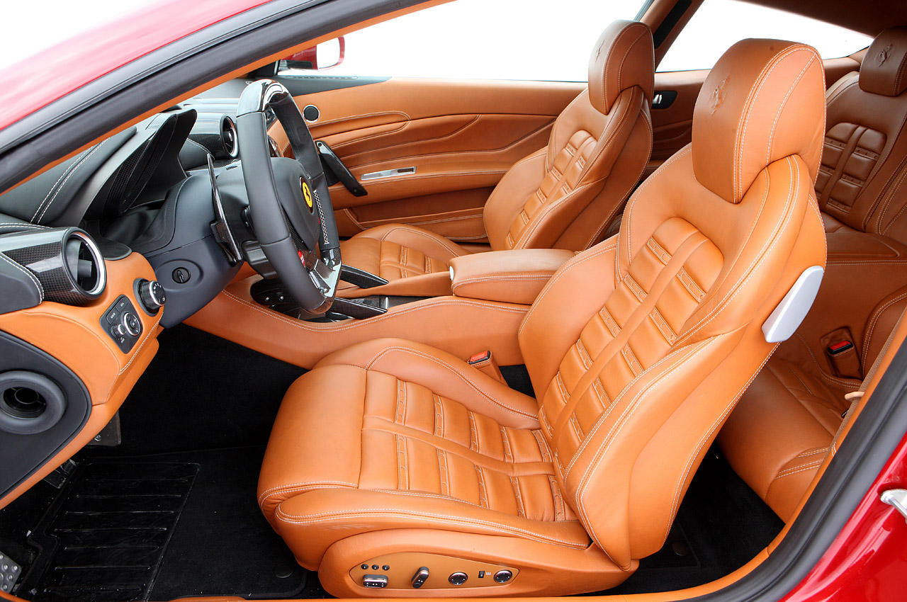
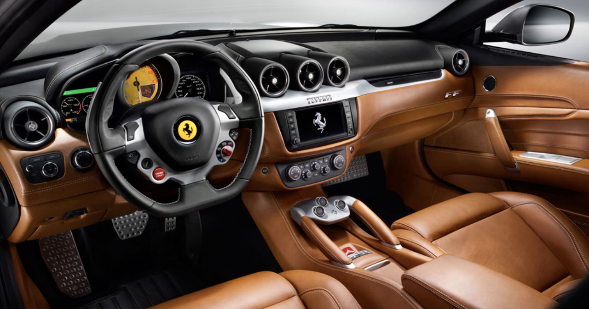
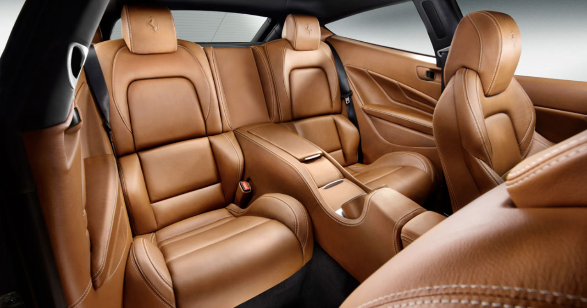

### Dört kişilik adrenalin

Müşterilerden gelen ısrarlı talepler yeni segmentlerin oluşmasında belirleyici oluyor. Bir süper otomobili şehir içerisinde dört kişi ile birlikte rahatça kullanabilme arzusu Maranello’daki tasarımcıları yeni bir otomobile yöneltmiş. Geçtiğimiz senelerde dört kişilik süperlerle başlayan rekabet, bu kez Ferrari FF ile daha anlamlı hale gelmiş. Gerçi markanın dört kişilik kabini ile 612 Scaglietti’sini daha önceden tanımıştık. Ancak günlük kullanım ve pratik sürüş isteği radikal çizgili FF’in doğumuna yardımcı olmuş. Otomobilin geleneksel Ferrari çizgilerine aykırı fotoğrafı ilk bakışta BMW Z3 M Coupe’yi hatırlatıyor. Fakat işin içerisine dikkat unsuru girdiğinde inşadaki zarafet belirginleşiyor. Genel olarak bazı fanatikleri ikna etmek kolay olmayacak gibi görünüyor. Zira onlarca senenin alışkanlık yarattığı heyecan verici çizgilerin değişmesine alışmak kimileri için zaman alabilir. Tam burada otomobilin arka kısmındaki tasarımdan bahsetmek gerek. Dört kişiyi bagajlarıyla birlikte taşımak, taşırken de rahatlıktan ödün vermemek ihtiyacı bu formu ortaya çıkarmış. Neticede yeni otomobil önden arkaya tüm ayrıntılarındaki oranları ile mükemmel bir silüete sahip. Bir stationun ya da sedanın hacmine sahip olmasa da (yapısal olarak bu sınıfta beklenemez) dört kişinin konforlu yolculuk etmesi için yeterli yer sunumu sağlanmış. Arka koltukların gerektiğinde katlanabilmesi sayesinde bagaj için epeyce yer kazanılmış oluyor.

Ferrari FF’te öne yerleştirilmiş, 650 HP gücünde, V12, tasarımı yeni bir motor bulunuyor. Maksimum gücü 8000 d/d’da elde eden motor, firmanın ilk direkt enjeksiyonlu güç ünitesi. 6000 d/d’da elde edilen 683 Nm’lik çevirme gücünün ilk 500 Nm’lik torku, henüz daha 1000 d/d’da iken gerçekleşiyor. Motordaki devre kesici ise 8000 d/d’da devreye giriyor. 6262 cc hacmindeki motorun 0-100 km/s hızlanması 3.7 saniye olarak verilmiş. Maksimum hız ise dört kişilik bir otomobil için cesaret arttırıcı. 335 km/s’lik son sürat ise yeni motorun, 599’un 6 litrelik motorundan 32 HP daha güçlü olmasından kaynaklanıyor.

FF, amortisörlerin yapısı ve kalitesi bakımından da ilkleri yaşatıyor. Üçüncü nesil “magnetorheological” adı verilen amortisörlerin sürüş üzerindeki pozitif etkisi tartışılmaz seviyede. Bozuk zeminlerde dahi sürücü ve yolculara adeta düz zeminde ilerliyormuş zevki yaşatan sistem, sarsıntısız çalışıyor. Hatta sürat arttırılsa dahi sistemin karakteristik yapısı bozulmuyor. Otomobildeki 4RM (Quattro Route Motrici) dört çeker sistemi çoğunlukla arkadan itişli olarak görev yapıyor. 200 km/s hızdan itibaren yalnızca arkadan itiş çalışan sistem, ön tekerlekleri kesinlikle devreye sokmuyor. Gerektiğinde (buz, ıslak, yağmur, çamur) çalışmaya başlayan sistemdeki çekiş hızı manettinonun hangi seçenekte olduğuyla ilgili. Seçenekler Comfort, Sport ve ESC Off konumlarını içeriyor. Tutunmanın derecesi ya da farklılık gösteren reaksiyon hızı, seçilen sürüş moduna bağlı. Sistemde diğerleri gibi orta diferansiyel veya ikinci bir şaft bulunmuyor. Öteki markaların ağırlıklarının yarısı kadar hafif çeken dört çeker sistemin diğer bir yeniliği ise torkun ön ve arka akslar arasındaki dağılımı için değil, otomobilin sağ veya sol tekerlekleri arasındaki dağılımı sağlaması. E-diff arka tekerleklere tork dağıtırken, PTU’daki çift debriyaj ise ön tekerleklere dağıtıyor. 7 ileri çift kavramalı şanzıman E-diff diferansiyelle birlikte arka aksa konumlandırılmış. PTU adı verilen ön aksın üzerindeki güç ünitesi ise her tekerlek için birer adet, bir çift yağlı debriyaj ile gücü öne aktarıyor.

FF’in kabini tipik bir Ferrari görünümü içinde. 458’i hatırlatan direksiyon üzerinde far, sinyal, silecek, süspansiyon ayar butonları, stabilize kontrol şalteri ve start/stop düğmesi bulunuyor. Vites değişim pedalcıkları ise direksiyonun arkasında her zamanki yerine yerleştirilmiş. Ön konsoldaki analog/digital saat ve göstergelerin yerleşim planı son derece şık ve profesyonelce konumlanmış. Yolcu koltuğunun karşısında konsol üzerindeki hız, devir, anlık sürüş verileri ve şasi ayarlarını yolcuya gösteren göstergeler ise opsiyonel satın alınabiliyor. Koltukların deri, karbon-fiber kombinasyonu görsel olarak Ferrari’ye yakışır cinsten. Uzun burunlu otomobilde arka görüş biraz kısıtlı olsa da, genel olarak etrafı rahatça görmek mümkün. TFT ekran sayesinde navigasyon, müzik sistemi, telefon gibi ihtiyaçlar kontrol edilebiliyor. 

Ferrari FF, yolda tutunması ile de şaşırtıyor. Sürücüsüne keyifli anlar yaşatan otomobildeki 650 HP’lik gücü, Pirelli lastikler üsleniyor ve görevini hakkı ile yerine getiriyor. Dört çeker otomobillerin hızlı girilen virajlardaki karakteristik arkadan kayma isteği FF’te yaşanmıyor. Viraj içerisinde dahi stabilitesini bozmayan otomobil, şaşırtıcı bir momentumla girdiği virajdan çıkabiliyor. Ancak, illa arkadan kaydırmak isteniyorsa, sadece ikinci vites esnasında kaydırma başarılabiliyor. Şasi ve kasa, viraj içerisinde yanal baskı gördüğü anda, sağa veya sola verilen kontra sayesindeki ağırlık transferi ile kaydırma mümkün olabiliyor. Otomobil, ancak kısa bir süre için izin verdiği bu keyfe anında müdahale ediyor ve çizgisini bozmuyor. ESC’yi kapatmak dahi klasik anlamdaki kaydırmalara izin vermiyor. 1880 kilogram ağırlığındaki otomobili hata yapılmadığı sürece yoldan çıkartmak zor görünüyor. Elektronik park frenine sahip FF, karbon-seramik disklerle donatılmış. Seramik frenlerin tepkisi ve sürtünme hissi yapılan sık frenlemelerde dahi performansından bir kayba uğramıyor. Egzosdan gelen armonik sesler ise sürücüsünü tahrik ediyor.

Ferrari’nin verdiği müthiş sürüş tepkisinin tadına, dört kişiyle varmak isteyen birçok müşterinin dileği firma tarafından özenle yerine getirilmiş. Süperler dünyasının efsanevi ismi istekleri göz ardı etmeden ve ödün vermeden yeniliklerine devam ediyor.

