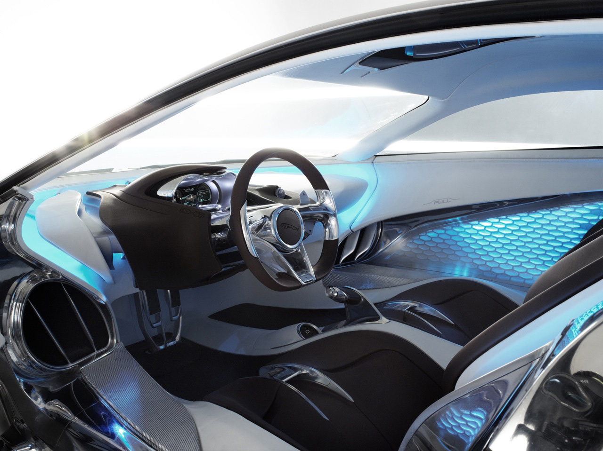

## Gerçek mi, bilimkurgu mu?

Hayalindeki rüyayı henüz görmeden gerçekleştirme şansını yakalayan biri varsa, kesinlikle Ian Callum’dan başkası olamaz. Callum, seneler önce bilimkurgu filmlerinde gördüğümüz otomobillere benzeyen ve gerçekte rastlamadığımız bir “harika” ile supercar takipçilerini büyülüyor. Markanın 75. yılı için hazırlanan C-X75, sadece iç gıcıklayan duygusal görüntüsü ile şaşırtmıyor. Otomobil, içsel yapısı açısından da geleceğin teknolojisini gözler önüne seriyor. C-X75’teki mühendisliğin geldiği nokta, daha önce rastlanan cinsten değil. Otomobilin kabininin arka tarafındaki motor bölümünde motor bulunmuyor. Alüminyumdan üretilmiş iki adet gaz türbini motor bölümüne yerleştirilmiş. Üçer kilogram ağırlığındaki jet türbinlerinin her biri 95 HP gücünde ve döndüklerinde 80.000 d/d’ya çıkıyorlar. Türbinin her biri direkt olarak kendi jenaratörüne bağlanmış. Son derece kompakt olan türbin ve jeneratör ağırlıklarının toplamı ise sadece 35 kg. geliyor. Jetlerde kullanılanlara kıyasla çok küçük olan gaz türbinlerinin sıkıştırma potansiyeli oldukça yüksek. Departman sorumlusu Tony Harper’e göre: Daha çok trafolarda kullanılan elektrik elde edici türbinlere benzeyen yapılanma, hafiflikleri nedeniyle jet uçaklarında kullanılan afterburner’lara benzemiyor. Otomobilin sürücüsü, “track” modunda elektrik motorlarını beslerken “normal” modda bataryaları şarj edebilmek için türbini devreye sokuyor. Select fonksiyonu ise arada seçim yapabilmek için kullanılıyor.

Maksimum hızı 325 km/s olarak belirlenen otomobilin akselerasyonu da rakip otomobillere benzemiyor. 0-100 km/s’e ulaşması 3.4 saniye sürüyor. Normal olan bu değer, 160 km/s’e ulaşıldığında 5.5 saniye gibi olağanüstü bir performansı yakalıyor. 300 km/s’e 15.7 saniyede çıkan C-X75, 400 metreyi sadece 10.3 saniyede geçiyor. Bu şaşırtıcı değerlerin nasıl gerçekleştiğine baktığımızda, ilk olarak otomobilin her lastiğinde 200 HP gücündeki ve 400 Nm torka sahip elektrik motorlarını görüyoruz. Süspansiyonların iç/alt kısmına monteli motorların tanesi 50 kg. ağırlığında. C-X75, elektrik motorları ile 100 km’yi 0 emisyonla gidebiliyor. Dört çeker karakterli otomobildeki sistem, (torque-vectoring) ana bilgisayar yardımı ile tüm gücü her elektrik motoruna ayrı ayrı yardım gönderiyor. Otomobilin ağırlığının 1350 kg. olduğunu düşünürsek, toplamda 800 HP güç ve 1600 Nm’lik çevirme gücü ile karşılaşıyoruz. Bu sonuç ton başına 587 HP’ye denk gelen gücü ifade ediyor. Ton başına ortaya çıkan tork miktarı ise 1185 Nm’lik gücü ile daha da etkileyici. Elektrik motorlar lityum-iyon bataryalardan (19.6 kWh) güç alıyor. Şehir prizlerden 6 saatte şarj olabilen pillerle 109 km menzil elde ediliyor. Ancak esas bomba, bu pillerin otomobilin arkasındaki iki mikro gaz türbini ile şarj olabilmeleri. İngiliz havacılık endüstrisinden Bladon firması aracılığı ile temin edilen su soğutmalı mikro jetler kendi güçlerini 60 litrelik dizel yakıttan elde ediyor. Bu arada fuel-oil veya LPG gibi diğer yakıtları da tercih etmek mümkün. Dolu bataryalarla ve ikinci bir şarja gerek kalmadan C-X75, 896 km’lik menzile erişebiliyor. Otomobilin ortalama yakıt tüketimi ise 100 km’de sadece 6.7 litre. Türbinlere yeterli miktarda hava iletme meselesi Callum ve ekibinin karşılaştığı zorluklardan birisi olmuş. Sorun, kapı altındaki zarif çizgili devasa hava girişi ve tavandaki diğer bir girişle çözülmüş. Sıra dışı yüksek devirden dolayı aşırı havaya ihtiyaç duyan türbinler, dakikada 70.000 litre havaya ihtiyaç duyuyor. Diğer süper otomobillerin ortalama 7500 litrelik hava ihtiyacı ile karşılaştırıldığında, sistemin içten yanmalı motorlarla olan farkı ortaya çıkıyor. C-X75 tek kademeli şanzımana sahip ve üç farklı sürüş modu var. (EV, Standart, Track) Seçilen mod sesleri birbiriyle aynı. Ancak Jaguar mühendisleri farklı modlardaki sürüş keyfini arttırmak üzere sentetik sesler üzerindeki çalışmalarına devam ediyorlar. 

İç mekana gelince; kabin içine, mavi ve buz beyazı renkli led aydınlatma hakim. Adeta bir uzay gemisi içinde hissettiren ön panelde, Bowers & Wilkins marka tam 120 adet parlak mikroağ (nano teknoloji) hoparlörlerden oluşan ses sistemi bulunuyor. Otomobilin içindeki sürücü ve yolcu, bal peteği formundaki hoparlörler sayesinde gaz türbinlerinin gürültüsünden uzak tutuluyor. TFT ekranlı panelde iki adet büyük gösterge var. Alternatif enerji sağlayan türbin devirleri bu göstergelerden izleniyor. Ortadaki renkli ekran ise yardımcı monitörü ile birlikte yol bilgisayarı bilgilerini, tur zamanlarını, sıcaklıkları ve sıvı seviyelerini gösteriyor. Göstergeler “touring” (sürüş hızı-menzil), “Vmax” (hız-güç) ve “heritage” (analog) modları arasındaki seçimleri görmeyi sağlıyor. Koltuklar sabit monte edildiğinden konsol, pedallar, direksiyon ve gösterge tablosu sürücü tarafından elektronik kontrollü olarak ayarlanabiliyor. Vites topuzu, uçaklardaki motor kontrol kollarından ilham alınarak tasarlanmış. Kolun yanında bulunan düğmeyse türbinlerin maksimum devri için kullanılıyor.

Otomobildeki ileri mühendisliği her ayrıntıda görmek mümkün. Jaguar C-X75’in altındaki hava akışını kontrol altına almak için epey uğraşılmış. Özellikle otomobilin arkasındaki hava kanalları ve karbon-fiber difüzör ilk göze batan unsurlar. Yüksek hızlardaki yere basma gücü, türbinlerin ikisi devreye girdiği anda egzos gazlarının difüzöre gönderilmesiyle sağlanıyor. Türbinler için sağlanan hava ise sabit koltukların arkasındaki hava kanalcıklarından iletiliyor. Kabin içindeki ergonomi otomobili farklı noktalara çekiyor. Kuğu kanadı şeklinde açılan kapılardaki zarafet olağanüstü. Jantların tasarımı muhteşem. Büyük tasarım lastikler, önde 265/30 ZR21, arkada ise 365/25 ZR22 ebatları ile sunuluyor. Üstelik lastiklerin bir sıra deseni çevreciliği temsil eden yeşil renkle boyanmış. UQM imzalı ve Jaguar için hazırlanan yazılım, içerisinde çekiş kontrol sistemini, stabilite kontrol sistemini ve lastik tork dağıtım sistemini barındırıyor. Lityum fosfat enerji hücreli dört jeneratör ve motoru bir oranlı (1 ileri) şanzımanı besliyor.

Otomobilin yazılımlarına etki etmeden veya zarar vermeden çıkılacak maksimum ve ideal süratin 221 km/s olduğu belirtiliyor. Bu hızda tam güçle çalışan iki türbin sayesinde bataryaları şarj etmeksizin, sadece enerji elde ederek uzun süre kullanmak mümkün olabiliyor. Eğer 160 km/s sabit hız seçilirse türbinin biri şarj ederken diğeri güç üretiyor. Anlaşılacağı üzere, bir takım kısıtlı olanaklar ortaya çıkmasına rağmen, faydalar çok fazla. Zira teknoloji ve inovasyonlar henüz çok yeni. Otomobilde ahşap malzeme bulunmuyor. Nereye bakarsanız yarı saydam materyallerle karşılaşıyorsunuz. Deri ve krom kesinlikle yok. Ancak suni kauçuk ve teatral malzemeler sıkça kullanılmış. Otomobil teknolojisi için dönüm noktası sayılabilecek Jaguar C-X75, mühendislerin taze fikirleri, kusursuz işçiliği ve kompozit malzemeleri ile dahice hazırlanan bir sanat eseri olduğunu kanıtlıyor.

