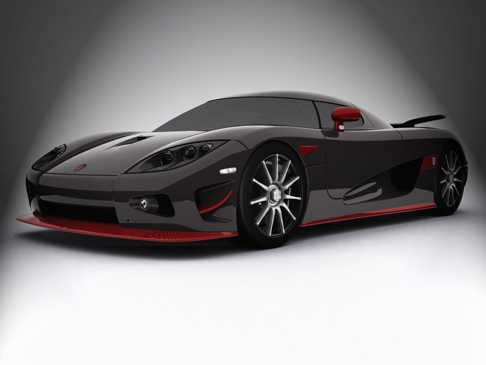
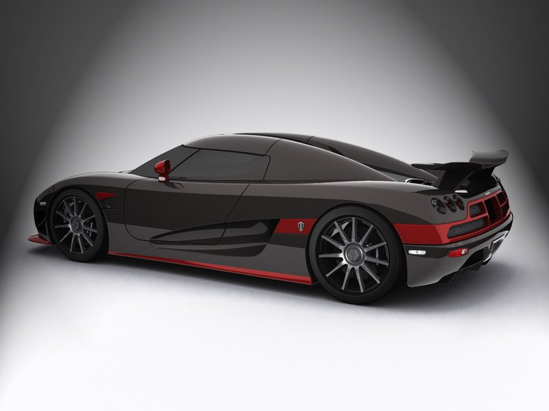
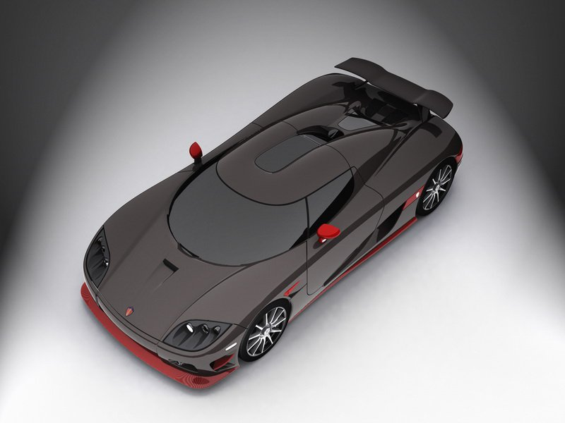
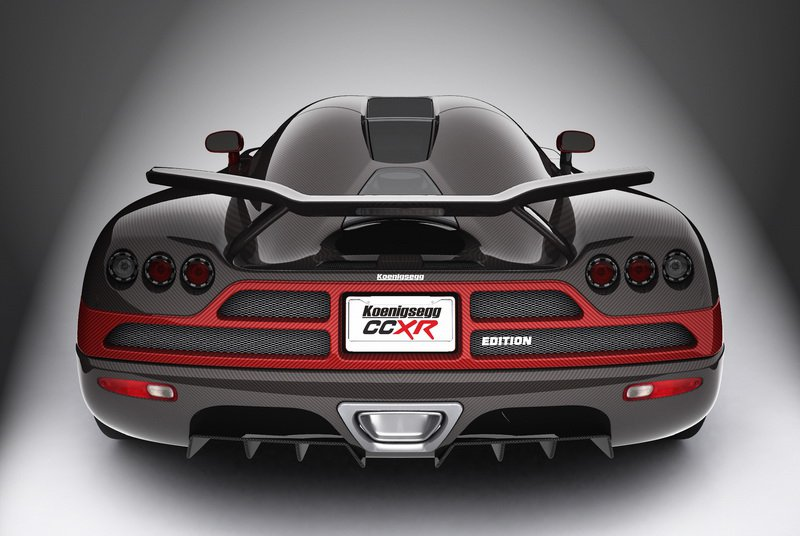
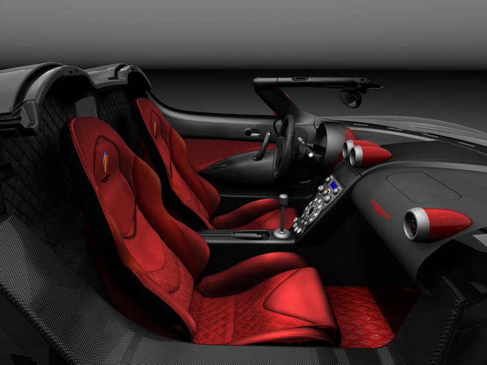

### Gezegenin geleceği ucuza mal olmayacak

Son yıllarda çevreci politikaların gelişmesine paralel olarak yeni yakıt türü bioetanole olan ilgi büyük ölçüde artış göstermeye başladı. Güncel yakıt türleri gibi petrolden elde edilen etanol, şeker, şeker kamışı, kereste ve nişastanın fermantasyonu ya da damıtma işlemiyle bioetanole dönüştürülüyor. Kimyasal etanole kıyasla güneşin kullanılabilir enerji seçeneğine dönüşebilme özelliği bu çevreci yakıtın yeni enerji kaynağı olarak tercih edilmesini sağlıyor. Bugünün teknolojisi (elektrik enerjisini saymazsak) fosil yakıtların yerine geçebilecek tek seçeneğin bu olduğunu gösteriyor. Yakıtın içerisindeki bitkisel karışımın karbondioksit gazını emme özelliği çevreye bırakılan egzos emisyonunu azaltması bakımından son derece önemli. Ancak bu durumda karşımıza çıkan ters orantı düşünmeye değer yeni bir problemi ortaya çıkarıyor. Yani dünyadaki tarım alanlarının yaklaşık dörtte üçünün sadece yakıt tüketimi için kullanılması söz konusu. Nitekim bir depoyu doldurmak için insanın bir yıllık mısır ihtiyacına eşit miktarda tarım alanına ihtiyaç duyuluyor. Anlaşılan gezegenin geleceği ile ilgili çalışmalar ucuza mal olmayacak.

Süper otomobillerin de çevreci olabileceğinin bir kanıtı olan CCXR %85'i etanol, %15'i benzin karşımı olan E85 kodlu bicetanol ile çalışıyor. Isveçli firma kendine rakip olarak Bugatti Veyron'u seçmiş. (Bkz. Egelife s.55) Seçim mantıklı görünüyor; zira Koenigsegg 1004 HP gibi sarsıcı bir güç üretiyor. Bir önceki versiyon olan CCX 806 HP gücü ile Veyron'a karşı yetersizdi. CCXR'de kullanılan 104 oktanlık E85'in 198 HP'lik performans fazlası logodaki "R" harbin artı getirisini ortaya koyuyor. 400 km/s üzerine çıkabilen otomobil sahip olduğu vahşi gücü kaputun altındaki 4.8 litrelik çift kompresörlii V8'den alıyor Motor standart yüksek oktan benzinle de çalışabiliyor. Fakat bu durumda çalışan motor daha fazla yakıta ihtiyaç duyarak ortalamada 100 km için 23.5 litre yakıyor. Viraj içersindeki yanal kuvvetin 1.4 G'ye ulaştığını belirtmemizde fayda var. Zira CCXR yalnızca 1280 kg ağırlıktaki dökme alüminyumdan imal edilen motor önceki versiyonlardan 200 kg daha hafif. 1004 HP'lik güç Veyron'dan 3 HP fazla olmasına rağmen 0-200 km/s hızlanması için 8.9 saniye istiyor. (Veyron 7.4 saniye) Bu arada çok ciddi bir rakip olan 1183 HP'lik SSC Aero'yu ayrıca inceleyeceğimizi belirtelim. Otomobilin fiyatına göz attığımızda 1.55 milyon euro'luk Veyron Hermes'ten ucuz olduğunu görüyoruz. CCXR'nin satın alınabilmesi için 1.5 milyon euro olması gerekiyor. Isveçli üretici firmanın sahibi Christian von Koenigsegg 6 adet bio-yakıtlı, 14 adet benzinli olmak üzere toplam 20 adet "Edition" üretmeyi planlıyor. 1994 yılında kurulan firma 2001- 2007 seneleri arasında toplam 55 adet otomobil satmış. Mart ayında satışa sunulan CCXR Edition gerçek bir çevre dostu. Yeni bir motor yönetim sistemi bulunan otomobilin benzin pompaları ve silindir başına iki adet olan yakıt enjektörleri yeniden tasarlanmış. Pistonların da değiştirildiği V8 motorun sıkıştırma oranı 9:2.1'e çıkarılmış. Yüksek basınçla başa çıkabilmek için endüksiyon bobini, bujiler ve Rotrex marka iki supercharger'in pervane kasnakları da revizyondan geçmiş. Turbo basıncı ise 1.3 bardan 1.6 bara yükseltilmiş. V8'in 6000 d/d üzerindeki performansı ve çevreye hiçbir zararlı gazın atılmayışı insanı şaşkına çeviriyor. Otomobil tam gaz kullanıldığında bile egzos boruları pırıl pırıl kalıyor.

Otomobili ayrıcalıklı kılan diğer özelliklerine baktığımızda öncelikle Ingiliz Aerospace şirketinin hazırladığı karbonfiber gövde ile karşılaşıyoruz. Otomobilin tavanına balıksırtı formu verilmiş. Tavandaki akıcı form arkadaki dikkat çekici kanada kadar devam ediyor. Yenilenmiş arka kanat down-force gücünü belirgin seviyede artırrnış. Kanat ve otomobilin gövdesindeki karbon-fiber parlak vernikle kaplanarak her türlü ışıkta mükemmel bir görüntü elde edilmiş. CCXR saatte 250 km/s hıza ulaştığında arka kanadın yere basma gücü 350 kg'a ulaşıyor. Otomobilin dengesi için söyleyecek hiçbir şey yok. Aerodinamik dengeyi korumak amaçlı olarak önde hava dağıtıcı ile iki adet kanatçık kullanılmış. CCXR Edition kaya gibi bir stabilizeye sahip. Otomobilin dinamizm özellikleri gerek yüksek hızlarda, gerek bozuk satıhlarda dengesini bozmadan ilerlemeyi sağlayabilecek kalitede ve tüm ayanlar değişken sürüş şartlarına göre yapılmış. Koenigsegg sürüş verilerini sürücüsüne anında ileten hassas bir direksiyonla sunuluyor. Ancak direksiyondan kumandalı vites kutusu opsiyonel satın alınabiliyor. CCXR yüksek verimli süper bir otomobil olarak hiçbir zorlanma ya da titreme yaşatmıyor. Viraja girerken gaz kesilmesi durumunda dahi (lift-on) rijitliğini bozmayan otomobil inanılmaz torku ile tamamen duyulara hitap ediyor. Sürücünün göğüs kafesini zorlayan çılgın otomobil aynı zamanda bir o kadar da güven duygusu veriyor. Otomobilin yere sağlam basması için önce karbon-fiber jantlar takılması düşünülmüş. Ancak görüntüde tezat yaratmak için çok kollu dövülmüş alüminyum jantlar tercih edilmiş. Ağırlığı aşağı yukarı karbon kadar hafif jantlar önde 19 inç, arkada ise 20 inç. Dodiklerin altına yerleştirilmiş jantlar, önde 9 kg, arkada 10.2 kg'a düşürülerek son derece hafifletilmiş.

CCXR'nin vites kutusu Xtrac tarafından geliştirilen otomatikleştirilmiş manuel (AMT) 6 ileri tip olarak sunuluyor. Otomobilde bundan önce de başarılı şaruımanlar görmüştük. Ancak bu kez değiştirme sırasında düz vitesin geçiş hissi yaratılmış. Daha hızlı değişim için "Super synchro" adı verilen sistem kullanılmış. Sistem vites değişimi sırasında krank mili hızını otomatik olarak ayarlıyor. Arkadan itiş otomobilin diferansiyeli ise sınırlı kaydırmall. Elektronik motor yönetimi bioetanol'le beslenen 1004 HP'yi kusursuzca idare ediyor. Maksimum tork ise 5600 d/d'de 1079 Nm gibi devasa bir rakam ile karşımıza çıkıyor. Yeni şanzıman motorun vahşi gücünü neredeyse kayıpsız olarak ve tekerleklere baş döndürücü bir şekilde aktarabilen cinsten.

Limitlerde kullanım için mutlaka eski bir uçak pistine ihtiyaç duyulan Koenigsegg, O'dan 100 km/s'ye sadece 2.9 saniye gibi ürkütücü bir zamanda ulaşıyor. Fabrikanın açıkladığı son sürat ise 408+km/s. Otomobilin kalkış anındaki sahip olduğu güç son derece etkileyici. Dünyadan ayrılış duygusu yaratan ivmelenme için sıradan ve benzinli çalışan motorlara kıyasla üçte bir oranında daha fazla yakıt gerekiyor. Ancak bu yakıtın kullanımı için Isveç hükümeti teşvik verdiğinden bu ülkede yaşayanlar daha az vergi ödüyor. Otomobil sadece aerodinamik görüntüsü ile büyülemiyor. CCXR içeriden incelendiğinde de çok zevkli bir otomobil. Yenilenen kokpit ile içerisi daha modem bir görünüme kavuşturulmuş. Eğlence otomobile girerken başlıyor. Hava girişinin arkasındaki bir düğme LCD kapıları otomatik olarak yukarıya doğru açıyor. Içeriye girildiği anda sürücü ve yolcııyu kırmızı sportif koltuklar karşılıyor. Oda konsoldaki normal boyutlardan uzunca yerleştirilmiş yuvarlak katlı gri vites kolu çok şık tasarlanmış. Turbo basıncı devir saati ve hız göstergesinin bulunduğu set ise "Chronocluster" donanım paketi ile sunuluyor. Diğer otomobillerden farklı gibi duran paket alışıldıktan sonra tüm bilgilere ulaşmakta kolaylık sağlıyor.

CCXR'nin frenleri de son derece etkili. Fren pedalına basıldığında ortaya çıkan ters G kuvveti sürücüyü öne doğru inerek emniyet kemerin de asılı bırakıyor. Gaza tekrar basıldığında ise bu kez koltuğa yapıştıran şok edici bir güçle karşılaşılıyor. Bu kadar fazla güce karşılık 1280 kg'Ilk ağırlık şok edici ve eğlenceli bir sürüş sağlıyor. CCXR'nin çekiş kontrol sistemi kapatılmaya kalkıldığında ise eğlence riske dönüşebileceğinden tehlikenin bertaraf' için ehil eller gerekiyor. Kapalı çekiş sistemi otomobili adeta asfalta yapıştırlyor. Michelin P Sport 2 lastikler tüm gücü yola iletiyor. Karbon-seramik frenlerde önde 280x34 genişliğinde diskler ve 8 pistonlu Brembo balatalar, arkada ise 362x32 genişliğinde 6 pistonlu AP Racing balatalar kullanılmış.

