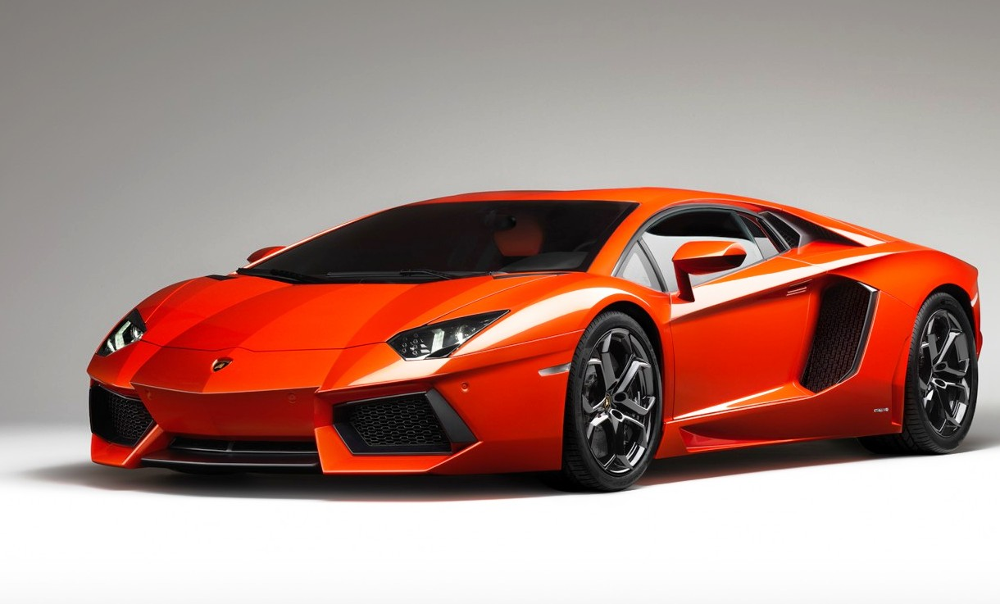
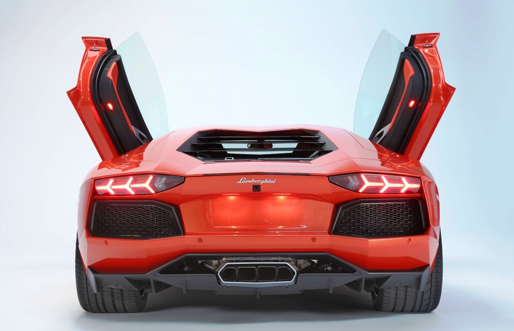
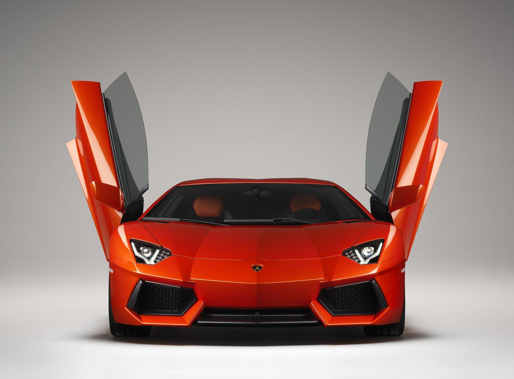
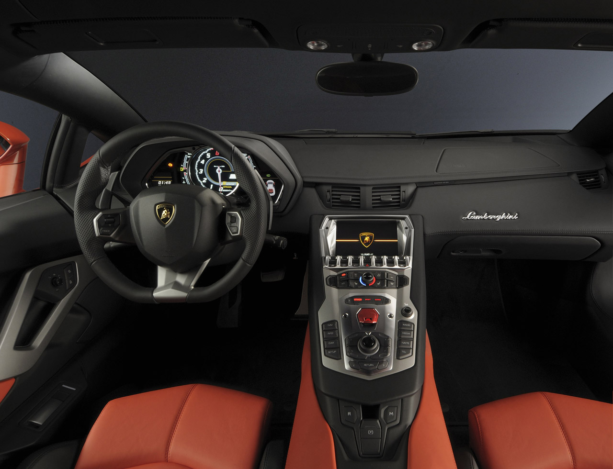
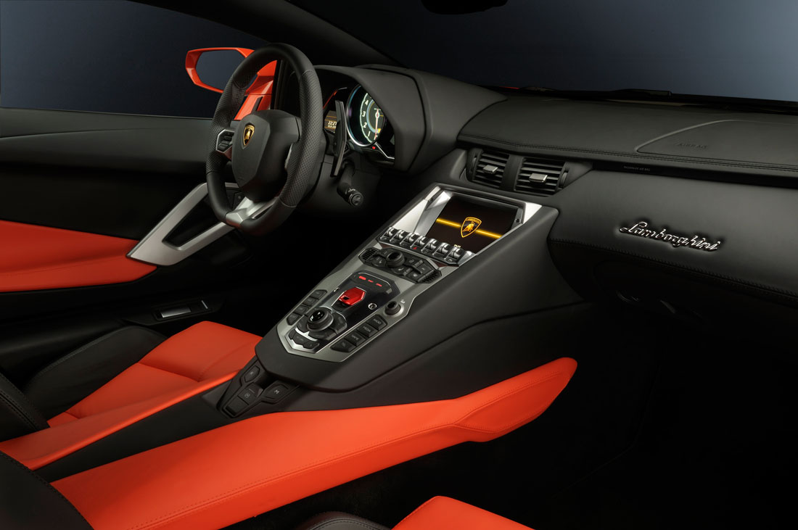
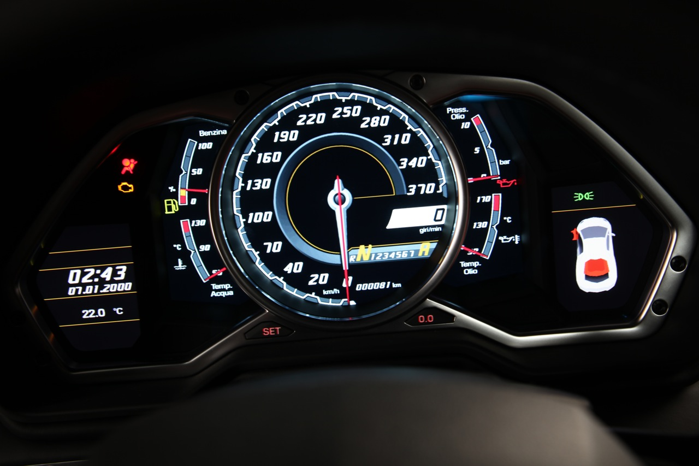
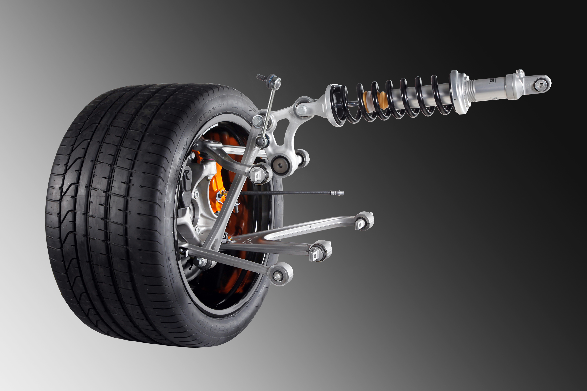

LP700 Aventador, bugüne kadar üretilen tüm Lambo’lardan, hatta bir önceki model Murceliago’dan dahi (her ne kadar görünüm benzerliği olsa da) çok farklı özel bir süper otomobil. Hele performans konusunda daha öncekilerin esamesinin bile okunmayacağı rahatça söylenebilir. Nitekim geçmişe göz attığımızda, 0-100 km/s hızlanma ve maksimum hız skalası ile önceki boğaların azgınlık oranlarını karşılaştırma fırsatı yakalıyoruz. 6.3 sn – 263 km/s ile 1967’deki Mıura, 5.9 sn – 280 km/s ile 1974’deki Countach, 4.1 sn – 325 km/s ile 1987’deki Diablo ve 3.7 sn – 330 km/s ile 2001’deki Murcielago seneler içerisinde artan performansı gösteriyor. 2011’deki LP700 Aventador ise 2.9 sn ve 350 km/s son sürati ile İtalyan firmanın çiftliğindeki (!) en azgın boğa olarak karşımıza çıkıyor.

Otomobil ismindeki “700” ibaresini, yeni 700 HP’lik 12 silindir motorundan alıyor. 6498 cc hacmindeki 48 valf, V12 motor, 700 HP’lik gücünü 8250 d/d’da ortaya çıkarıyor. 690 Nm’lik tork ise 5550 d/d’da tekerleklere aktarılıyor. Yeni motor birbirinden 6 derece açıyla ayrılmış iki sıra 6 silindirden oluşturulmuş. Bir önceki motordan 18 kg daha hafif olan motor, şasi üzerindeki yuvasına 60 mm daha aşağı yerleştirilmiş. Daha ilk çalıştırıldığı anda gerek sesi, gerekse tepkilerinden farklı bir yapılanması olduğunu hissettiren güç ünitesi, selefinden 250 d/d daha sonra tam devrine ulaşıyor. 6.5 litrelik motor Murcielago LP640’dan 60 HP, 760 HP’lik SV serisinden ise 30 HP daha fazla güç üretiyor. Aynı hesap yeni otomobilin torku için de geçerli. 43 HP’lik artı çevirme gücü LP640’tan 43 Nm daha fazla. Otomobilin gücünü anlamak için biraz rakamlarla boğuşmak gerekse de, maksimum sürat olan 350 km/s’yi kolaylıkla anlamamız için gerekli. Yeni ortaya çıkan her makineyi Veyron’la mukayese etmek gibi bir gelenek oluştu. Veyron’daki 431 km’lik son sürat şimdilik hayal olsa da, markanın patronu Stephan Winkelmann’a göre gelecekteki otomobillerde son süratten ziyade ağırlık/güç oranları ve akselerasyona konsantre olunacak. LP700’deki ekstradan elde edilen güç ile birlikte 90 kg’lık eksi ağırlık, otomobilin 2.9 sn’de 0’dan 100 km/s’ye çıkmasına neden olmuş. Ton başına elde edilen güç ise 400 HP’yi gösteriyor. Sonuç olarak dünyadaki en hızlı süperlerden birisi ile tanışıyoruz. 2000 d/d’da başlayan güç aktarımı kesintisiz olarak 8550 d/d’ya ulaşıncaya kadar devam ediyor. Otomobil yalnıza hızı ile değil, hızı kontrol edebilme kabiliyeti ile de öne çıkıyor. Çünkü 2.9 saniyelik akselerasyon, yetersiz bir sürücünün karayolu üzerinde halüsinasyon görmesine neden olabilecek kadar hızlı.

LP700’deki şasinin motor etrafındaki takviyeleri aliminyumdan imal. Kokpit için ise karbon kullanımı ağırlıkta. Tüm bu çalışmalar için bu modelde de Boeing ile ortak çalışmalara devam edilmiş. Şasi, tamamen monokok dizaynı ile son derece güçlendirilmiş ve sertlik ayarı eskisine kıyasla %150 oranında arttırılmış. Aventador’daki kapılar geleneksel olarak yukarı açılıyor. Ancak küçük bir farklılık yaratan kapı kolu, bu kez yukarı değil iç tarafa monte edilmiş. Otomobilin silüetinde de ayrıntılar çok fazla. Basık ve geniş ölçüler önceki modellerden daha fazla çizgi içeriyor. Çizgi uyumu özellikle arka cam üzerinden tavana kadar süren detaylarda muhteşem görünüyor. Kaput üzerindeki havalandırma ızgaraları ise yeni otomobilin kaslı yapısını daha da güçlendirmiş. Şıklık, agresiflik ve aerodinamik çizgilerin harmanlandığı mükemmel gövde, 20 inç jantlar ve Pirelli’nin P Zero Corsa 335 lastikleriyle birlikte otomobili seyredene haz veriyor.

Lamborgini LP700 Aventador, sürücünün ideal sürüş pozisyonunun ayrıntıları ile düşünüldüğü bir iç mekana sahip. Direksiyon açısı sürücüye yaklaşık ancak, eskisinden daha yatay konumlandırılmış. Emniyet kemerleri standart formu ile takılıyor. Audi yönetiminin kaliteye verdiği önem ve teknolojik alt yapı LP700’ün iç mekanına yansımış. Audi kendi otomobillerinden hiçbirinde Aventador’daki gösterge panellerini kullanmamış. Daha önceki MMI kontrol paneli yerine bu kez Ingolstadr teknolojisini içeren panel bulunuyor. Fazla renkli, iç içe tasarımlı sanal göstergelere alışmak ve rahat okuyabilmek otomobilin o anki süratine bağlı.

Dört tekerlekten çekişli otomobil 7 ileri, sıralı, manuel şanzımanla sunuluyor. Şanzıman, ağır ve pahalı olması gerekçesiyle çift kavramalı sistemi içermiyor. Intelligent Shift Rod (ISR-Akıllı Değişken Rot) adı verilen ve değişik rotların en yakındaki vitesi çalıştırdığı sistemde, vites değişim zamanları 50 ms’ye indirilmiş. Sistem üzerindeki sürüş modları ise Strada, Sport ve Corsa olarak adlandırılmış. Otomobilin tarihinde ilk kez olarak görülen bir diğer yenilik ise amortisörlerin ve yayların ön tarafa dik olarak (yarış tipi) yerleştirilmesi. Her sürüş modunda gövde kontrolünü mükemmel hale getiren yapılanma, hiçbir salınım veya yalpaya izin vermeden görev yapıyor. Corsa modu otomobili adeta kudurtuyor. Corsa modu açıkken Haldex diferansiyel oluşan torkun %60’ını ön tekerleklere aktarıyor. Karbon-seramik frenlerin etkisi ve hassasiyeti farklı sürüş modlarında dahi yeteneğinden bir şey kaybetmiyor.

647.667 Euro’luk etiket fiyatı yeni otomobili rakipleri arasında cazip kılıyor. Yılda 700 adet üretimesi planlanan Aventador, hafif, hızlı, verimli ve kolay kullanılabilirlik avantajı ile Lamborghini’nin bayrağını dalgalandırmaya hak kazanıyor.

