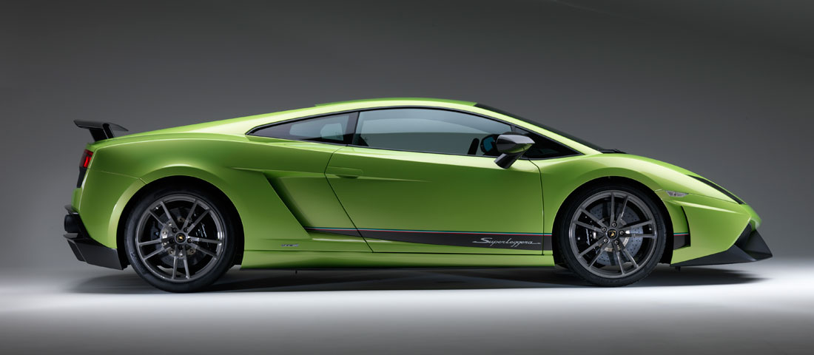
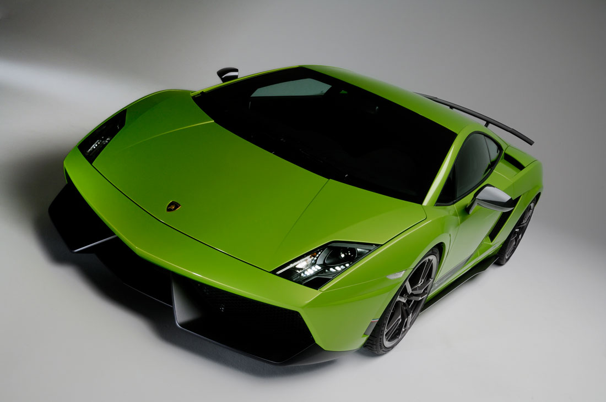
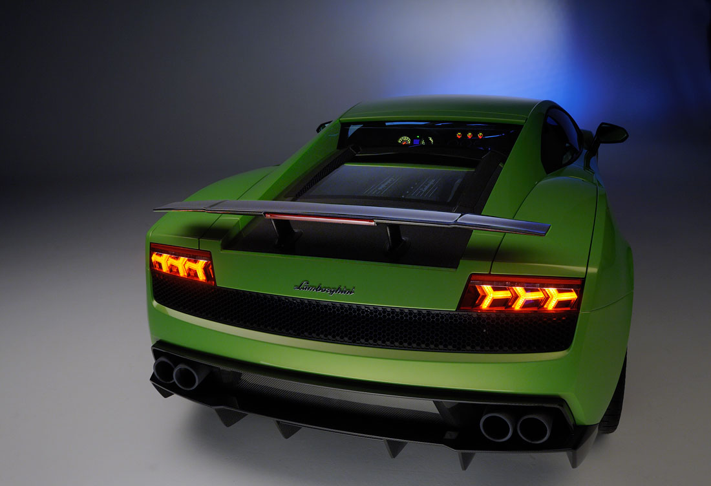
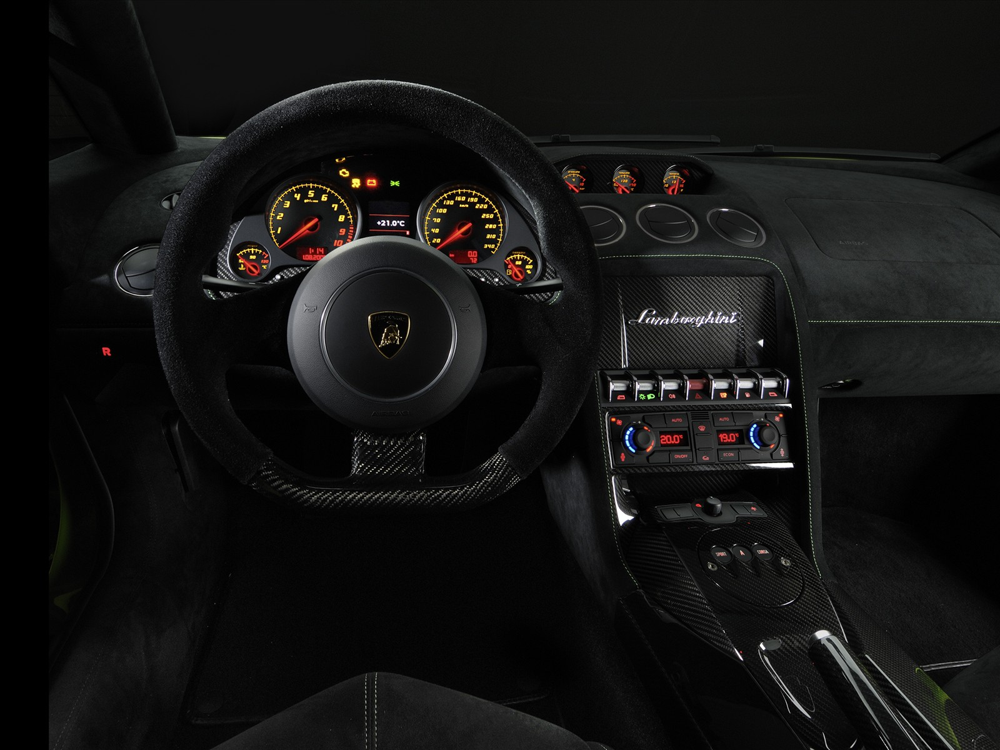

### Yeşilin sakinliği!!!

Enzo Ferrari’nin kendisi ile görüşme talep eden Ferrucio Lamborghini’yi red etmesi üzerinden tam 48 yıl geçti. O günden beri tüm Lamborghini çalışanları, mühendisinden test pilotuna kadar herkes, işin peşini bırakmıyorlar. Ürettikleri her modelin kesinlikle Ferrari ile mukayese edilmesini sağlıyorlar. Gerçi, yönetim dahil tüm çalışanlar Lamborghini’nin “farklı bir otomobil” olduğunu iddia etse de, dünya alem gerçek sebebin ne olduğunu onlarca senedir biliyor. Ve gelenek devam ediyor. Gallardo LP 570-4 Superleggera’ya bakıldığında, ya da incelendiğinde gözlerden kaçmayan yeni bir hedef görünüyor. Ferrari 458 Italia…

Markanın tahrik edici silüeti bu modelde fazlasıyla belirgin. Gallardo LP 560-4, dikkatlice ve elit bir makyaj sonucunda LP 570-4’e dönüştürülmüş. Makyaj ekibinin başındaki Maurizio Reggiani daha önceki birçok Lamborghini modelinden tanınan bir isim. Sant’Agata fabrikasından çıkan her otomobilde tasarımcının alın teri var. Özellikle karbon-fiber çalışmalarına katkısı ile öne çıkıyor. Otomobili seyredenlerin ağzının sulanmasını sağlayan usta tasarımcı, bu modelde de bol miktarda karbon-fiber kullanmış. Ağırlığı düşürmek için kullanılan karbon-fiber bu tarz otomobillerin kompozit yapıları için son derece önemli bir materyal. Şirket bu amaçla Washington Ünivesitesi ile ortak olarak “Lamborghini Otomobilleri Gelişmiş Kompozit Yapıları Laboratuarı”nı kurmuş. Şirketin CEO’su Stephan Winkelmann, karbon-fiber kullanımının CO2 emisyonlarını düşürdüğünü ve spor karakterin bozulmamasını sağladığını söylüyor. Boeing 787 Dreamliner projesi için de üniversite ile birlikte çalışmalar yapan Winkelmann, 2001 yılından itibaren Lamborghini’de kullanılacak “karbon materyaller” üzerindeki çalışmalara ağırlık vermiş. Nitekim, geçen seneler içerisinde Horacio Pagani ismini dahi, usta tasarımcı ile birlikte aynı konu üzerinde çalışırken görmek mümkün.

Ön-ortaya uzunlamasına yerleştirilmiş V10 motor, alüminyum alaşımdan imal. DOHC motor silindir başına 4 sübap ve değişken sübap zamanlaması programlı. 4805 cc hacmindeki motor yüksek oktan benzin kullanımı için yapılandırılmış. 8700 d/d’da 570 HP güç üreten motorun çevirme gücü 480 Nm. Ortaya çıkan tork ise 6800 d/d’da elde ediliyor. 0-100 km/s akselerasyon bir önceki motorla (LP 560-4) kıyaslandığında, 0.2 saniye düşürülmüş. Yeni motorla 3.5 saniyede 100 kilometreye ulaşılıyor. 0-200 km/s hızlanma ise 10.2 saniyede gerçekleşiyor. Kuru ağırlığı 1380 kilogram olan (motor yağı, soğutma suyu, şanzıman yağı, fren ve direksiyon hidrolik sıvıları olmadan ağırlık) LP 570-4 tüm yağ ve sıvılar tamamlandığında 1480 kilograma ulaşıyor. Otomobilin maksimum hızı ise 325 km/s olarak verilmiş. Sürücüsünü kudurtma markanın esas amacı olsa da, otomobilin dengesi ya da rijitliği konusundaki sanat, otomobilin rakamlarına bakıldığında hissediliyor. Örneğin 570-4 ibaresindeki 4, otomobilin dört tekerlekten çekiş olduğunu ifade ediyor. Markanın AR-GE direktörü Maurizio Reggiani, heyecanlandırıcı sürüşe sahip bir otomobilin dört çeker olması gerektiğini düşünüyor. Gallardo LP 570-4’ün viraj içerisinde veya viraj çıkışlarındaki çekişinin mükemmel olduğunu belirten direktör, sürüş keyfinden ödün veremeyeceklerini söylüyor. Ancak 30 kg daha ağır olmasına rağmen, 4x4 çekiş sistemi opsiyonel olarak satın alınabiliyor. Safkan İtalyan aygırı Gallardo 6 ileri otomatik şanzımanla sunuluyor. Diferansiyel ise limitli kilitli, VSC ve TRAC kontrollü. Ön ve arka süspansiyonlar ise çift salıncak, helezon yay, amortisör ve viraj çubukları ile bütünleştirilmiş.

Superleggera 570-4, abisi sayılan Murcielago LP 670-4 SV ile kıyaslandığında adeta aynı çizgilere sahip. Ancak tasarımın görselliği açısından otomobilin burun kısmındaki koyu renk siyah malzemeye rastlanmıyor. Yeniden elden geçirilen ön bölüm rüzgar tünelinde herhangi bir problem çıkartmamış. Öndeki mutlak yere basma gücü, arka taraftaki karbon-fiber difizörün daha da iyileştirilmesine ve otomobilin yola yapışmasına neden olmuş. Mümkün olduğu kadar diyet uygulanan otomobilde, ağırlığın azalması için gereken her şeyin yapılmasına rağmen, elektrikli camlar, ses yalıtımı, klima ve halılar gibi ihtiyaçlardan vazgeçilmemiş. Arka spoylerin ebadı küçük sayılabilir. Ancak daha büyük spoyler opsiyonel olarak alınabiliyor. Toplam olarak otomobil halefine oranla 70 kg daha hafif. Azımsanamayacak bu kilo kaybı motor kaputu, arka difüzör, marşpiyeller, arka spoyler, gövde altı ve aynaların karbon-fiber malzemeden üretilmesi sayesinde oluşmuş.

Kabin içerisindeki homojen görüntü her tarafın karbon-fiber olmasından kaynaklanıyor. Yeşil renk ile müthiş kontrast oluşmasına neden olan bu inanılmaz malzeme her yerde kullanılmış. Sparco koltuklar, kapı içleri, ön konsol ya da şanzıman tüneli tamamen karbon-fiberden. Ayrıca yan camlar inceltilmiş hatta motor bölümünün üstündeki cam yeri polikarbonattan imal edilmiş. Tüm bağlantılar veya vidalarda ise titanyum kullanışmış. Jantların alüminyum olması ise toplamda 13 kg daha tasarrufa neden olmuş. Sonuç olarak Superleggera’nın güç/ağırlık oranına baktığımızda 384 HP/ton gibi önemli bir rakamla karşılaşıyoruz. Şanzımanın değiştirilmediğini egzos sisteminin de eskisi ile aynı kaldığını hesaba katarsak başarının büyük olduğu göze çarpıyor. Rakibi Ferrari 458 Italia ile karşılaştırıldığında, performans değerleri açısından sürprizle karşılaşılmıyor. Maksimum hızları birbirine eşit. Fiyatları dahi birbirine çok yakın. 458 Italia için Ferrari, 169.545 pound isterken, Lamborghini Superleggera’nın fiyatının yaklaşık 175.000 pound olacağını belirtiyor.

LP 570-4 son derece keskin ve kontrollü bir sürüş vaad ediyor. Agresif sürüşe uygun hale getirilmiş ESP, süspansiyonlarla ahenk içerisinde çalışıyor. Sant’Agata’daki fabrika frenler konusunda da esnek davranmış. Standart olarak çelik disklerle sunulan otomobil istenirse soğutmalı karbon-seramik disklerle de satın alınabilecek. Diskler önde 390 mm, arkada ise 360 mm çapında. Jantlar ve lastikler muhteşem bir görüntü içerisinde. Öndeki 9.5 x 20 inç, arkadaki 11.5 x 20 inç jantlara Bridgestone Potenza RE050A lastikler takılmış. Lastiklerin ebatları ise 265/35 R20 ön, 305/30 R20 arka olarak verilmiş. Bu arada Kuzey Amerika’daki müşteriler için daha yumuşak amortisör ayarı yapılabilen seçenekte göz önüne alınmış. 

Otomobilin üzerindeki yeşil renk, frekansı ile sürücüsüne sakinlik telkin etse de, otomobil tamamen aksi fikirde. Son jenerasyon makine, derisi üzerindeki yeşilin ifade ettiği gibi sakinlik ve dinginlikten çok uzak bir portre çiziyor. İkilem içerisinde kalmadan direksiyonla bütünleşebilmek ise ancak otomobile uygun kabiliyette bir sürücü ile gerçekleşebilir. Çünkü duygulardan ziyade içgüdü, teknik ve tecrübe karışımına ihtiyaç duyuluyor.

