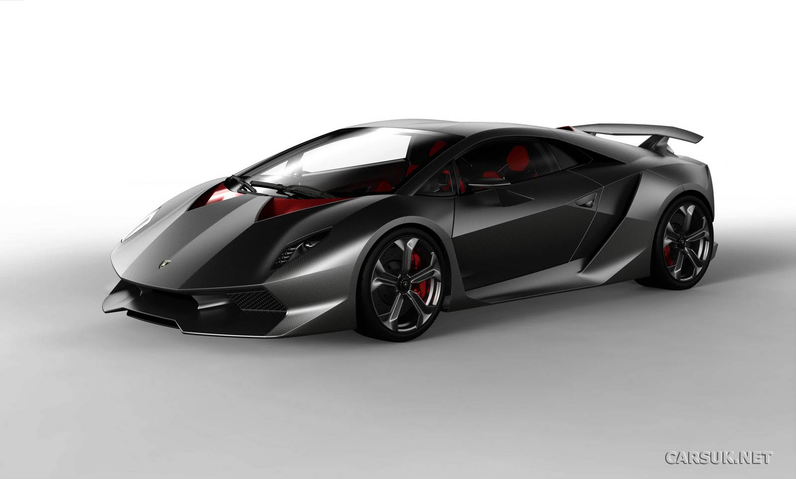
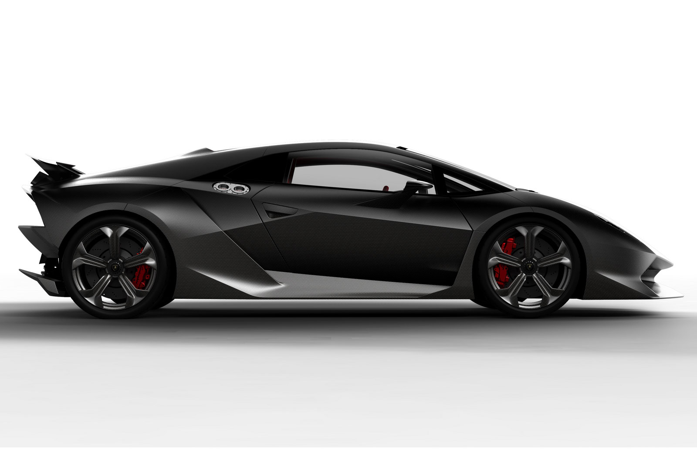
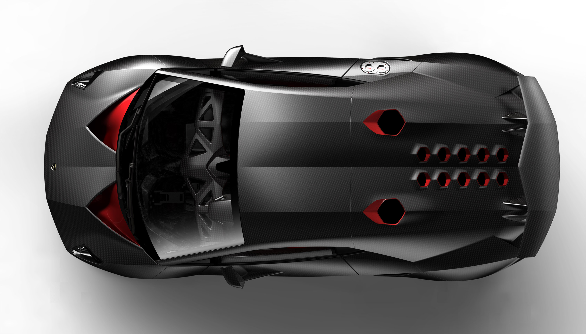
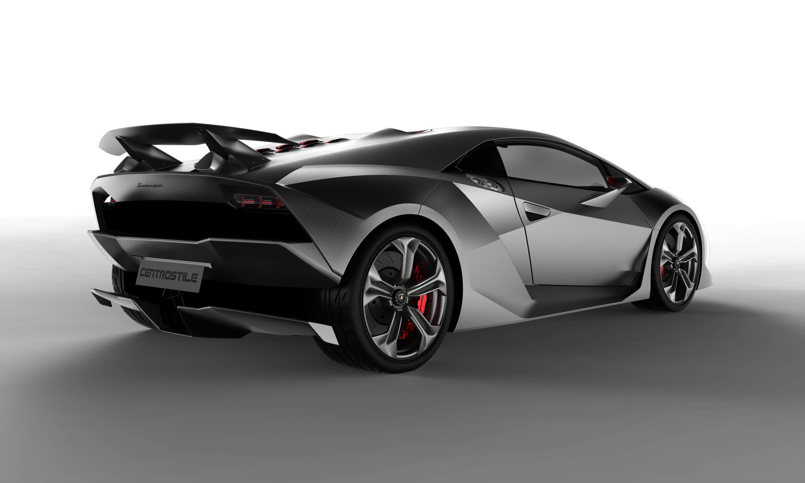
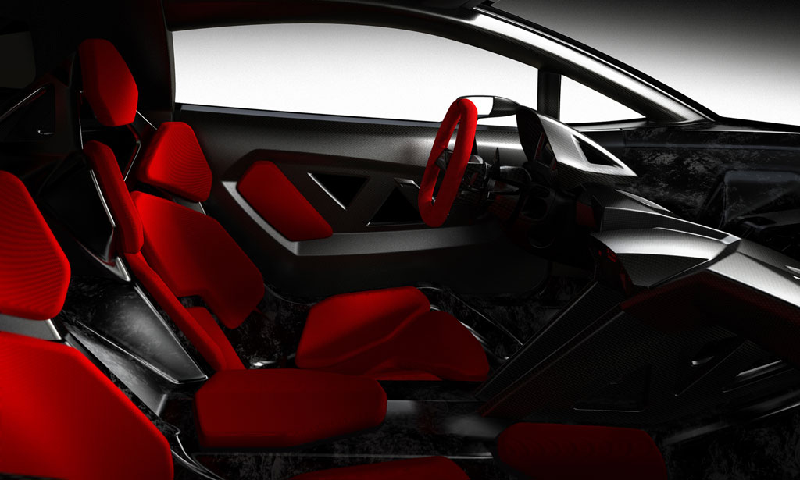
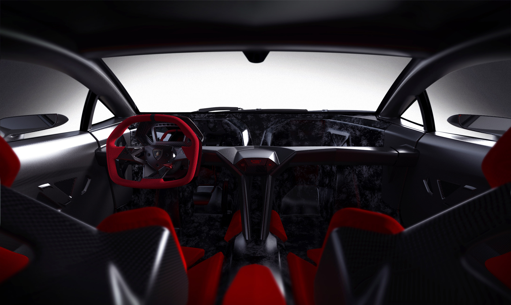

### Altıncı element

Süper otomobillerde kullanılan karbon malzemelerin dayanıklılığı, hafifliği ya da istenilen her biçime girilebilme özelliği tüm tasarımcıların ilgisini çekiyor. Kompozit malzemelerin paslanmazlığının ve sürtünmelere mukavemetinin yanı sıra, çevreci olmalarının avantajını daha önceki modellerde görmüştük. Son zamanlarda titanyumun da sıkça kullanıldığına şahit oluyoruz. Maliyetin eskiye kıyasla daha ehven (!) olması, ortaya çıkan otomobilin esnekliğine ve çevikliğine katkıda bulunuyor. Her türlü kıvrılma ve kalınlığa imkan veren fiber lifleri örülerek kumaş ya da daha sert madde olarak forma sokuluyor. Dördüncü element olarak adlandırılan karbon, şasinin veya gövdenin monokok formu için ideal çözüm sağlıyor. Özellikle PVC’den ayrıştırılan özel malzeme, son olarak Lamborghini Sesto Elemento’da daha da belirginleşmiş. Firma, Boeing ile yapılan ortak çalışma sonunda özel bir scanner geliştirmiş ki, herhangi bir kaza sonunda hasar gören malzeme taranıyor ve hasarlı malzemenin boyutları hesaplanarak yenisi ile değiştirilebiliyor.

Motora gelince, Lamborghini atmosferik motoru tercih ediyor. Markanın başkanı Stephan Winkelmann, turbo kullanılmayan atmosferik motorların çok özel olduğunu ve bundan vazgeçmeyeceklerini belirtiyor. Hatta 2015 yılından sonra sektörde olacakları göremediklerinden, CO2 değerlerini azaltmanın bile planları dahilinde olmadığını söylüyor. Belli ki önümüzdeki yıllarda da Lamborghini’de turbo güç takviyeli bir modele rastlamayacağız. AR-GE başkanı Mauriozi Reggiani ise turbo ile hiç ilgilenmiyor. Atmosferik motorların yeterince geliştirilemediği durumlarda, turbonun devreye sokulduğunu düşünüyor. Başkan, atmosferik motorun direkt tepkisini her zaman için tercih ediyor ve “Suni bir güce ihtiyacımız yok” diyor. Zaten motorun rakamsal verilerine göz atıldığında rakiplerde rastlanmayan şaşırtıcı sonuçların elde edildiğini görüyoruz ve iştahımız kabarıyor.

Sant’ Agata Bolognese’de üretilen otomobil aşağı yukarı Gallardo ile aynı boyutlara sahip. Mühendisler, 10 silindir V motoru markanın tarihindeki en gelişmiş güç ünitesine dönüştürmüşler. 570 HP gücündeki motorun akselerasyonu için (0-100 km/s) 2,5 saniye gibi bir rakamdan söz ediyorlar. Atmosferik motor, 999 kilogram ağırlığındaki otomobili Superleggera’dan 1 saniye daha iyi performansla 100 km/s’ye ulaştırabiliyor. Nasıl oluyor? sorusunun cevabını karbon-kompozit şaside buluyoruz. Sesto Elemento’nun şasisi de Boeing ile yapılan ortak çalışmanın ürünü. Yeniden geliştirilen karbon üretim tekniği, otomobilin ağırlığında devrim yaratmış. (Gallardo Superleggera 1340 kg) Üstelik, ağırlığa otomobildeki dört çeker sistemi de dahil. CFRP olarak adlandırılan karbon-fiber plastik, şasi dahil karoser panelleri ve çarpışma kutularında da kullanılmış. Winkelmann, “Tüm süper sporlar kolaylıkla 300 km/s üzerine çıkabiliyor. Fakat süratlenmek önemli değil. Bu hızlarda sürmek otoyol veya pistlerde dahi mümkün olamıyor. Geriye akselerasyon ve yol tutuş kalıyor ki, odaklanmamız gereken bu!” diyor. Nitekim, Sesto Elemento’nun 1 beygir başına 1.75 kilogramlık güç/ağırlık oranı, bütüne baktığımızda 571 HP/ton gibi inanılmaz bir değere sahip. Baş döndürücü akselerasyonun birincil amaç olması, gelecekteki Lamborghini’lerin ruhu hakkında fikir veriyor. 

Sesto Elemento, iddialı olmaktan daha öte bir portreye sahip. Otomobildeki tek parça (monokok) şasi ve şasi tüpleri, Sheet-Moulded Composite (SMC) adlı yeni ve ilerici bir teknolojinin ürünü. Sert ve güvenli yapı, otomobilin önünden jantlarına kadar devamlılık göstererek ilerliyor. Muhteşem yol tutuş ve ivmelenmedeki radikal sonuçlar frenleme esnasında da ortaya çıkıyor. Güvenlik veya konfordan ödün vermek ise söz konusu dahi değil. Gövde mat zemin üzerine transparan bir kaplama ile sunuluyor. Kapılar, yekpare iki parçanın birbirlerine yapıştırılması ile oluşturulmuş. Markanın tasarım departmanı Centro Stile tarafından geliştirilen kapı panelleri son derece hafif ve küçük bir itişle kalkabiliyor. Mühendisler, bu yeni yapılanmaya “Cofano” kaput, “Parafango” kanat  kelimelerini kısaltıp birleştirerek “Cofango” ismini vermişler.

Sesto Elemento’nun kabini de gövdesi gibi kırmızı ve siyahın armonisini yansıtıyor. Karbon parçalara uygulanan cila (Nano teknoloji) parlak kristalleri sayesinde muhteşem kırmızı rengi oluşturuyor. Koltuklarda, direksiyonda vites değiştirme pedallarında, konsol altı ve kapı içlerindeki kırmızı karbon-fiberin yarattığı etki göz alıyor. Direksiyon ile koltukların ergonomisi üst seviyede. Otomobilin her tarafında kullanılan üçgen form içeride de devam ediyor. Aerodinamik çizgilere alışık olmadık ölçüde kabinde de yer verilmiş. Otomobilin güç ve ağırlık merkezi arka aksın önünde. Profile son derece olumlu katkısı olan bu konumlandırma diğer aerodinamik elemanlarla tamamlanmış. Stabil yol tutuşu garantilemek, kanat formlu devasa spoiler, difizör (dağıtıcı) ve ortada hava deflektörünün (saptırıcı) ustalıklı uyumu ile gerçekleştiriliyor. Viraj içi dengeleme ve yüksek hızdaki yanal hareketlerin kontrolu mükemmel seviyeye çıkarılmış. Pyrosic adı verilen malzemeden üretim egzos sistemi 900 derece ısıya dayanabilecek şekilde sunuluyor. Kırmızı şölen otomobilin arkasında da devam ediyor. Motor muhafaza kapağının üzerindeki beşer adet, iki sıra yerleştirilmiş ve 10 adet kapak ve tavandaki taze hava girişini sağlayan iki tünel kırmızı rengi ile gövdenin mat siyahını öne çıkarıyor.

Sesto Elemento e-gear şanzımana sahip. İlk kez bir süperde kullanılan Dövme Kompozit teknolojisi şu ana kadar elde edilen en ideal ağırlığı meydana getirmiş. Ve Lamborghini başkanı gerek hafif yapı tekniği, gerekse performans için son sözünü söylüyor: “Tüm teknolojik becerimizi tek bir çarpıcı form içerisinde toplayarak Sesto Elemento’yu yarattık. 

Sesto Elemento’daki dinamik özellikler ve tasarımdaki zarafet, süper otomobili benzersiz kılıyor. Konsept görünümün aynen üretime geçmesi mümkün veya değil, bunu zaman gösterecek.

