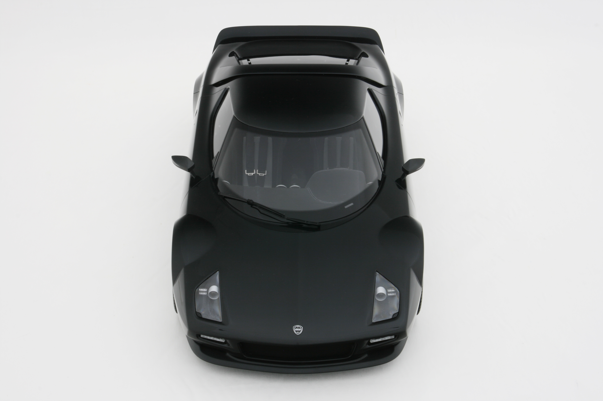
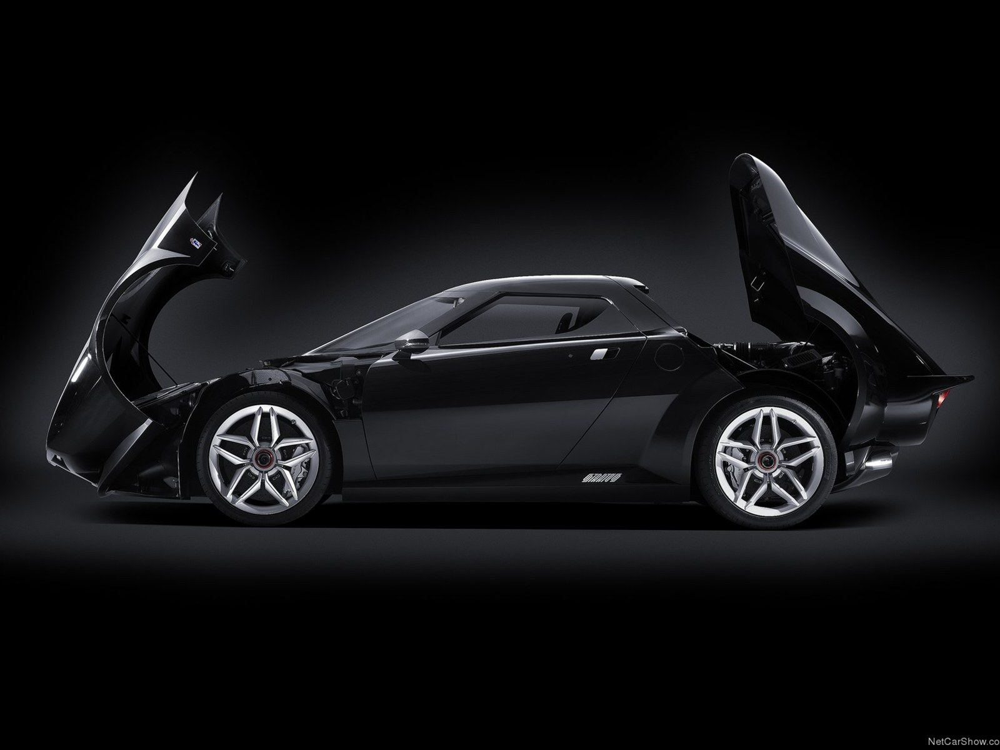
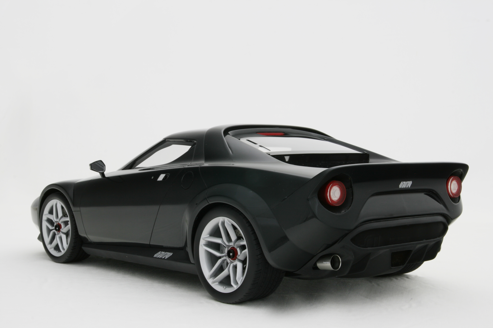
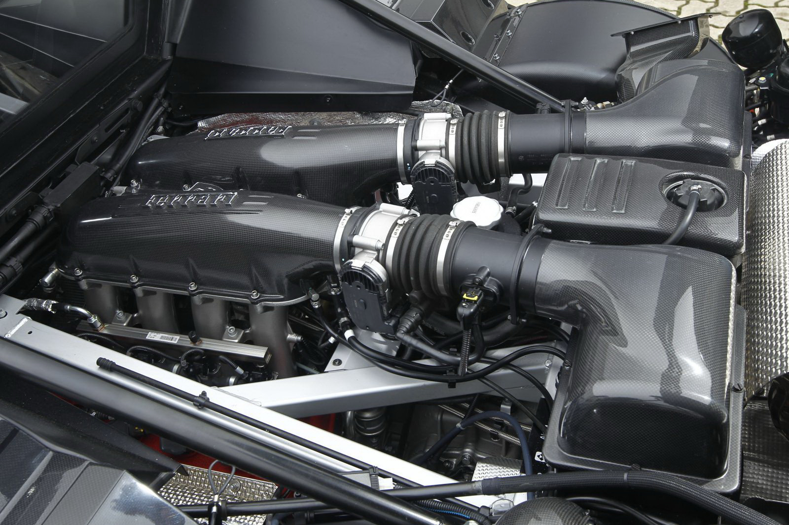
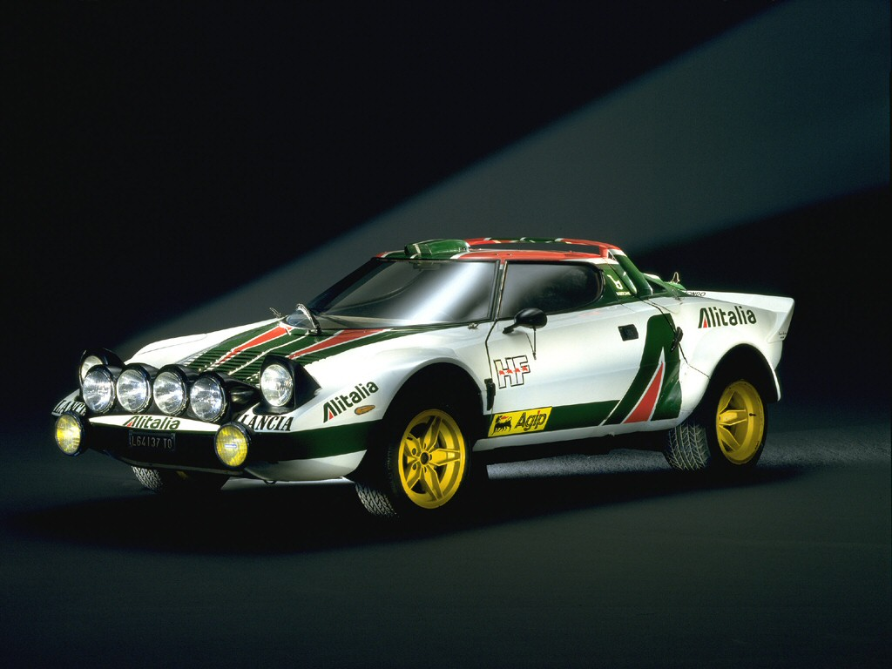

## Eski şampiyondan olağandışı geri dönüş

1970 yılındaki Torino Otomobil Fuarı’nda ilk kez görüldüğünde her kafadan bir ses çıkmıştı. Bazıları “ilk ve son kez görüyoruz” diye fikirlerini açıklarken, bazıları ise STRATOS için “gerçek bir ralli otomobili” yorumunu yapıyordu. 1972’den 74’e kadar 492 adet üretilen otomobil, Lancia’nın Dünya Ralli Şampiyonası otomobili olarak 74, 75 ve 76 yıllarında üst üste üç kez ipi göğüsledi. Daha sonra 1981 yılına kadar çeşitli kullanıcılarla birlikte kayda değer sonuçlara imza atmaya devam etti. Nitekim o seneleri hatırlayanlar Audi Quattro ile olan rekabeti özellikle anımsarlar.

STRATOS’un geleceği ile ilgili macera, yıllar önce (24 sene) meydana gelen bir kaza sonunda iki otomobilcinin tanışması ile başlıyor. Avusturyalı tasarımcı Ferrari Dino’su ile yoldan çıkmış ve otomobilinin içerisinde sıkışmıştı. Kazayı görüp yardım için otomobilini durduran kişi ise ileride kader birliği yapacakları insandı. Avusturyalı STRATOS koleksiyoncusu ve otomobil tasarımcısı Chris Hrabalek ile otomotiv endüstrisine tedarik hizmetleri ile bilinen Brose şirketinin CEO’su, Alman iş adamı Michael Stoschek’in kaderi ve ortaklıkları başlamıştı. Üstelik Lancia’nın kendi otomobilini üretmeyi istememesi, STRATOS’un yeniden projelendirilmesinin kıvılcımını ateşliyordu. Markayı satın alan Stoschek’e göre üretim için işbirliğine ihtiyaç vardı. Bu amaçla Pagani, Gumpert ve Koenigsegg gibi şirketlerle görüşmeler gerçekleştirildi. 2008 yılı sonlarında ise Pininfarina ile anlaşma sağlandı. Otomobilin tasarımının neredeyse yarısını hazırlayan Stoschek, Bugatti tasarımcısı Etienne Salome’nin tasarıma son dokunuşları sayesinde istediği görüntüye kavuşmuş.

Ferrari 430 Scudera şasisi üzerinde yapılan değişiklikler otomobilin altyapısını oluşturuyor. Platformun üzerindeki değişiklik F430 gövdesinin çıkartılması ve aksın 200 mm kısaltılması ile başlıyor. 40 mm’lik FIA onaylı çelik kafes tüpleri rijitliğin sağlanması için kokpitin çevresine uygulanmış. Detaylar için aşırı düşünüldüğü hemen fark ediliyor. İstiridye kabuğu gibi açılan arka kaput ve karbon-fiber laminasyon son derece iddialı. Hatta, tüm somun ve vidalar dahi karbon-fiber ve titanyumdan imal. Pininfarina ve ekibi ön splitter, yan marşpiyeler ve tavan spoyleri kombinesinin aerodinamisi için rüzgar tünelinde uzun testler yapmış. Malzeme kalitesinin arttırılması bütçeye fazladan yük olmasına karşın, otomobilin üst seviyelerdeki profesyonelliği gözden kaçmıyor. Otomobil 1270 kilogramlık boş ağırlığı ile Scudera’dan 80 kilogram daha hafif. Otomobildeki dinamik bütünlük mühendislerin tek amacı olmuş. Alkantara süet kaplı yarış koltukları ve beş noktadan bağlı emniyet kemerleri otomobilin mazisi hakkında bilgi veriyor. Yedi adet yuvarlak gösterge ile Ferrari’nin klima ve havalandırma kontrollerinin uyumu ergonomik ve sürücü odaklı konumlandırılmış. Kendine özgü sürüş karakteri otomobilin direksiyonu sayesinde hissediliyor. Büyükçe durmasına rağmen direksiyon arkasındaki karbon vites değişim pedallarının kullanımı rahat. Direksiyonun üzerindeki ışıklar ise vites değiştirme zamanları için uyarıyor. Hızlı girilen virajlarda ön kısmın yük altında kaldığı sezilse de, gaza yüklenildiğinde ağırlık potansiyel güce dönüşüyor ve otomobil kendi etrafında dönecekmiş hissi veriyor. STRATOS’un sürücüsünü heyecanlandıran geleneksel sürüş karakteri yeni otomobilde de değişmiyor. Otomobilde elektronik diferansiyel bulunmuyor. Drexler sınırlı kilitli diferansiyel, 20 kilogram daha hafif olması nedeni ile tercih edilmiş. Ancak direksiyon üzerinden “race” yarış modu seçildiğinde vites hızları ya da sertlik değişiyor. STRATOS’un fren diskleri Scudera’da olduğu gibi seramik disklerle sunuluyor. Otomobili tamamen geliştirmek için 3 milyon Sterlin harcanmış. Sadece 25 adet üretilecek otomobil 500.000 Sterlin fiyatla satışa sunulacak.

STRATOS ortaya uzunlamasına yerleştirilmiş 4308cc hacminde ve 540 HP gücünde düz kranklı Ferrari motorla sunuluyor. Stoschek, 700 HP’lik Novitec motoru da kullanabileceklerini ancak, hafifliğin temel prensipleri olduğunu belirtiyor. Otomobilin 540 HP’lik maksimum gücü 8200 d/d’da elde ediliyor. 500 Nm’lik çevirme gücü ise 3750 d/d’da gerçekleşiyor. 44/56 oranlı ön/arka ağırlık dağılımı otomobilin akselerasyonu için mükemmel avantaj sağlıyor. Nitekim motor 0-100 km/s hızlanmayı 3.3 saniyede gerçekleştirirken, 0-200 km/s’e 9.7 saniyede ulaşıyor. Otomobilin güç/ağırlık oranı ise 417 HP/ton. Maksimum hız ise 322 km/s olarak verilmiş.

Otomobil drift için ideal görünse de Bosch ve Magneti Magnelli (elektronik destek sistemleri) engel olmaya çalışıyor. Kompakt otomobilin yol tutuşu son derece iyi ve frenlemede sol ayak kullanabilen sürücüler için ideal bir yapıya sahip. Limitlerdeki sürüşlerde CT kapatılırsa, otomobilin kaydırma oyunları için yapılmış olduğuna veya savurmak için tasarlandığına inanmanız dahi mümkün. Nadide otomobil, silüeti ile de çarpıyor. Kilden modellerin ve rüzgar tünellerinin sabırlı çalışmaları görsel bir şölen oluşturmuş. Scudera’da kullanılan egzos sistemi STRATOS’a özgü Capristo sistem ile değiştirilmiş. Cila altındaki siyah renk karbon-fiber etkileyici parlaklığa sahip. Tavan spoylerinin alt yüzeyindeki hava girişi motorun hava almasına yardım ediyor. Spoylerin tam ortasında ise LED stop lambası bulunuyor. Ön farlar ise orijinaline sadık kalınarak tasarlanmış. Ancak bir kısım fanatikler otomobilin üzgün bir ifadesi olduğunu belirtmişler. Stoschek ise geleneğe bağlı olarak, bunun böyle olması gerektiğini düşünüyor. Lastikler önde 265/30 ZR19, arkada ise 315/30 ZR19 ebatındaki Dunlop Sport Maxx ile sunuluyor. Otomobilin konsoluna fazladan bir saat ve G metre göstergeleri monte edilmiş.

Sonuç olarak Pininfarina ve iki eski dost, Ferrari Scudera’yı parçalayarak eski şampiyonu olağandışı bir teknoloji ile günümüze uyarlamışlar.

