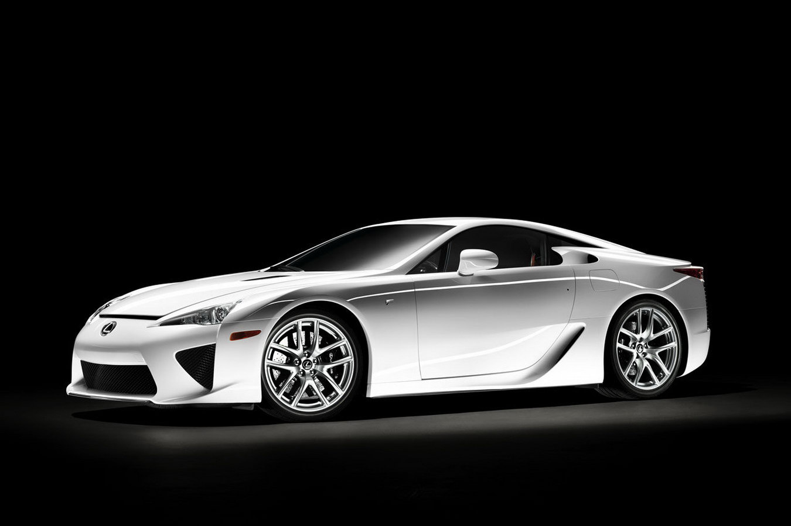
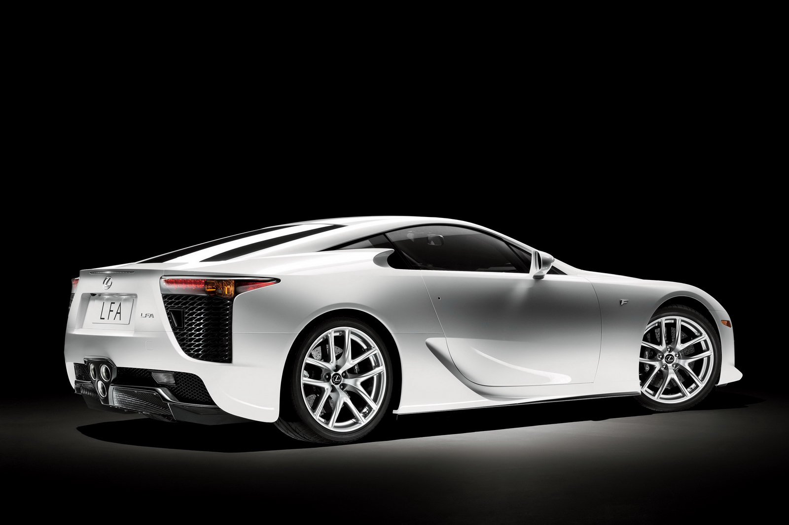
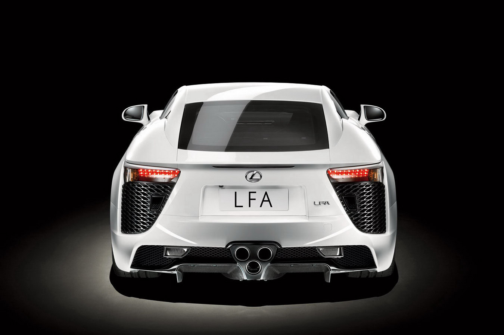
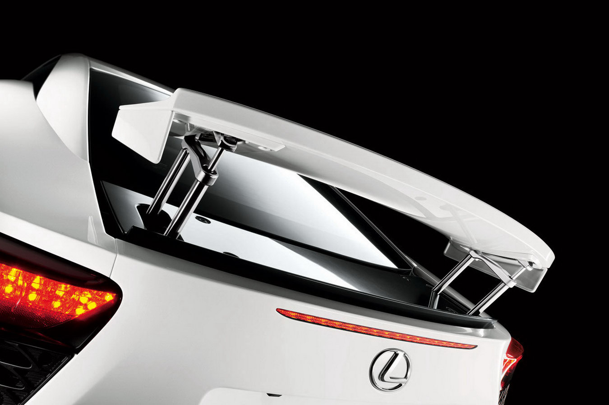
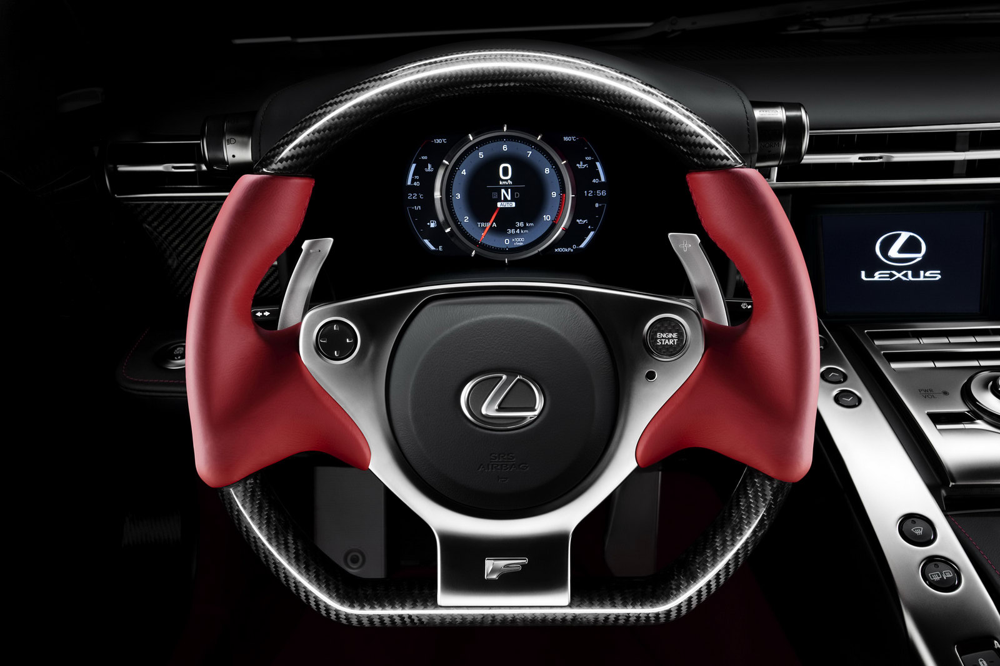
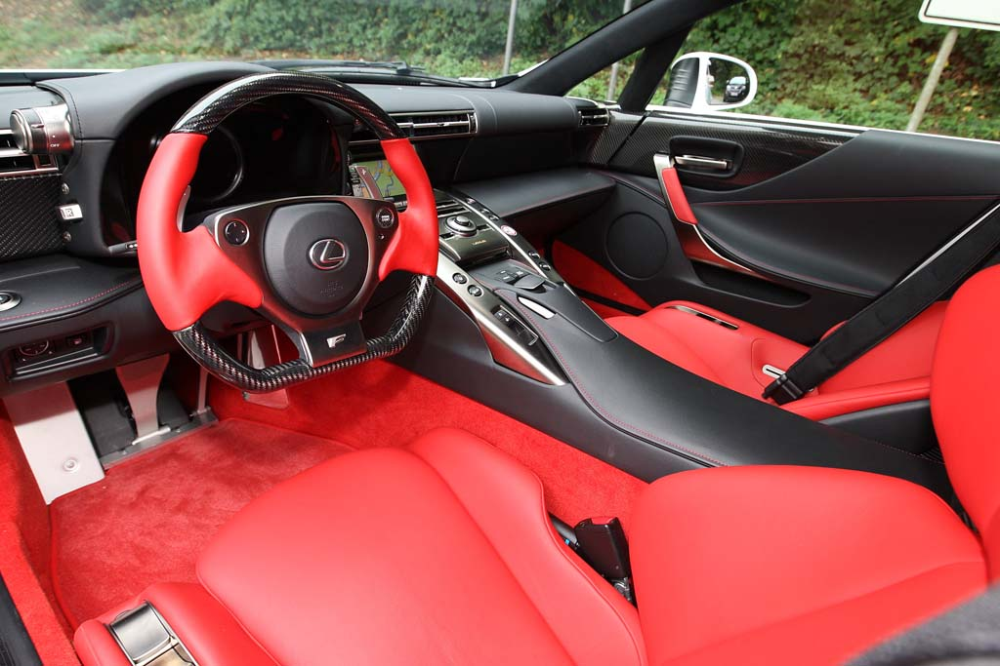

### Sansasyonel silüet

Kendi yaptığı otomobilin caddelerde görünmesine kadar geçen süre içerisinde, akla karayı seçme durumunda kalan tek kişi şüphesiz ki projenin başındaki isimdir. Yaşanan stres ile ustalığın üstünlüğü birbiriyle harmanlanıp karışınca, başmühendisin karşılaştığı zorlukları anlamak çok zor olmasa gerek. Nitekim, bir dizi teknik ve teknolojik kaygının sonunda ortaya çıkan otomobile baktığımızda duyduğumuz his sadece hayranlık oluyor. Bu seferki başyapıtın başmühendisi Japon Haruhiko Tanahashi. Lexus LFA onun elinden çıkma ve tüm detaylarda mühendisin alın terinden izler görmek mümkün.

340.000 Pound, eğer elde edilecekse, Lexus LFA için ödenecek fiyatı gösteriyor. Geleneksel Lexus lüksü ve bir süpersporun karakteristik sürüş özellikleri ile birlikte sunulan otomobilin anahtarı dahi titanyum ve karbon-fiberden üretilmiş. Almanya’da geliştirilen LFA, Toyota’nın tarihinde görülen en pahalı makine. Otomobil henüz lansmanda görüldüğü anda Nissan GT-R ile mukayese edilmeye başlandı. Tanahashi’ye göre “LFA ile GT-R’nin birbirleriyle karşılaştırılması anlamsız ve amaçları ayrı otomobiller.” Nissan GT-R tamamen ve her türlü şartta hız üzerine odaklanmış ya da sürücüsünü hız için hırslandıran bir otomobil. Ancak LFA’da belirleyici olan esas unsur bunlara ilave olarak rafine sürüş ve lüks. Kıymet belirleyen özelliklerin her süpersporda farklı olması, otomobillerin hangi noktalardan öne çıkarıldığına bağlı. Örneğin motor 9000 d/d’ya çıktığında Lexus LFA’nın pistonlarının hızı ölçülmüş ve yaklaşık olarak saniyede 25 metre mesafeye ulaştığı görülmüş ki, F1 otomobillerinin piston hızlarına epey yaklaşıldığını görüyoruz. Hal böyle olunca rolantide çalışan motorun 9000 d/d’ya çıkması adeta bir patlama olurcasına 0.6 saniyede gerçekleşebiliyor.

LFA’da ortada uzunlamasına yerleştirilmiş, DOHC, 10 silindirli 4805 cc hacminde V motor bulunuyor. Silindir başına 4 sübaplı ve değişken sübap zamanlamasına haiz motorun silindir bloğu ve üst kapağı alüminyum alaşımdan imal. Motorun gücü akranları ile aynı seviyeleri gösteriyor. 555 HP’lik maksimum güç, fabrika verilerine göre 8700 d/d’da elde ediliyor. 6500 d/d’da sinirlenip delirmeye başlayan motor, egsoz ve emme seslerinin birbirine karışmaya başlaması ile birlikte sürücüsünü tahrik etmeye başlıyor. Tam burada 6800 d/d’da ortaya çıkan 480 Nm’lik çevirme gücüyle karşılaşıyoruz. Aslında daha 3000 d/d’da neler yapabileceğini belli eden motor, zorlanmaya başladıkça gerek yol tutuş gerekse stabil dengesiyle güven veriyor. 1480 kilogramlık ağırlık LFA’nın yola sağlam basmasındaki en önemli unsurlardan birisi. Ton başına elde edilen güç yabana atılacak cinsten değil. Güç/ağırlık oranına baktığımızda 379 HP’lik gücü görüyoruz. Yakıt kesici ise 10000 devire yaklaşıldığında devreye giriyor. 0-100 km/s hızlanmanın 3.7 saniyede gerçekleştiği LFA’da son sürat 325 km/s olarak verilmiş.

Otomobilin kabinine kapının üzerine yerleştirilmiş küçük bir kanada basarak girebiliyorsunuz. Her iki kapının üzerindeki aynaların iç bölümlerindeki ızgaralar radyatörlerin hava alması için tasarlanmış. Önden giren hava, arka stop lambaların üzerindeki kanalcıklardan dışarı çıkıyor. Lexus’a dair özellikler otomobilin içine girer girmez hissediliyor. Hafif ve kompakt malzemeler, ön ve orta konsoldaki armonisi ile etkileyici bir bütünlük içerisinde. Kırmızı renkli el ile dikilmiş koltuklar ve manuel ayarlı direksiyon kombinasyonu, optimum sürüş pozisyonu ayarları için alternatifler sunuyor. Titanyum, karbon-fiber malzemeler ve kırmızı rengin albenisi, pahalı bir süperin içinde olduğunuzu gösteriyor. İstediğimiz gövde rengini alabilmek için ödeyeceğimiz ekstra 22.000 Pound, otomobildeki lüksün özeti anlamına geliyor. Marş motorunu çalıştırmak için direksiyon üzerindeki “start” düğmesine basılıyor. Daha düğmeye basar basmaz Yamaha’nın müzik enstrumanları departmanı tarafından hazırlanan ses kompozisyonunu, arkada ortada monteli üçlü egzos çıkışından dinleyebiliyorsunuz.

Otomobil hidrolik destekli manuel şanzımanla sunuluyor. Ağırlığın düşürülmesi için çift kavramalı otomatik şanzıman kullanılmamış. 6 ileri, hidrolik iticili, sıralı manuel şanzıman arkadan itişli ve LFA’da kesintisiz bir vites geçişi sağlıyor. Şanzımanda “Auto, Sport, Normal ve Wet(ıslak)” modları bulunuyor. Karbon tübüler şasi ile limitli kilitli diferansiyelin stabil dengesi, her türlü zeminde gaza basma isteği uyandırıyor. Sağ ayak ile diferansiyel kontrolü arasındaki koordinasyon üst seviyelerde. Limitlerde ise elektronik kontroller devreye giriyor. LFA’nın kaputunun burun tarafı alçak tasarlanmış. Aerodinamik endişeler ön tarafta sadece klima sisteminin ağırlığına izin vermiş. Hatta sıvı hortumları dahi ağırlığın düşürülmesi için inceltilmiş alüminyumdan imal edilmiş. Ebatları geniş olsa da LFA günlük kulanım için uygun ve sürüş zevki yaşatan bir otomobil. Altı tamamen düz olan otomobil 80 km/s hıza ulaştığında arka kanat yükselmeye başlıyor. Yol tutuş söz konusu olunca, 10 silindirin gücünü yere ulaştıran ve adeta yola yapıştıran lastiklerin katkısını göz ardı edemiyoruz. Önde 265/35 ZR20, arkada 305/30 ZR20 ebadındaki Bridgestone Potenza RE050A lastikler, viraj veya limitlerde yolu ısırırcasına görev yapıyor. Frenlerde ise soğutmalı seramik diskler bulunuyor. ABS sistemli fren disklerinin ebatları, önde 390 mm, arkada 360 mm çapında. Jantlara (BBS) baktığımızda ise önde 9,5x20, arkada ise (daha büyük çaplı) 11,5x20 ölçülerini görüyoruz.

Lexus LFA, tüm detayları , sürücü odaklı ergonomik yerleşim planlaması ve malzemelerin kalitesi ile “sansasyonel silüet” oluşturmuş. Şanzıman tüneli üzerindeki orta konsol ve dashboard kusursuz bir resim veriyor. TFT navigasyon ekranı ve ön konsoldaki digital hız göstergesi son derece şık tasarlanmış. Motorun 0.6 saniye içerisinde 9000 d/d’ya çıkması nedeniyle hız göstergesi, görsel uyumun sağlanması bakımından digital olarak entegre edilmiş. Fabrika verilerine göre otomobilin 0-160 km/s hızlanması ise 7 saniye civarında gerçekleşebiliyor.

Başmühendis Haruhiko Tanahashi, hızlı dünyaya yeni bir üye sunuyor. Otomobil teknolojisi ve silüeti ile hayranlık uyandırıyor. Ancak Lexus LFA ile bütünleşebilmek için söz konusu dünyadan haberdar olmak gerek. Standart bir sürücü ile kabusa dönüşecek sürüş, standart üstü bir sürücü ile ekstrem bir rüyaya dönüşebilir.

