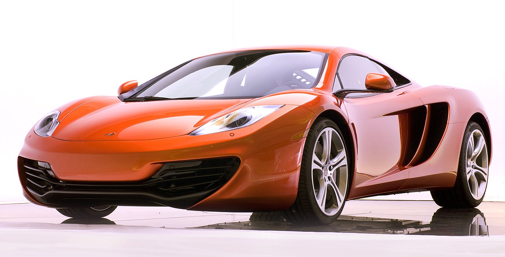
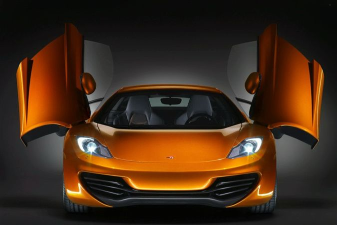
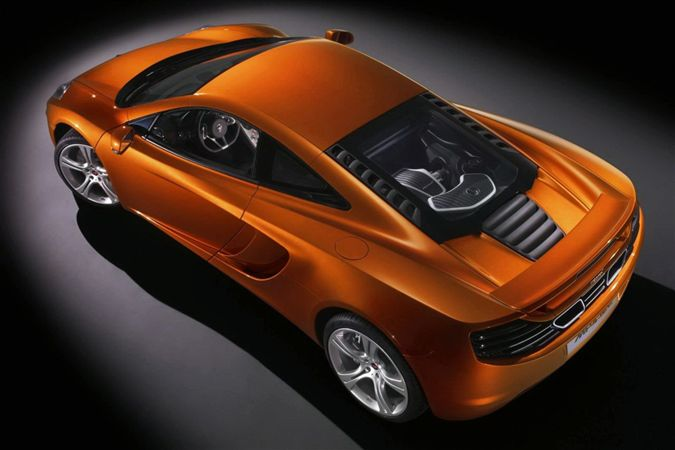
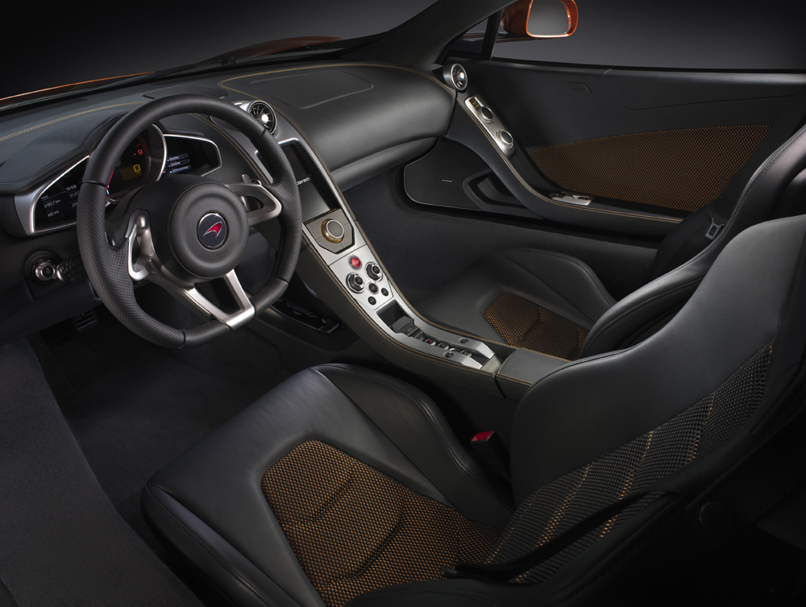
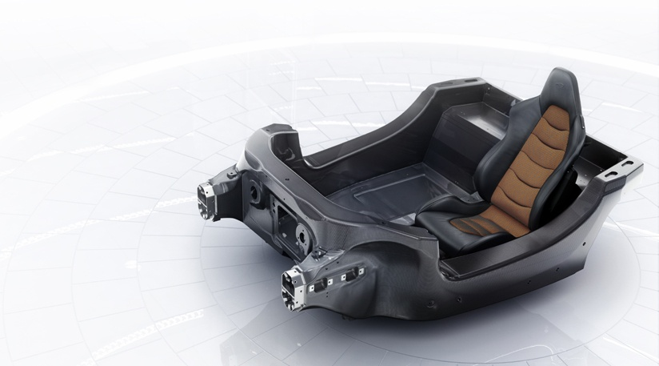
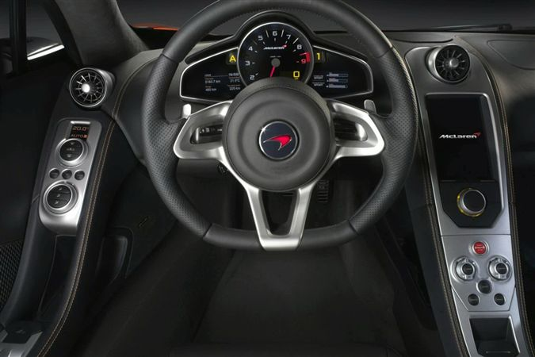
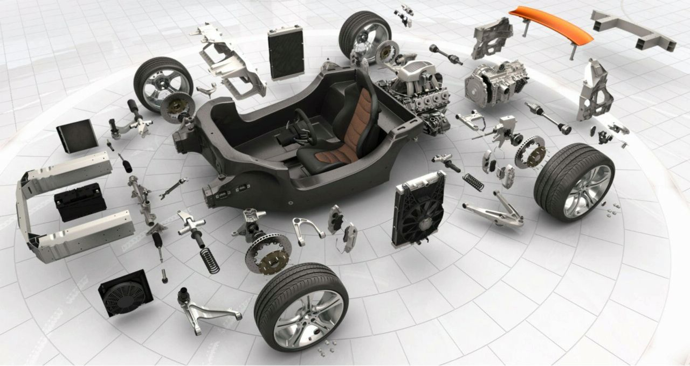

### Süper Egzotik İngiliz

Bu kez süper otomobil standartlarını ve ayrıntılarını tamamen karşılayan etkileyici bir makine ile karşı karşıyayız. McLaren geliştirme pilotu Dick Glover’e kulak verdiğimiz de “Otomobilin etkileyici ve belirgin özelliğinin genel kullanım kolaylığı, gövdenin kontrolü, yüksek konfor seviyesi, keskin tepkiler, çeviklik ve pist üzerindeki yol tutuşu”olduğunu öğreniyoruz. Glover’e göre, aktif sistemlerin ya da otomobilin ayarlarının yapıldığı düğme ve butonların kullanımı kolaylıkla yapabilecek pozisyonda ayarlanmış. Verimlilik açısından rakipleri ile kıyaslandığında ise ( Porsche, Ferrari, Mercedes,Audi,Lamborghini, Bugatti) F1’den alınan özellikleri ile sıkı bir alternatif olarak gördüklerini belirtiyor. 2011 tarihi için siparişlerin alınmaya başladığı düşünülürse Glover’ın öngörülerine hak vermek gerekiyor. Diğer bir McLaren Automotive yetkilisi olan tasarım direktörü Frank Stephenson’a göre (daha önce Maserati MC12’yi tasarlamıştı) yeni otomobilde dizayn için epey uğraşılmış. Ferrari ve Mini için de tasarım yapmış deneyimli ustaya göre 12C mükemmele yakın duruşlu bir otomobil. Akranları olan otomobillerden daha dar, daha alçak ve daha kısa yapısı McLaren’i görsel olarak çok şık ve çevik hissettiriyor. Olağanüstü aerodinamik çizgiler hangi yönden bakılırsa bakılsın otomobilin yarışcı ruhunu yansıtıyor. Hafif ve kompakt imalat McLaren’in her tarafında görülebiliyor. Firmanın yönetim sorumlusu Antony Sheriff “İhtiyacımız olan şey yeni bir otomobil değil, sınıfında standartları belirleyen otomobiller üreten bir firma olabilmek. McLaren ile Mercedes’in önümüzdeki günlerde ayrılacak olması nedeniyle Mercedes’den temin edilecek tüm parça ve destek ihtiyacı yeni otomobilin geleceğini zorlayabilirdi. Bu yüzden ürettiğimiz her otomobil için güçlü olmalıyız” açıklamasını yapıyor.   

McLaren’in rakam ve harflerden oluşan ismi bir dizi sır saklıyor. Otomobilin şasisi MP4 kod adı ile anılıyor. F1 tecrübesi ile yapılan şasi, bilgisayar destekli hazırlanmış. 1981 yılından beri McLaren’in Formula otomobillerinde kullandığı şasi ile aynı teknoloji ürünü. İsimdeki 12 ibaresi otomobilin iç performans listesini simgeliyor. Güç, ağırlık, aerodinamik kaygılar ve emisyonların bileşkesi bu ibare altında hesaplanıyor. MonoCell şasinin hafifliğini ve güçlülüğünü temsil eden karbon ise C harfi ile belirleniyor. Otomobilin 200 bin pound civarındaki fiyatı ile eksterm sporcuların arasında yer alabilmesi ( Koenigsegg, Veyron, Zonda) tamamıyle bu ince hesapların sonucu. Değerlere baktığımızda MP4-12C’de 3.8 litrelik çift türbo ve kuru karterli bir V8 motorun uzunlamasına yerleştirilen 600 HP’lik gücü ile karşılaşıyoruz. İsmi şimdilik açıklanmayan bir ortak ile birlikte geliştirilen motor rijit ve kompakt olarak tasarlanmış. 600 Nm’lik çevirme gücünün %80’i 1900 d/d’da gerçekleştiren motor düz krankı sayesinde şaside aşağı konumlandırılmış. Devre kesici 8500 d/d’da devreye giriyor. Aynı rakamı Ferrari’de görebiliyoruz. 1300 kg ağırlığındaki otomobil rakiplerinden yaklaşık 300 kg daha hafif. Ton başına 469 HP’lik güç son derece anlamlı görünüyor. Neredeyse Ferrari Enzo’yu yakalayabilecek bir rakam. Karbon-fiber şasiye sahip ilk ve tek otomobil olan McLaren’in son hızının 320 km/s’in üzerinde olması bekleniyor. 0-100 km akselerasyonu ise 3 saniye civarında olan motorun 160 km’ye ulaşması için ise 6 saniye yeterli olacak. İçten yanmalı güçlü motorun HP başına ürettiği CO2 miktarı Toyota Prius gibi hibridlerden daha iddialı. Bu konuda henüz bir açıklama yapmayan İngiliz marka yetkilileri, atık emisyon konusunda da müşterileri meraklandırıyor.

Otomobildeki turuncu renk, McLaren’in F1 otomobillerinde kullandığı renk ile birebir uyuşmuyor. Zira 1998 yılında kullanılan endüstriyel boyalar toksin içeriyordu. Günümüzde çevresel duyarlılıkların gereği olarak zehirli boyaları kullanmak mümkün olamıyor. Bu nedenle imaj rengi olan turuncu renk yeni otomobilde daha koyu duruyor. McLaren MP4-12C’deki V şeklindeki kapıları açmak için eli kapının altındaki girintiye sokmak gerekiyor. Çünkü kapıların dışında herhangi bir kol bulunmuyor. McLaren’in inşasında temel olan ortak payda yekpare karbon-fiberden (MonoCell) imal havuz şeklindeki şasi. Yaklaşık 5 yıllık bir çalışma sonunda ortaya çıkan şasinin ağırlığı sadece 80 kg ağırlığında. Hafif, sert ve kompakt yapı rijitliğin yanı sıra direksiyon girişi ve ön süspansiyonun direkt hava girişi gibi birçok fonksiyona sahip. Bu arada şasi üzerine konumlandırılan koltuklar uzun ve titiz bir çalışmanın sonunda mükemmel bir oturuş pozisyonu almış. Maliyet ise, 1998 senesindeki F1 şasisine kıyasla onda bir oranında düşmüş. Antony Sheriff kompozitlerin hiçbir yorulma göstermediğini ve aşınmaya maruz kalmadığını söylüyor.

McLaren’in yan taraflarında iki adet devasa hava girişi bulunuyor. Fren soğutma için bolca nefes alma imkanı sağlayan hava girişleri frenaj esnasında stabiliteye yardım ediyor. Otomobilin arkasındaki hava akışı ise 3 kademeli hava frenini dizginlerken etkileyici bir fren performansı gerçekleştiriyor. Kuyruktaki elektronik spoyler yere basma (down force) kuvvetini eksiksiz yerine getirerek otomobildeki kararlı duruşa yardım ediyor. Fren diskleri demir alaşımdan imal edilmiş. Ancak daha hafifletmek için bağlantı noktalarında alüminyum kullanılmış. Tercihe bağlı olan karbon seramik diskler ise pist kullanımlarında tavsiye ediliyor. Mühendisler demir disklerdeki fren pedalı hissinin daha iyi olduğunu belirtiyorlar. Türbolar için kullanılan 2 adet intercooler düşük ısılarda çalışabiliyor.

P11 kod adlı otomobilin genelindeki belirgin titizlik, iç mekanda görsel bir uyum sağlamış. Orta konsol sade bir görünüm içerisinde olmasına rağmen çok şık. Sürücü odaklı dashboard ergonomik anlamda kusursuz. Ağırlık transferi amacıyla sürücü ve yolcu otomobilin ortasına yakın oturuyorlar. Yolcuların ağırlığını merkeze taşımak mühendislerin en önemli isteklerinden biri olduğundan koltuklar birbirlerine çok yakın konumlandırılmış. Konforlu ve sıkı koltuklar sürücü ve yolcunun beklediği pozisyonları elektronik olarak kolaylıkla ayarlayabiliyor. Orta konsol üzerindeki 7 inçlik ekran, dikey olarak yerleştirilmiş. Konsoldaki düğmeler süspansiyon ayarlarını, yere basma gücünü, vites geçiş hızlarını ya da stabilite kontrolünü yapabilmeye yarıyor. Kontrol düğmeleri sürücünün her iki tarafına dağıtılmış. Elektro-hidrolik kremayer direksiyonun arkasındaki vites değiştirme pedalları McLaren F1’den alınma. İki ayrı pedal yerine merkezdeki bir mil üzerine oturtulmuş pedalın biri çekildiğinde diğeri de hareket ediyor. Sistem içerisindeki diğer bir fonksiyon (Pro-log), ilk kademe olan elektro-hidroliği harekete geçirdiği sırada şanzıman hangi vitese geçileceğini anlıyor. Bir sonraki aşamada ise anlık vites değişimi gerçekleşiyor. McLaren mühendisleri otomobildeki bu sistemin geleneksel çift debriyajlı şanzımanlardan daha seri ve akıcı olduğunu söylüyor. 7 ileri şanzıman kısa boyu ile oldukça kompakt tasarlanmış. Şanzımanın boyunun kısaltılması, otomobildeki dengenin artmasına  ve ağırlığın azaltılmasına yarıyor. Önde %43, arkada %57 ağırlık dağılımı kilitli diferansiyelin bulunmadığı otomobilin çevikliğine katkıda bulunuyor. Otomobil viraja gereğinden hızlı girdiğinde iç taraftaki lastiğe fren yapan sistem (Brake-steer), virajdaki doğru yönlendirme çizgisini apekse göre düzeltiyor. Sistem, aktif diferansiyel fonksiyonu görevi görüyor. Netice olarak kilitli diferansiyelin ağır ve komplike yapısı nedeniyle otomobilde bulunmaması artı bir hafiflik sağlamış. McLaren’in SSG adını verdiği şanzımanda üç farklı sürüş modu bulunuyor. Normal, Sport, Launch modlarının yanı sıra kış modu da seçenekler arasında. Daha önce belirttiğimiz Pre-cog (ilk baskı) ayarı ise bir sonraki vites değişimi için şanzımanı hazır hale getiriyor.

McLaren’in güven veren özelliklerinden birisi de sürücüsünün sürüş çizgisine katkısı. Sürücü camdan öne baktığında sağ ve sol çamurluk bombelerindeki en yüksek noktanın ön lastiklerin tam merkezi hizasında olduğunu anlayabiliyor. Otomobilin alt kısmı ise 80 kg’lık ağırlığı ile son derece hafif ve rijit. Çarpışma testlerinin sonunda bu sektördeki diğer rakiplerden daha üstün sonuçların elde edilmesi bir tesadüf değil. Süspansiyonda çift salıncak ve helezon yayı ile geleneksel sistem görülüyor. Burulma kolu amortisörlerin içinde yer alıyor. Viraj demirleri 3 kademeli burulma kontrolü yapıyor. Orta konsol üzerindeki ayar düğmeleri sayesinde sürücü istediği süspansiyon ayarını yapabiliyor. Kendi sınıfında en üstün seviyeye ulaşmış sistem konforlu ve esnek yapısı ile heyecanlandırıcı bir yol tutuş sağlıyor.

Elektronik destek sistemleri içerisinde ABS, ESP, ACS çekiş kontrol sistemi, elektronik fren dağıtımı ve yokuşta kayma (hill holder) önleme sistemi gibi standart sürüş destekleri bulunuyor.  Çeşitli sensörler yardımıyla neredeyse hiç yana yatmayan MP4-12C düz yolda aynı sensörlerin sayesinde üst sınıf bir sedan kadar yumuşak. Otomobilin iç mekanında ufak tefek eşyalar için yeterince yer bulunabiliyor. Koltukların arkasındaki bölüm ve ön konsolun arkasındaki boşluk bu amaçla kullanılabiliyor. Diğer süperler gibi direksiyonun üzerine yerleştirilmiş butonlar yok. Hız göstergesi dijital ve büyük bir kadranla entegre edilmiş. Kadranın iki tarafında tüm sürüş bilgileri okunuyor. Yukarıya doğru açılan kapılar ise günlük kullanımlara uygun olarak tasarlanmış.

Marka yılda 1000 adet üretim yapmayı planlıyor. Yedek parça, servis ve garanti prosedürleri için çalışmalar devam ediyor. Yönetici Antony Sheriff otomobil ile mücadelenin hala sürdüğünü, hiçbir parçayı başka bir yerden almadıklarını, nitekim bunun için büyük emek sarfetmek gerektiğini söylüyor. Sherrif, aynı zamanda en küçük parçanın dahi belli bir amaçla yerleştirildiğini ve başarırlarsa muhteşem bir otomobile sahip olacaklarını belirtiyor. Binlerce kilometre testi yapılan otomobil dinamik özellikleri, optimize edilmiş yol tutuşu ile gerçekten sıkı bir süper olmuş. Egzotik İngiliz’deki özel ve radikal şasinin ise gelecekteki tüm otomobiller için referans olacağı düşünülüyor.

