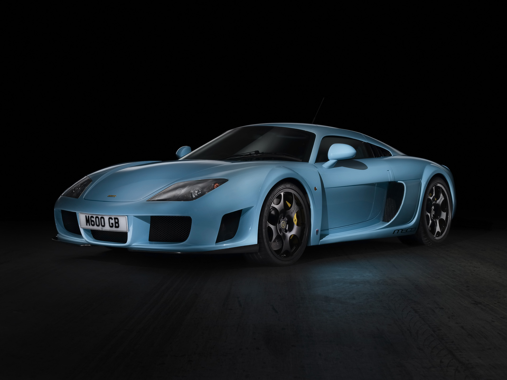
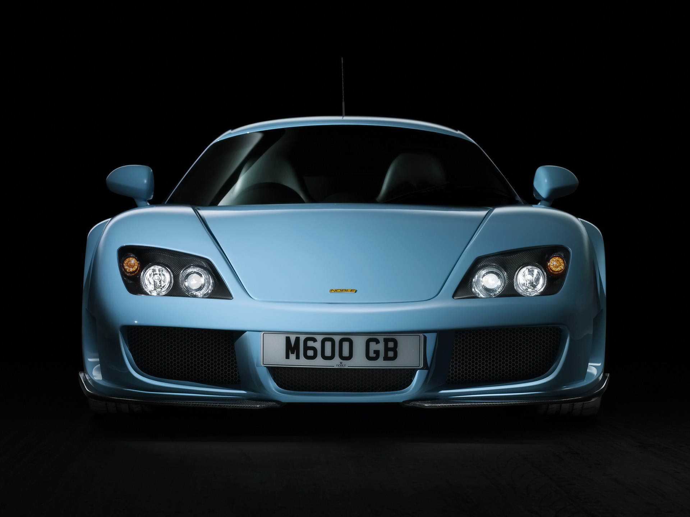
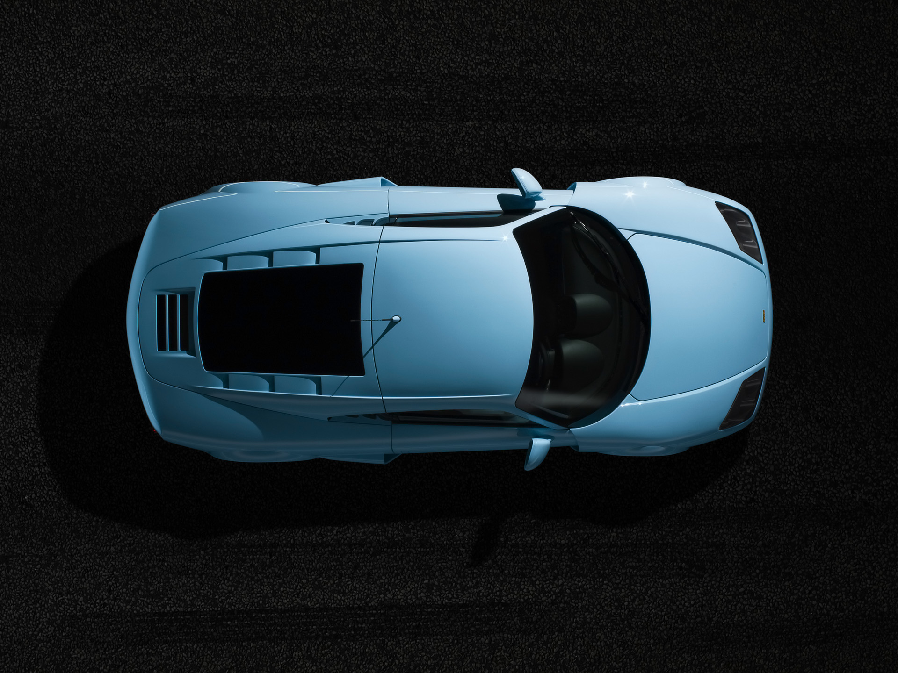
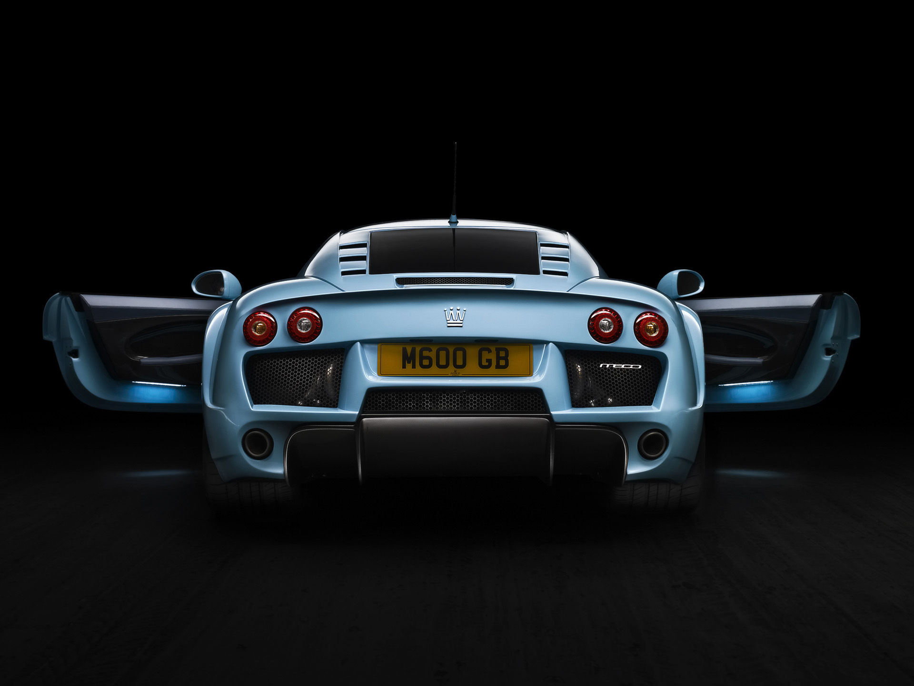
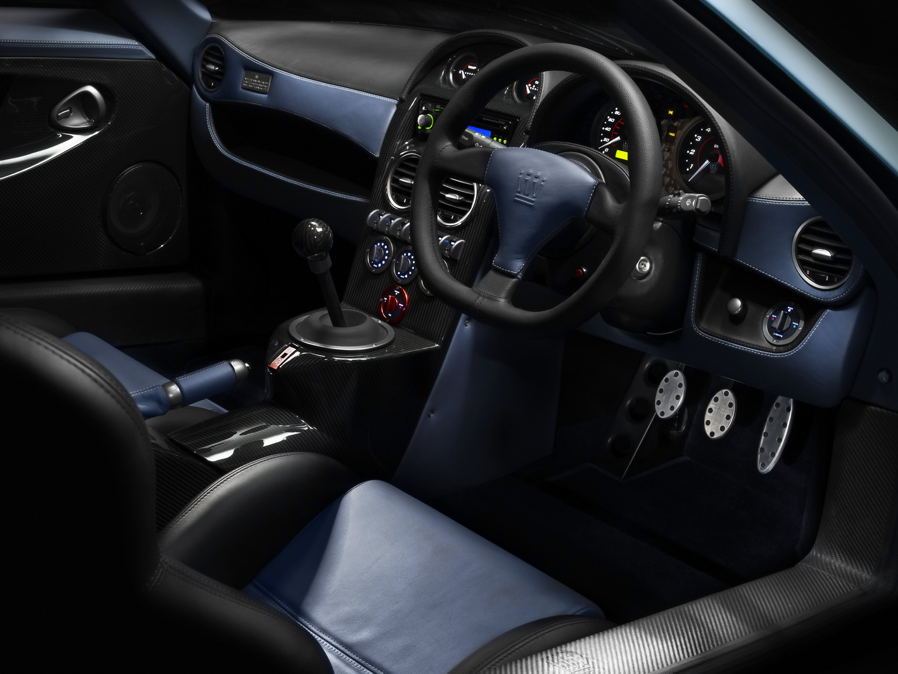

### G gücü hazır ancak, uygun ellerde

Güç savaşları durmaksızın devam ediyor. Savaşa giren markalar patlamaya hazır son silahlarını birer birer ortaya çıkarıyorlar. Silahın gücü patlattığı adrenalin miktarı ile ölçülüyor. Sektörün konumuz olan en üst klasmanında ekonomik şartların kaale alınması falan söz konusu değil. Onlardan birisi de	NOBLE. Kolay kullanım iddiası ile hazırlanan NOBLE’nin son silahı M600 Kasım ayında “süper” marketteki yerini alacak. Görüntü itibariyle sürücüsünü kışkırtmak, rakiplerini ürkütmek için dizayn edilmiş otomobil, tam 650 HP gücünde çift türbolu V8 motorla can buluyor. 650 HP’lik güç 6800 d/d’da elde ediliyor. Devir saatindeki kırmızı bölge 7000 d/d’yı gösterse de gücün etkisi oldukça alt devirlerde başlıyor. Ortaya uzunlamasına yerleştirilmiş motorun gövde dengesine etkisi ve türboların referans sayılabilecek ivmesi gücü yere iletmekte hiç vakit kaybetmiyor. 4439 cc hacimli motor üstten çift eksantirikli ve silindir başına dört sübaplı. Alüminyum alaşım motor değişken zamanlamalı ve direkt yakıt püskürtmeli. Motec elektronik beyin henüz daha 3800 d/d’da ortaya çıkan 819 Nm’lik tork ise maruz kalınacak G gücü için hazırlanmayı işaret ediyor. Otomobildeki 4.4 litrelik V8 motor Yamaha tarafından Volvo için üretilmiş. Ancak mühendisler motoru M600 için elden geçirmişler. Ton başına harcanan güce baktığımızda motorun hırsını anlayabiliyoruz. 528 HP/ton aralığı kağıt üzerinde Veyron’dan daha iyi. Nitekim Amerikan Motorkraft’ın aynı motoru daha da güçlü hale getirdiği ile ilgili söylentiler var. Bazı kaynaklar pistonların, piston kollarının ve daha güçlü krank mili uyarlamasının yeni inşası ve Garrett türbolar sayesinde 750 HP’lik gücün ortaya çıktığını belirtiyorlar. 

M600’ün türbo basıncını ayarlama düğmeleri vites kolunun hemen arkasında panel üzerinde bulunuyor. 360 km/s’lik son sürate sahip otomobilin olmazsa olmazı ayar düğmesi “Road” konumuna alındığında 0.6 bar değeri ile 450 HP, “Track” konumunda ise 0.8 bar basıncı ile 550 HP güç üretiyor. Ön panelde göstergelerin arasında seçilen fonksiyonu görebilmek mümkün. Road seçeneğinde yeşil yanan gösterge Track seçildiğinde turuncuya dönüşüyor. Gel gelelim “Race” modu ayarı kırmızı renk göstergesi ile M600 sürücüsünü azdırmaya hazırlıyor. Şaltere eşlik eden aynı renkte diğer bir düğme daha var. Vites kolunun önüne 45 derece açıyla monte edilmiş T/C (çekiş kontrol) düğmesi 1250 kilogramlık otomobili dizginleme fonksiyonunu gerçekleştirmeye yarıyor. Zira otomobil topun namlusundan fırlamaya hazır bir mermi kadar güçlü.

Tüm hesapların yol tutuş üzerine odaklandığı otomobilde kabin içi son derece pratik ve kolay yönetime uygun olarak tasarlanmış. İşçiliğin üst seviyelerde olduğu gözlenen kabinde otomobilin dış rengi ile uyumlu bir armoni yaratılmış. Deri ve karbon-fiber ikilisi son derece kaliteli ve ayrıcalıklı bir ortam sağlamış. Sparco deri döşemeler çift renkli olarak düşünülmüş. Vites topuzu da kokpitteki çoğu malzeme gibi parlak karbon-fiber ile sunuluyor. Üç kollu direksiyonun tasarımı ve yerleşimi kendine özgü. Tüm havalandırmalar veya gösterge çerçeveleri ise alüminyumdan hazırlanmış. Direksiyon derinlik ve yükseklik ayarlı. Sürücü koltuğunda da yükseklik ayarı bulunuyor. El freni, vites ve direksiyon üçlüsünün kombinasyonu ideal handling açısından son derece başarılı. Pedalların kullanım pozisyonları iyi ayarlanmış. Sade görünümün verdiği havanın birinci sınıf olduğunu rahatlıkla söyleyebiliriz.

M600, 6 ileri manuel şanzımanla sunuluyor. Arkadan itişli otomobilde antipatinaj sistemi bulunuyor. Keskin gaz tepkisi sayesinde otomobilin kayma süresi ya da açısı kolaylıkla ayarlanabiliyor. Limitlerdeki kullanımlarda fazla zorluk çıkartmayan NOBLE M600 sürekli dengesini koruyor. Arkaya konumlandırılmış Graziano şanzıman çift kavramalı motorla son derece uyumlu çalışıyor. Diğer birçok süperlerle mukayese edildiğinde azgın güç daha kolay kontrol altına alınabiliyor. Çelik tubüler uzay kafesi şasi ile gövdenin uyumu hızlı kullanımlarda sürücüsüne dünyada olduğunu unutturuyor. Sürüş esnasında kayma/tutunma hesabını yapabilmek kabul edilebilir ölçülerde gerçekleşiyor. Ön ve arka süspansiyonlar çift salıncaklı, helezon yaylı ve viraj denge çubuklu. Amortisör açıları iyi ölçülerle hesaplanmış. Nitekim limitlerdeki rahatlık ve doğallık virajlarda doyum sağlıyor. Sürüş kalitesinin mükemmelliği ve türboların gücü kullanıma davet etse de yine tecrübeli ellere ihtiyaç duyuluyor. Karbon-fiber kompozit karoserli otomobil Michelin Pilot Sport lastiklerle sunuluyor. Öndeki 255/30 ZR 19, arkadaki 335/30 ZR 20 ebadındaki lastikler otomobilin yol tutuşundaki mekanikliğe büyük katkı sağlıyor. 19 ve 20 inç ebadındaki jantlar koyu renk alüminyum alaşımdan imal edilmiş. Alcon frenler demir diskli ve minimum servo yardımlı. Soğutmalı diskler önde 380 mm, arkada ise 350 mm çapında.

200.000 sterlin fiyatla satışa sunulması beklenen NOBLE M600, her otomobilin içerisinde fabrika üretim numarasını belirleyen bir plaket taşıyor. Otomobilin yakıt depo kapağı olumlu bir düşünce ile tasarlanmış. Aşağı doğru açılan kapak yakıtın dökülmesini engelleyerek boyanın bozulmasını önlüyor. Bagaj hacmi ise kendi kulvarındaki otomobillerle mukayese edildiğinde daha geniş sayılabilir. NOBLE, M600 ile ilk kez rekabet içine giriyor. Ancak “single” marka fanatiklerinin gözlerini dört açarak etrafa daha dikkatli bakması gerekiyor. Ehil olmayan eller direksiyon başında kendinin ya da yandaki yolcunun iç organlarının anatomisini bozabilir.

