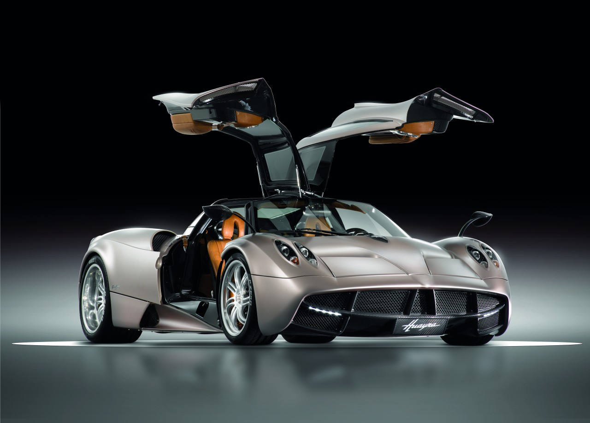
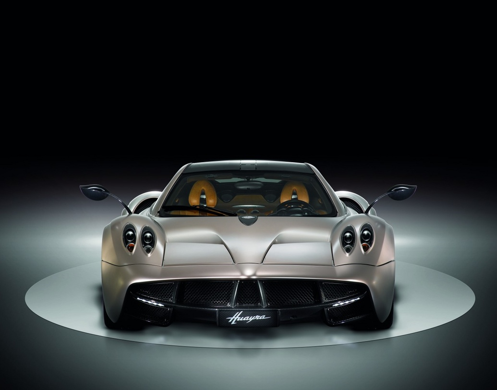
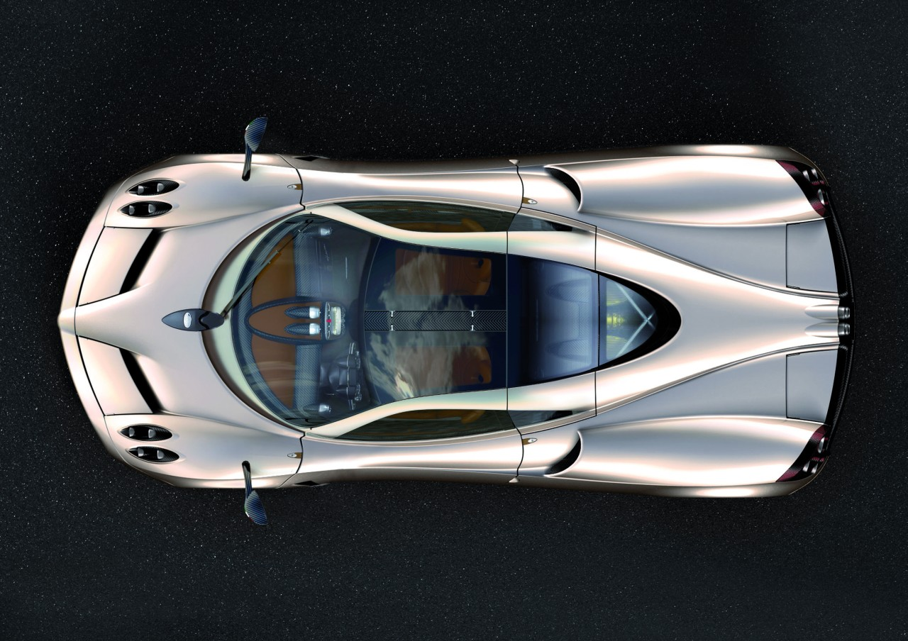
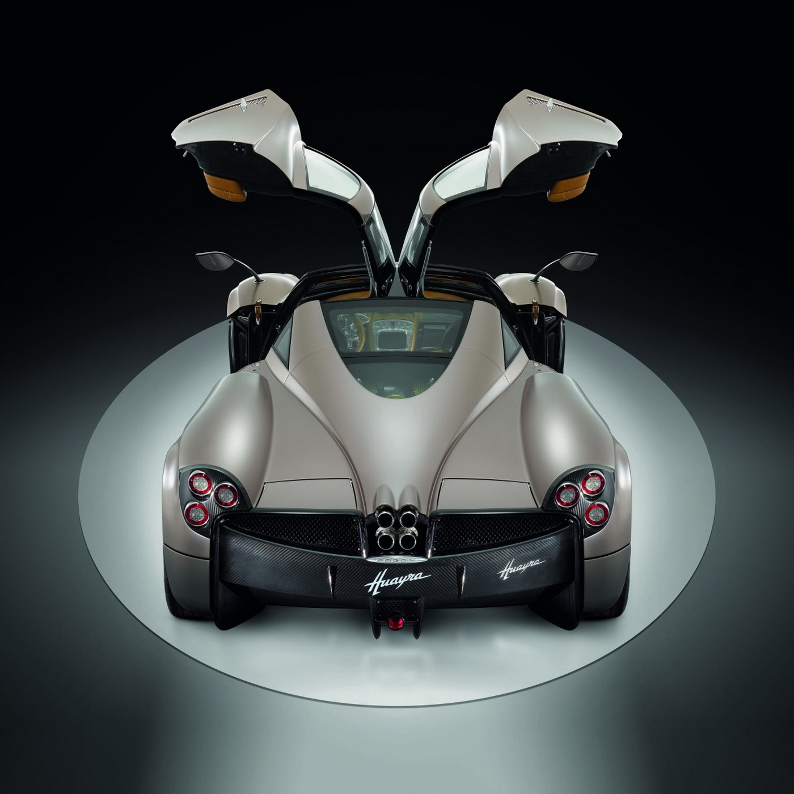
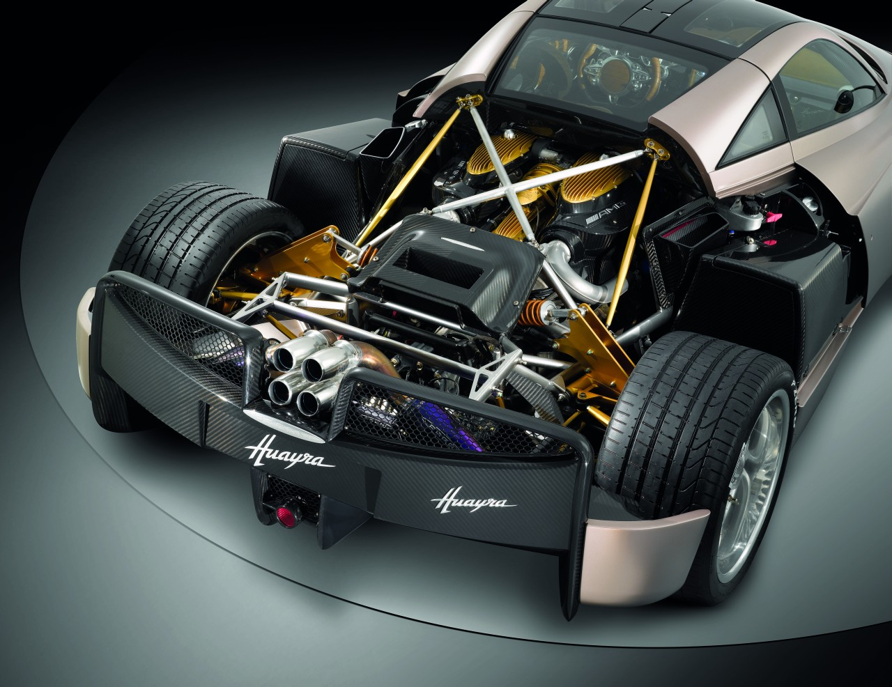
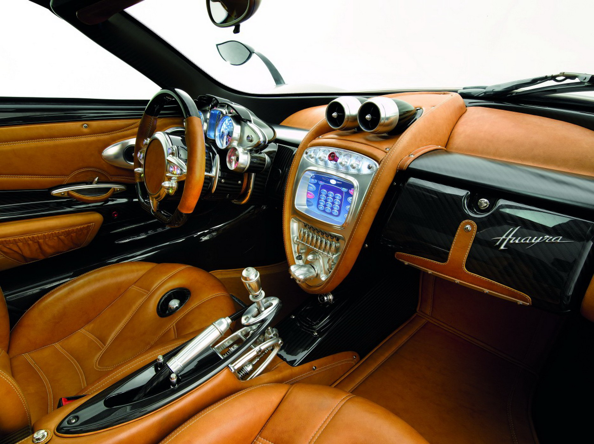

## Patronun mücevher hassasiyeti

Arjantinli patron Horacio Pagani, yeni süper otomobiline en az otomobilin kendisi kadar fantastik bir isim vermiş. Kendi segmentinde dahi nadir bulunabilecek standartlarla yaratılan otomobil ismini Arjantin’in antik çağlarına dair bir rüzgar tanrısından alıyor. Otomobilin ruhu ile bütünleşmiş HUAYRA adı silüetin görüntüsüne çok yakışmış. Otomobile dışarıdan bakıldığında Zonda’yı anımsatsa da detaylarda daha farklı olduğu öncelikle seziliyor. Ön farlardan başlayan zarif ve teknolojik tasarım karbon-fiberden imal ince uzun yan aynalar ile devam ediyor. Önden arkaya doğru göz gezdirilmeye devam edildiğinde sağ ve sol tarafta ışıl ışıl parlatılmış, farklı dönüş desenli, önde 19 arkada 20 inç jantlar dikkat çekiyor. Lastiklerin desenleri ise jantların dönüş yönüne göre uyarlanmış. Görselliği güzelleştiren diğer bir unsur ise jantların göbeğindeki yuvarlak titanyum bijon. HUAYRA’da uçak kanat teknolojisi ve tasarımından alıntılar bulunuyor. İlk etkileşim burun bölümünde. Ön tarafta splitter kullanılmamış. Bunun yerine iki devasa hava girişi bulunuyor. Önden gelen hava splitter bulunmamasına rağmen kaput üzerindeki iki flap sayesinde burnu yere basıyor. Aerodinamik kanatlar otomobilin arkasına da yerleştirilmiş. Arkadaki dört adet flap uçakların alçalmaya başladığı andaki gibi çalışıyor. Flaplar anlık hızı, yatay sapmaları, yanal ivmeyi, direksiyon açısını ve gaz pedalı konumunu kontrol ediyor. Sürüş ya da frenleme esnasındaki yükler ve flap açıları ECU kontrol sistemi sayesinde anlık olarak hesaplanarak belirleniyor. Frenajda kalkan flaplar rüzgarı tutarak yarattığı sürüklenme ile hava freni görevi yapıyor. Yatay hareketlerde ise mühendisliğin kalitesi daha da ustaca. Nitekim, viraja girildiği sıra yalnızca iç taraftaki flaplar kalkıyor ve kendi tarafındaki lastiklerin yere basma gücünü arttırarak düz yolda gidermişçesine viraj tutuşu sağlıyor. Bu esnada karoserin hareketlenmesi minimum seviyeye iniyor ki, tüm flaplar açıkken direnç kat sayısı 0.3ten 0.5e yükseliyor. Fren sırasındaki diğer bir ayar ise yükseklik ayarlı diğer amortisörlerle yapılıyor. Yol ile otomobilin burnu arasındaki yükseklik ECU sayesinde ölçülerek ağırlık dağılımı nötrleştiriliyor. Radyatörün üzerinden akan sıcak hava ön lastiklere doğru gönderiliyor. Karbon-seramikten imal disklerin ideal çalışma sıcaklıklarını ayarlamak ve balataların ömürlerini uzatmak için akıllıca tasarlanan sistemde intercoolerden gelen hava da direkt olarak seramik disklere yönlendirilmiş. Böylelikle 50 derece civarında kalan disk sıcaklıkları ideal frenleme sağlıyorlar.

Performans sınıfında bir sonraki aşamanın nasıl olacağı hakkında önemli ipuçları veren HUAYRA’da mühendisler Mercedes AMG’den alınma, M158 kodlu, 5980cc hacmindeki biturbo (twin turbo) motoru kullanmışlar. Motor 710 HP güç üretiyor. Euro 5 veya LEV II (Amerikan) emisyon kurallarına uyumlu motor 3500 d/d’de 1000 Nm’lik torka sahip. Kilometre başına atılan 310 gramlık emisyon değeri ise 12 silindir motor için son derece anlamlı. 1350 kilogram ağırlığa sahip arkadan itişli otomobilde motor ortaya diklemesine yerleştirilmiş. 7 ileri Xtrack şanzımanla birlikte sunulan HUAYRA kilitli diferansiyel ve ESP’ye sahip. Maksimum hızı 378 km/s olarak verilen otomobilin 0-96 km/s hızlanması ise sadece 3.2 saniyede gerçekleşiyor. Otomobilin güç/ağırlık oranı ise 512 HP/ton. Kabin arkasındaki küçük ve panoramik kesimli pencereden otomobili kudurtan motoru görmek mümkün oluyor.

HUAYRA iç mekanda devrim yaratıyor. Horacio Pagani tüm ayrıntılar için mücevher hassasiyeti göstermiş. İlk karşılaşılan güzellik dışa doğru açılan martı kanadı formundaki kapılar. Ancak kapılar açıldıktan sonra esas görsel şölen başlıyor. Vites kolunun tasarımı şimdiye kadar görülmemiş cinsten. Havada duruyormuşçasına bir görüntü veren krom kol, ortadaki tünel yuvasına nal şeklinde bağlanmış. Üstten ise tek bir krom parça ile sabitlenmiş. Sürücü vites kolunu hareket ettirdiğinde, tünel içerisindeki krom parçalar adeta dans ediyor. Ancak kol yalnızca Park, Drive veya Reverse için kullanılabiliyor. 7 ileri şanzımanın vites geçişleri direksiyon arkasındaki shift pedalcıklarıyla sağlanıyor. Muhteşem direksiyonun üzerinde Elektronik Stabilite Kontrolü, silecekler, farlar, sinyaller gibi bir dizi kontrol düğmesi var. Bunun yanı sıra şanzımandaki Normal, Sport veya Race modları da direksiyondan kontrol edilebiliyor. Race modu yatay güçleri ve tur zamanlarını kayıt ediyor. Göstergeler ise neredeyse birer sanat eseri. Pagani için İsviçreli bir saat üreticisi tarafından tasarlanan göstergelerde tüm rakam ve numaralar metalden üretilmiş. Sadece gösterge setinin maliyetinin 2500 Euro olduğu söyleniyor.

Titanyum, krom, deri ve karbon karışımı görüntü, her parçanın artistik detayını belli ediyor. Koltukların sürücü odaklı yapısı muhteşem. Güvenlik standartlarının üst seviyelerde tutulduğu göz önüne alınırsa, koltuk kombinasyonundaki teknolojinin üstünlüğü tartışılmaz seviyelerde. Yolcu koltuğunda pek gerekmese de Isofix bağlantıları dahi düşünülmüş. Karbon-fiber koltuklarda ağırlık sensörleri bulunuyor. Orta konsol ise bir başka şıklık içerisinde. Konsolda ortaya yerleştirilmiş dokunmatik arayüz birimi LCD ekran, navigasyon, ses sistemi, klima ve telefon gibi sistemlerle birlikte entegre edilmiş. Alüminyumdan imal edilmiş ve otomobilin maketi şeklindeki anahtar ise özel olarak hazırlanmış. Salt anahtar görevi görmeyen tasarım aynı zamanda müzik depolamada kullanılıyor. Anahtar, yuvasına yerleştirildiği anda kayıtlı müzik otomobile aktarılmış oluyor.

HUAYRA’da Veyron’daki gibi son derece pahalı lastikler kullanılmamasına rağmen testlerde 378 km/s hıza ulaşılmış. Ağırlığın azaltılması için tüm parçalar titanyumdan üretilmiş. Öyle ki, Xtrack şanzıman maksimum ağırlık dağılımı için transverse formunda yerleştirilmiş. Çift kavramalı şanzıman ise aynı nedenden ötürü (ağırlık düşürmek) kullanılmamış. Üstelik tek kavramalı şanzımanın 1100 Nm’lik torka dayanabilmesi ise müthiş bir ayrıcalık. Böyle bir mühendisliğin ortaya çıkardığı otomobilin satış fiyatının makul olduğunu düşünmek abes olur. İngiltere satış fiyatının vergiler dahil 1.000.000 sterlin olması bekleniyor. Modifiyeye son derece açık AMG motorun ise daha da geliştirilmesi ve yeni “S” versiyonunun planlaması ile ilgili çalışmalar devam ediyor.

