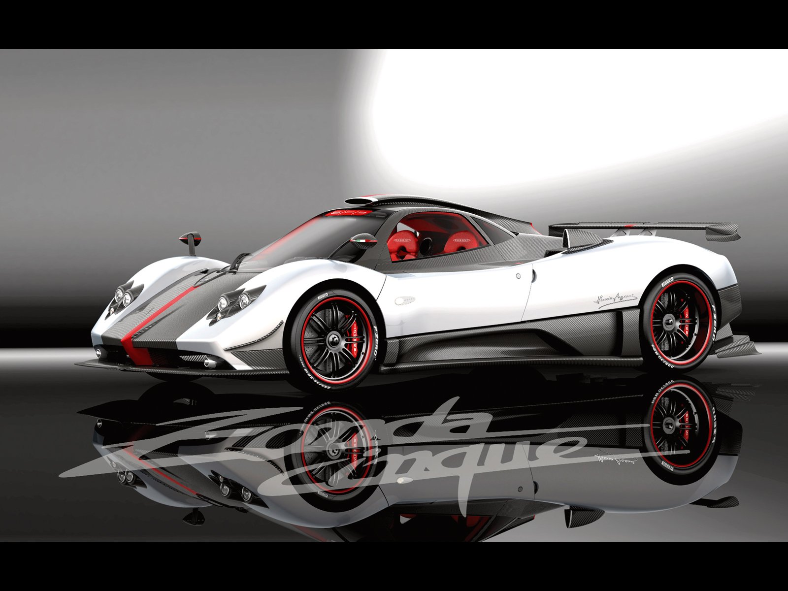
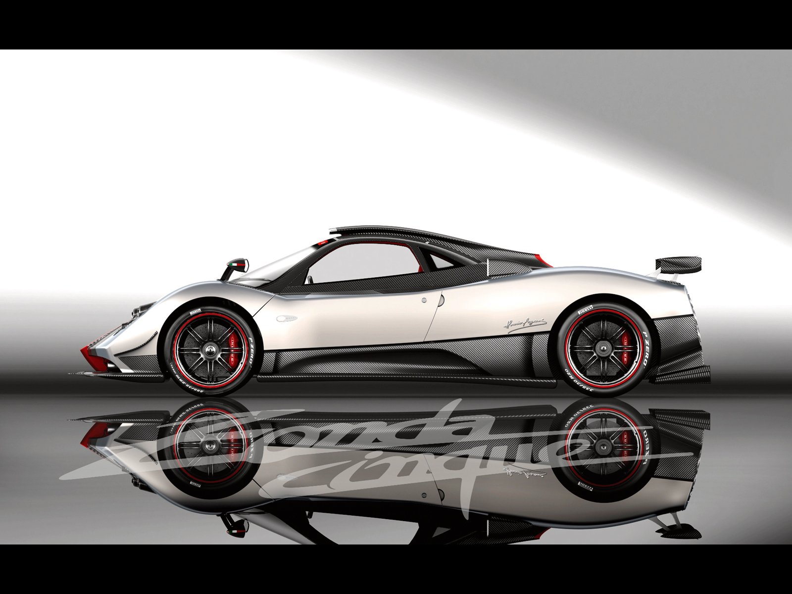
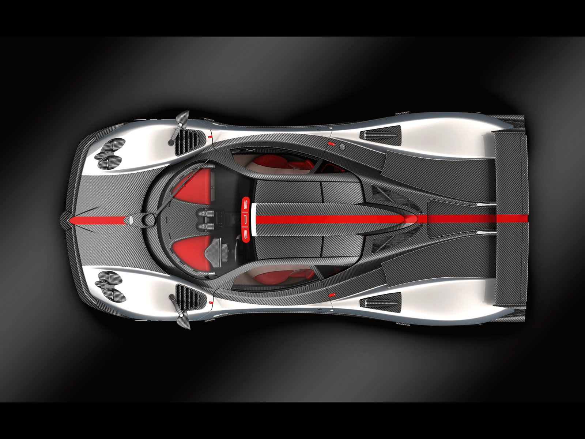
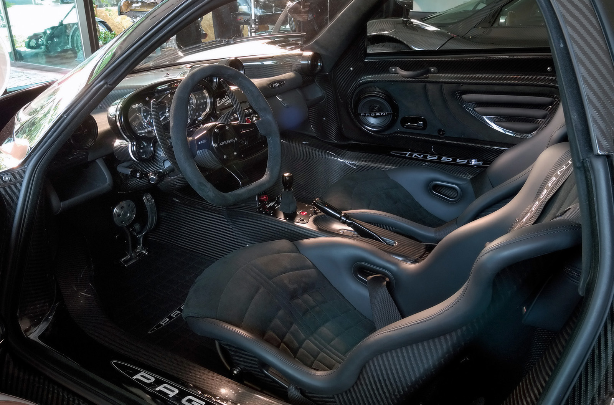
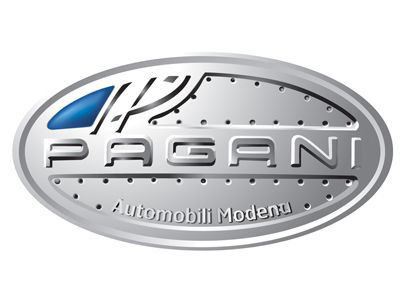

### melez beşizler

Anatomik olarak bakıldığında bu kez İtalyan-Alman karışımı melez bir canavarla tanışıyoruz. Horacio Pagani’nin bir takım kaygılarından kaynaklanan gerekçelerle üretim sayısı sadece beş adetle sınırlandırılmış beşizlerin kalbi Alman AMG’den, bedeni ise İtalya’dan. Böylesine bir fusion sonucunda ortaya çıkan makinenin fiyatı otomobilin kendisi kadar müthiş. Tam tamına 1.360 milyon Euro’luk etiket otomobili sabırsızlıkla bekleyenler için önemli olmasa gerek. Markanın tarihine göz atıldığında geçmişte özellikle ZONDA R, C12 ya da F gibi süper otomobillere rastlamak mümkün. Ancak Horacio Pagani kendi fanatiklerinin daha fazla güç isteklerini değerlendirmekte kayıtsız kalmamış olmalı ki mesaj adresine ulaşmış. F1 otomobillerine şapka çıkartan güç Mercedes AMG’nin V12’sinden elde ediliyor. Ortaya uzunlamasına konumlandırılan 7291 cc hacmindeki V12 tam performansını açığa çıkartabilmek için kesinlikle eski bir hava alanı pistine ihtiyaç duyuyor. Ekstrem motor 678 HP gücü ile sürücüsünü deli etmeye ayarlanmış. Üstten çift eksantirikli motorun silindir bloğu ve üst kapağı alüminyum alaşımdan imal. Silindir başına 4 sübaplı motorun hafifliğindeki en önemli unsur malzemenin alüminyum olması. CINQUE’nin yola aktarmaya her an hazır olduğu çevirme gücü ise 780 Nm. Ortadan motorlu otomobilin mükemmelliği yalnızca az bulunur olmasından ibaret değil. Nitekim motorun kimlik kartını kontrol ettiğimizde radikal rakamlarla karşılaşıyoruz. Örneğin ağırlık veya ağırlık/güç oranları, son derece tatminkar verilere sahip. Boş ağırlığı sadece 1210 kg olan otomobilin ağırlık/güç oranı ise 569 HP/ton. Akselerasyona artı yönde etki eden bu rakamlar sık rastlanmayan bir durum. CINQUE’nin 0-100 km/s hızlanması 3.4 saniye olarak verilmiş. Otomobilin son sürati ise 350 km/s+ gibi dudak uçuklatan cinsten.

Otomobilin aerodinamik çizgileri adeta seyredilsin diye tasarlanmış. Ön tasarımda modern zamanların silüeti görünürken, arka kısımda biraz tuhaflığına rağmen retro bir hava seziliyor. Son derece alçak olan CINQUE’nin iç mekanı karmaşık görüntüsüyle bir ralli otomobilini andırıyor. Direksiyon alkantara deri ile kaplı ve alt tarafı düz olarak tasarlanmış. Karbondan imal yarış tipi koltuklar ise Toora firması tarafından hazırlanmış. Kenarları kırmızı deri ile kaplı koltukların ortaları direksiyon gibi alkantara deri kaplı. Kabin içerisinde dört noktadan bağlantılı emniyet kemerleri mevcut. Diklemesine yerleştirilmiş gaz pedalı yuvarlak formlu fren pedalı ile sürücüyü kışkırtan unsurlardan. Gösterge tablosunda iç içe geçmiş devir ve kilometre saatleri mevcut. Saatlerin üzerinde hangi viteste olduğunuzu belirten led ekran ve vites değiştirme ışıkları bulunuyor. Karbon-fiber vites pedalları oldukça iri ve direksiyondan bağımsız olarak direksiyon miline monte edilmiş. Vites topuzunun ve start düğmesinin şanzıman tünelinin üstündeki yeri oldukça ergonomik. Ön cam üzerinde tavana entegre hava girişi pist için üretilen R modelinden alınma. Arka ortada bulunan dörtlü egzos çıkışı elektrik mavisi rengi ile agresif bir bütünlük sağlamış.

PAGANI ZONDA CINQUE’nin en önemli özelliği tartışmasız ürkütücü performansı ve yol ile bağlantısı. Yol tutuş randımanının yüksekliği ayarlanabilen Öhlins amortisörler ve özellikle titanyumdan üretilen yaylar sayesinde gerçekleşiyor. Ağırlığın düşürülmesi için süspansiyonlar magnezyum ve karbon-titanyumdan üretilmiş. Geometrik açıların son derece iyi ayarlanması ile birlikte şasiye monte edilen karbon-titanyum materyal yeni ve daha önce kullanılmamıştı. İşçilik ve teknolojinin birbirine karıştığı yeni malzemedeki gümüş renkli elyaflar adeta bir dokuma görüntüsü veriyor. Otomobilin arkasında iki tarafta bulunan çıkıntılı hava girişleri frenlere gerekli havayı yolluyor. Ön taraftaki kullanışsız dış aynalarla birlikte zarif ve aerodinamik bir görüntü veriyor. CINQUE’nin önde alttaki kanat ile arkadaki difüzör ve spoyler 300 km/s hızda 750 kg. down-force (yere basma) gücü uyguluyor. Motoru ateşleme için anahtarı çevirirken fren pedalına basmak gerekiyor. Vites kolunun önündeki “start” düğmesi ile motor çalıştırılıyor. Sıra direksiyonun arkasındaki karbon-fiber paddle shift’i kullanmaya geliyor. İlk kez bu modelde kullanılan pedallar direksiyon miline direkt bağlantısı nedeniyle kontralarda rahat erişim ve kolaylık sağlıyor.

Altı ileri Cima şanzıman Automac tarafından otomatikleştirilmiş. Vites kolunun ön tarafına monte edilmiş kırmızı renk düğme aracılığı ile vites artış hızları ayarlanıyor. Vites kutusu içerisinde üç ayrı mod bulunuyor. Kırmızı select düğmesi modlar arasında seçim imkanı sağlıyor. Comfort, Sport ve Race seçenkleri arasında tercih yapmak tamamen sürücünün isteğine bağlı. Arkadan itiş ve kilitli diferansiyele sahip CINQUE hangi mod seçilirse seçilsin komutlara itirazsız itaat ediyor. Direksiyon ağır gibi algılansa da agresif karakteri ile kışkırtıcı. Geniş kalçalı otomobile tam gaz verirseniz ASR sistemi hemen devreye giriyor ve patinaja girmeyi engelliyor. Genellikle kolay kullanım hissi veren otomobil sürücüsüne yol tepkilerini eksiksiz iletebiliyor. Virajlardaki değişken yanal ağırlıklar saf yol tutuş sayesinde dengeleniyor. Sert frenajlarda dahi sorun yaratmayan CINQUE, adeta altında mıknatıs varmışçasına yola yapışıyor. Şanzımanın vites artışı esnasındaki kısmi tork kesmesi mühendislerin manuel vitesi düşünmelerini gerektirse de müşteriler kesinlikle otomatik şanzımanı tercih etmişler. Otomobilin frenajdaki başarısı hava kanallı karbon-seramik disklerle gerçekleşiyor. Ön ve arkada 380 mm’lik diskler kullanılmış. Siyah jantların içindeki kırmızı kaliperler tavandaki kırmızı şeritle birlikte görsel bir bütünlük sağlamış. Önde 225/35 R19, arkada ise 335/30 R20 ebadındaki Pireli P Zero lastiklerle donatılan CINQUE’de süspansiyonlar önde ve arkada çift salıncaklı, helezon yaylı ve ayarlanabilen amortisörlerle sunuluyor.
İtalyan firmanın limitli sayıda ürettiği CINQUE, Zonda’nın günümüze kadar ürettiği en güçlü ve en sinirli otomobil. Ancak müşteriler yetinmeyip otomobilin R versiyonu için taleplerine devam ediyorlar.

