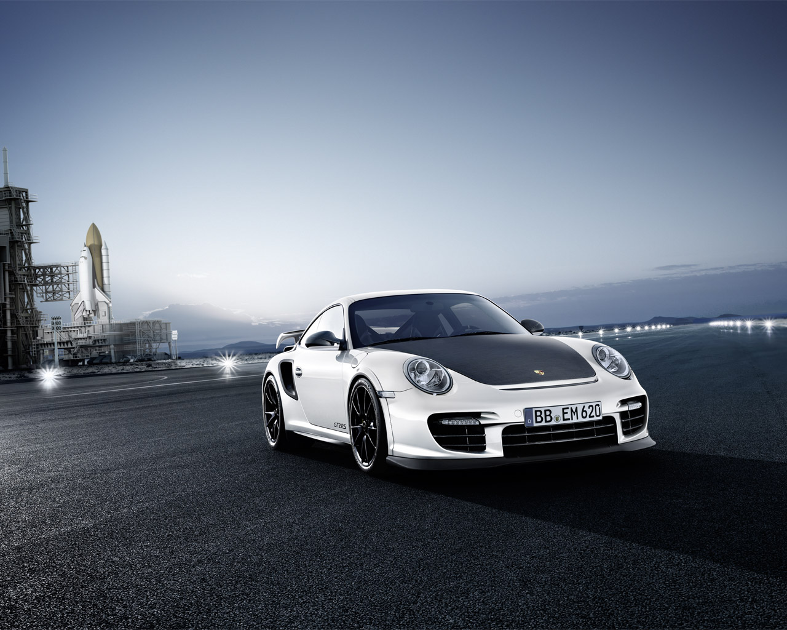
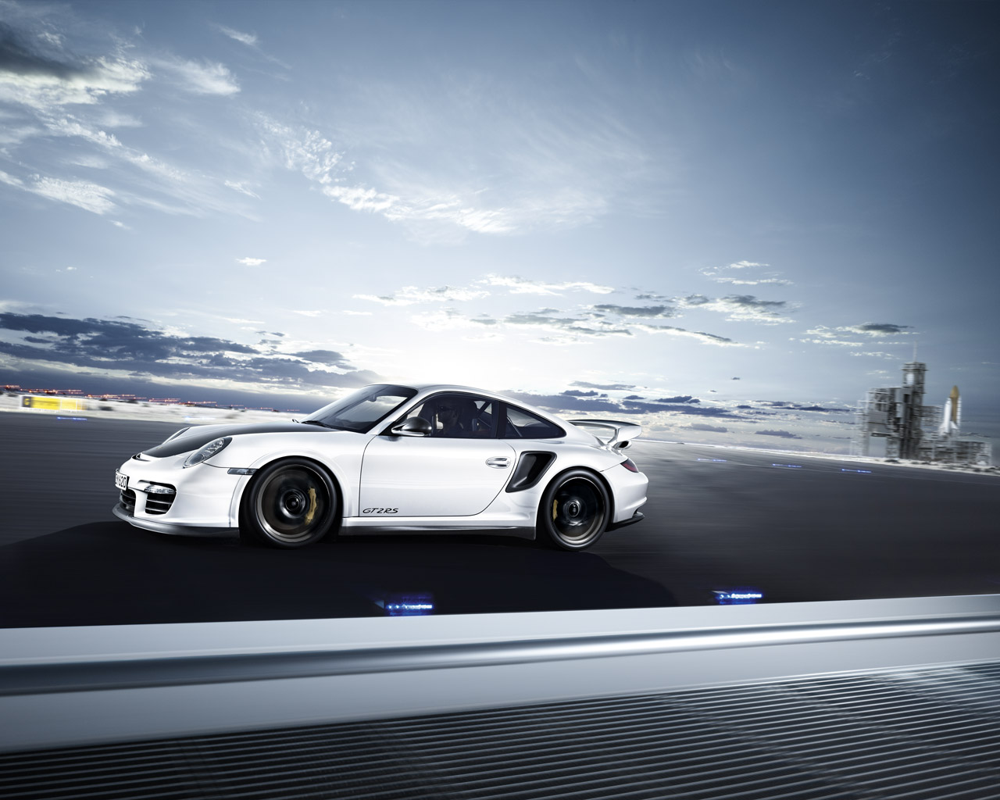
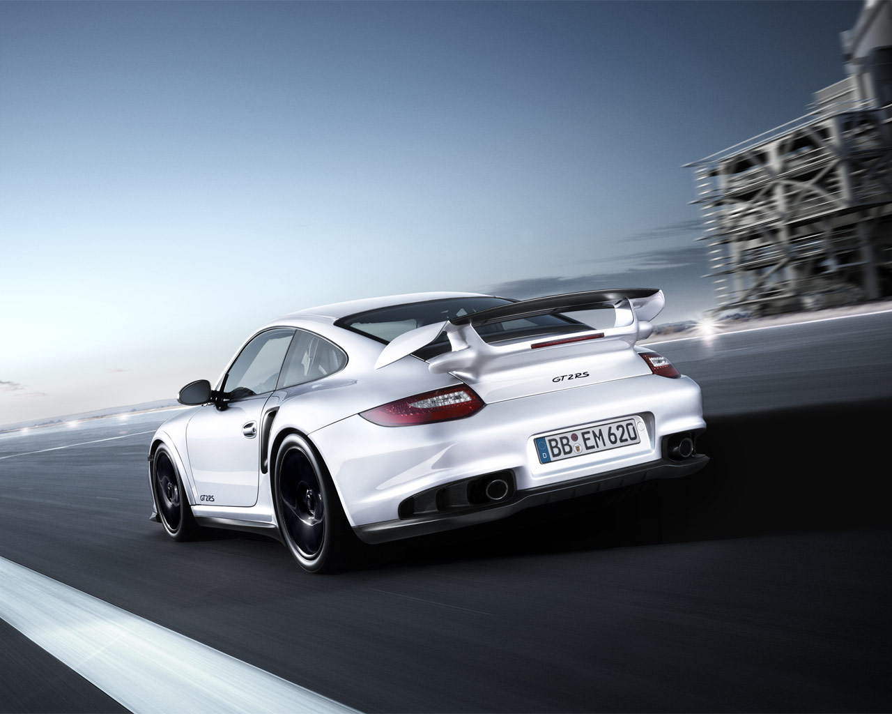
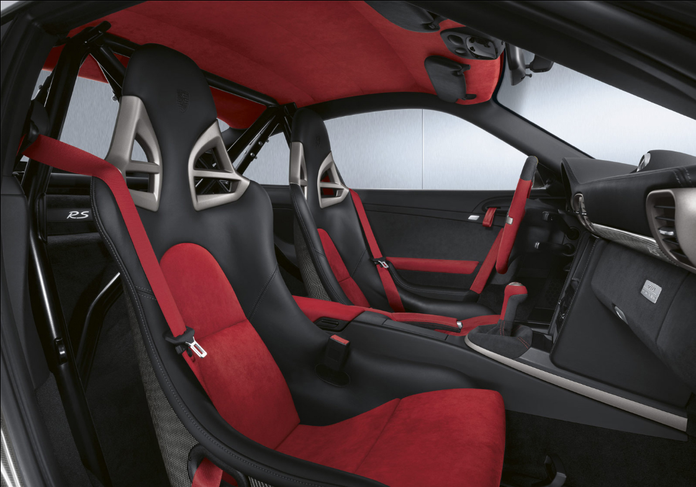
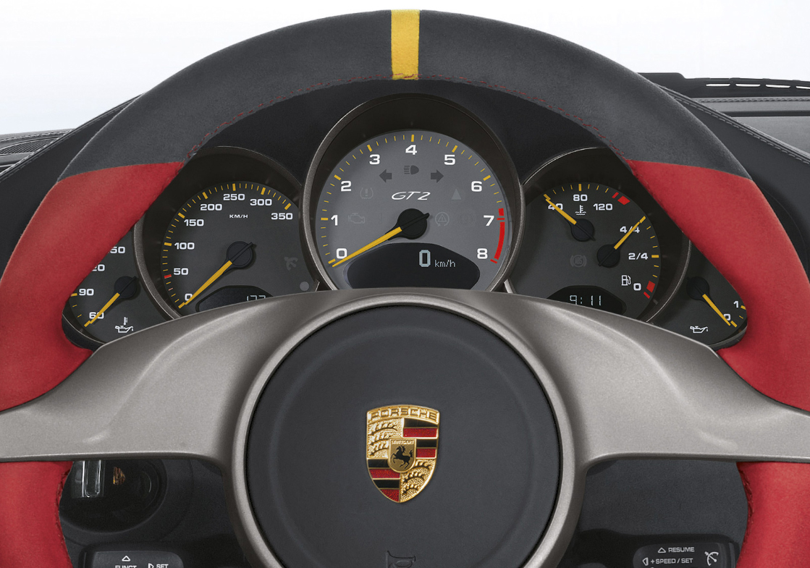
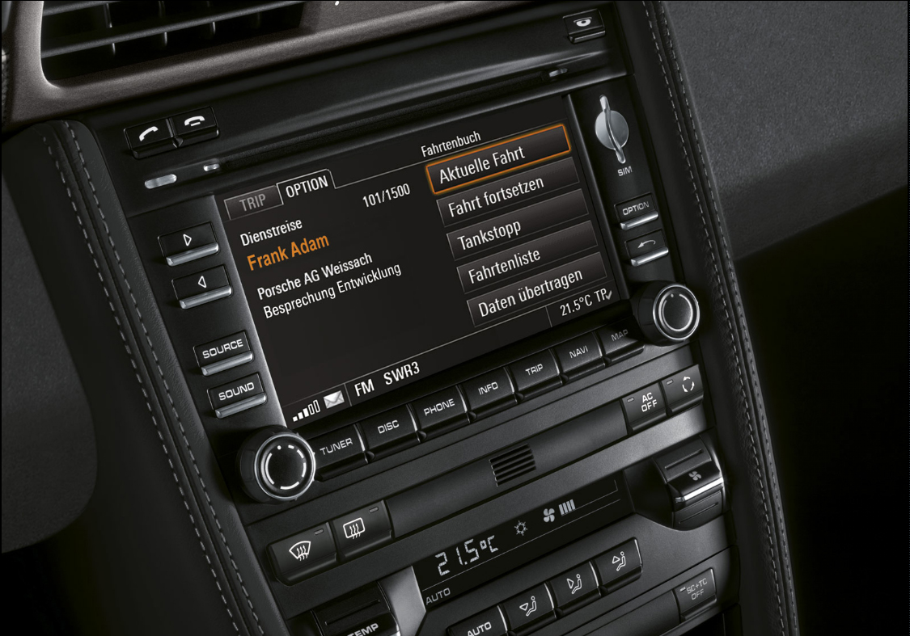

## Ekstrem 911

Gelen talepler üzerine 911’ler her sene daha fazla güç kazanıyor, hızlanıyor. Yalnızca 300 adet üretim sayısı ile sınırlı GT2 RS, daha hızlanan ve güçlenen markanın en yeni üyesi. Mevcut 911’lerin içerisinde en fazla teknoloji ile donatılan otomobilin her biri, üzerinde üretim sayısını gösteren plakası ile birlikte sahiplerinin garajına girecek. Yetkililere göre, otomobil iki noktada önemini gösteriyor. Bugüne kadar üretilenlerin içerisinde en iyisi olduğu belirtilen GT2 RS, gerek performans, gerekse yol tutuş ikilisi ile kendi klasındaki diğer otomobillere meydan okuyor. Klasikleşmiş tasarım ve kıdemli çizgilerini muhafaza etse de, bünyesinde aerodinamik yasaların isteği olan bir takım ayrıntıları barındırıyor. Ekstra ağırlığa neden olacak herhangi bir detaya rastlanmayan gövdede bagaj kapağı dahi fikslenmiş. Atmosferik motorlu GT3 RS modelinin şasisi modifiye edilerek GT2’ye uygun hale getirilmiş. Salıncak kollarına fazladan bağlantılar yerleştirilmesi ile sürücü tepkileri optimum hale getirilmiş. Otomobilin daha fazla hava alması için önde splitter bulunmuyor. Bunun yerine arka kanada ikinci bir dengeleyici kanat eklenmiş ki, down-force (yere basma gücü) GT3’le mukayese edilemeyecek şekilde artmış. Plastik malzemeden üretilen tek parça kanatlar (opsiyonel) görünüm, fonksiyonluk ve mekanik açıdan son derece başarılı bir uygulamayla gerçekleşmiş.

GT2 RS altı silindir boxer ve çift turbolu motor ile sunuluyor. Arkada ve uzunlamasına yerleştirilen motor, 6500 d/d’da 620 HP’lik güç değeri ile neler yaşatabileceğini hissettiyor. GT2 ile kıyaslandığında görülen 90 HP’lik artı güç diğer tüm rakamlarda da karşımıza çıkıyor. Örneğin 2250 ile 5500 d/d aralığındaki çevirme gücü tam 700 Nm. (GT2’den 24 Nm daha fazla) Boş ağırlığı 1370 kilogram olan otomobilin 0-100 km/s hızlanması 3.5 saniyede gerçekleşiyor. Hızlanma hevesi üzerine yapılandırılan DOHC motor, sıfırdan 160 km/s’e ise 6.8 saniyede çıkabiliyor. Bu rakamlar söz otomobilin hafifliğine gelince daha anlamlı hale geliyor. Nitekim, karşılaştırmada göz önüne aldığımız Porsche GT2 kantarda 70 kilogram daha fazla çekiyor. Ciddi bir sporcu ile karşı karşıya gelindiği konusu ton/HP oranına göz atıldığında da ortaya çıkıyor ki, rakam tam 453 HP’yi gösteriyor. 

Her zaman olduğu üzere, sürücünün yetenekleri otomobilin tam performansını göstermesi bakımından yaşamsal önem taşıyor. Kısa oranlı vites geçişleri kilitli diferansiyel ile birlikte ritmik bir bütünlük sağlamış. 6 ileri manuel şanzıman ile bütünleşebilmenin yolu ancak gözleri dört açarak ve otomobile mutlak hakim olabilmek ile mümkün. Ancak, limitlere yaklaşıldığında veya ürkme başlarsa PSM devreye sokulabilir. Sistemdeki bir dizi elektronik müdahale ve yardımlar sürücüye destek sağlamak amacı ile programlanmış. Program içerisinde bulunan ABS, ESP ve TC gibi destek sistemlerinin yardımı özellikle viraj içlerinde elektronik olarak gerçekleşiyor. Direksiyon tepkileri ise GT3 RS’ye oranla daha keskinleştirilmiş. Sürücünün, yol üzerindeki değişiklikler veya darbeler arasındaki iletişimi son jenerasyon Porsche GT2 RS’nin direksiyonu ile daha güvenilir hale gelmiş.

Turbolara baktığımızda basıncın 1.4’ten 1.6’ya çıktığını görüyoruz. Değişken zamanlı turbolar, yenilenmiş intercooler, egzos sistemi ve pistonlarla entegre edilmiş. Şasi üzerindeki yeni yapılanma ile gövdenin birlikteki uyumu GT2 RS’i bir viraj ustasına dönüştürüyor. Otomobilde delikli soğutmalı karbon-seramik diskler ile sunulan fren sistemi bulunuyor. Önde 380 mm, arkada 350 mm ebadındaki seramik diskler yorulmadan çalışıyor. GT2 RS için özel üretim Michelin Pilot Sport Cup lastikler, önde 245/35 ZR 19, arkada ise 325/30 ZR 19 ebadında. İddia edilen 331 km/s’lik son sürat ise standart üretim bir 911’in geldiği son hızı gözler önüne seriyor. Otomobil şehir içi veya pist kullanımındaki başarısı 911 GT2 RS’nin arzulanması için yeterli kriterler olarak kabul ediliyor. Agresif otomobilin kullanımı rafine özelliklere sahip. Yüksek hızlardaki yol tutuş, daha önceki modellerden daha iyi seviyede. Nitekim, otomobilin hızlanması esnasında burnunun yükselmemesi ve önden tutunmanın sağlamlığı sürücüsüne ekstra güven veriyor. Sürüş keyfini arttırmak için viraj çıkışlarında erken gaza basmak veya gereksiz kontralara girişmemek gerek. Bu durumda derhal güvenlik sistemleri devreye giriyor. Bu süper otomobilde de karbon-fiber malzeme ağırlıklı olarak kullanılmış. İç mekan ve gövde üzerinde kullanılan kompozit malzemeler, otomobilin hafifletilmesi için kaçınılmaz bir etken. Otomobilde isteğe bağlı olarak gövde ve jant renkleri değiştirilebiliyor.

Son jenerasyon ekstrem paket 911 GT2 RS Porsche, yaklaşık 165.000 sterlin fiyatı ve ısrarla tekrar duymak istenen motor sesi ile heyecanlandırıyor. Ancak, standart üretim GT2 RS için “ekstrem” dedik, ama: Bir Porsche’nin gelebileceği en son noktayı görmek isteyenler için Brabus’ten ayrılan ve senelerdir tüm Porsche modellerini modifiye eden eski kurt Jan Fatthauer’in elinden çıkma 9FF GTURBO 1200 isimli (6 silindir, 1200 HP, yaklaşık 400 km/s) akıllara zarar, manyak (!) Porsche’yi önümüzdeki sayıların birinde ayrıca inceleyeceğiz.

