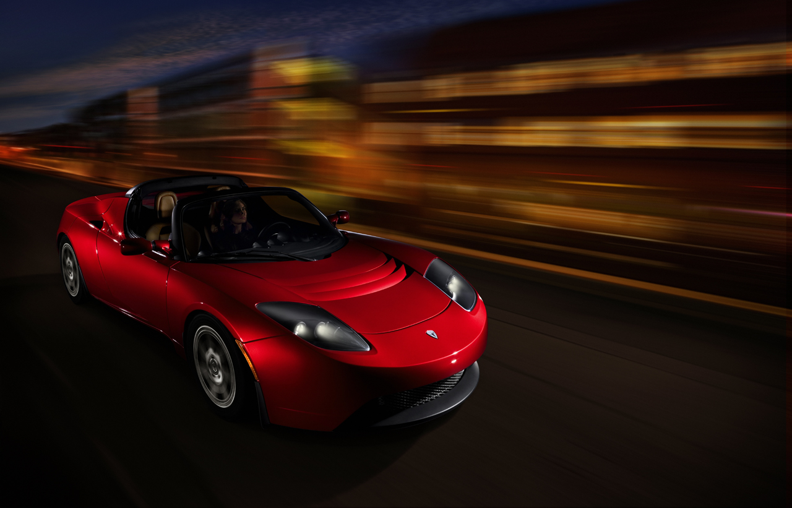
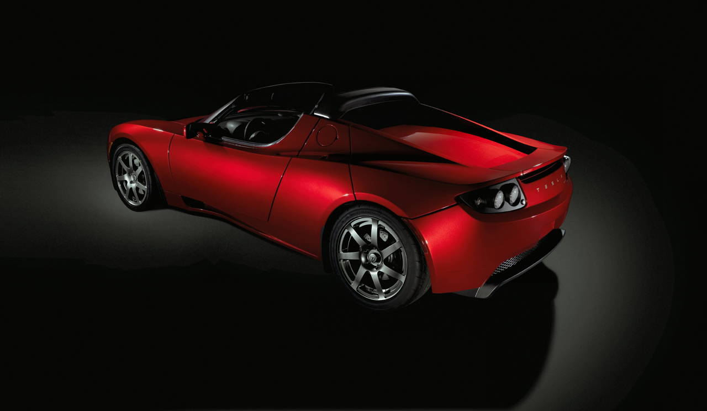
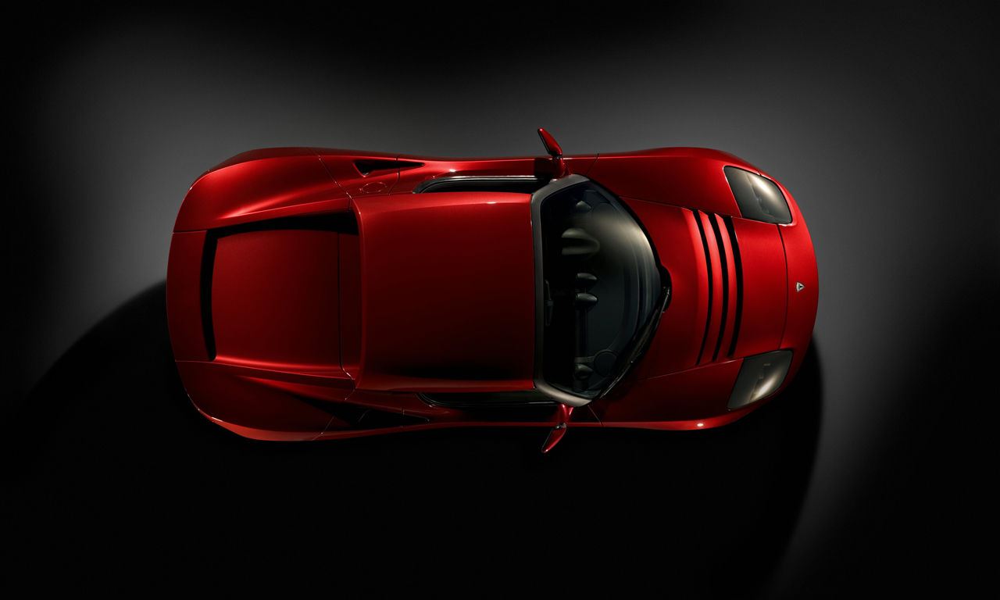
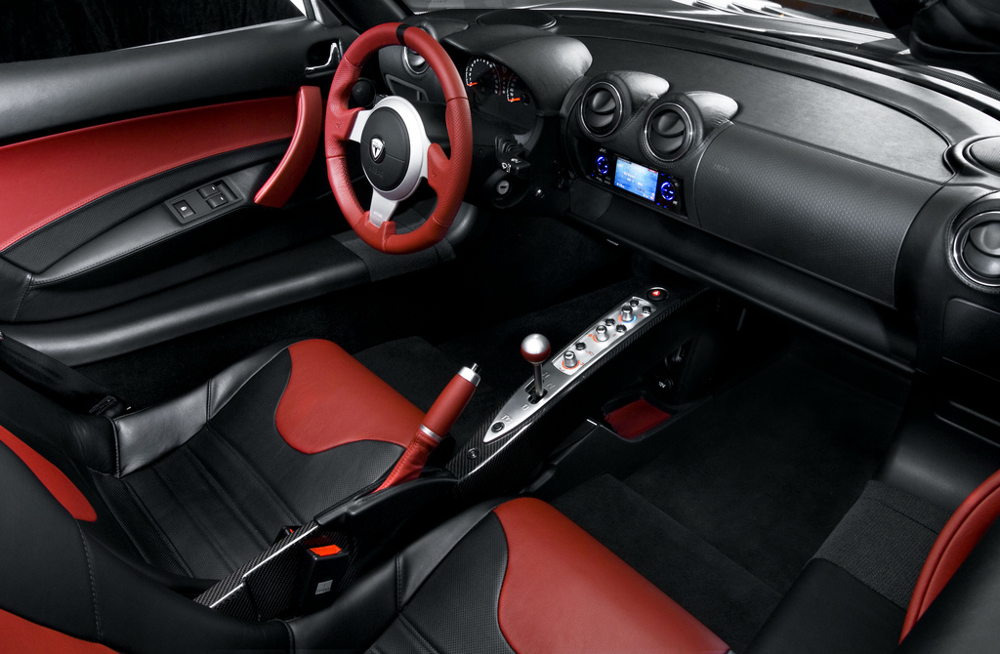
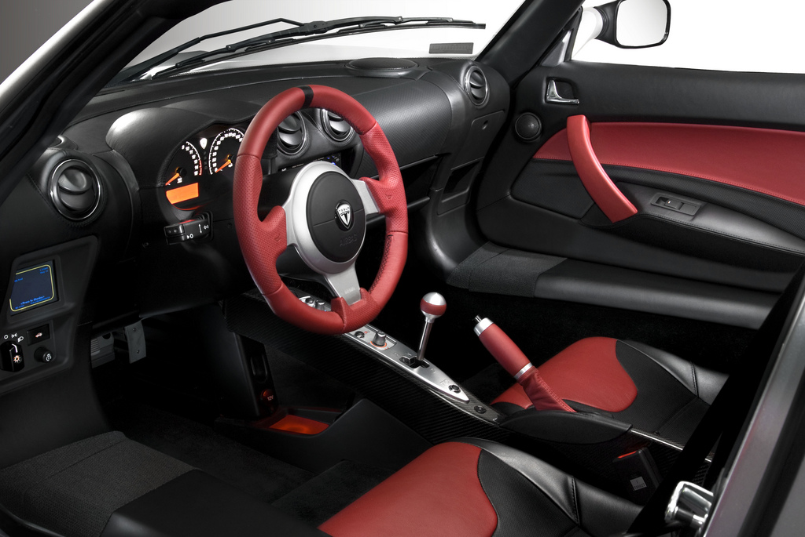

### Emisyon: 0, Gürültü: 0

Üretici firmanın sahibi Elon Musk, Newsweek dergisi ile yaptığı röportajda gelecek 30 yıl içersinde bütün otomobillerin elektrikli olacağını, hatta biraz daha ileri giderek plug-in hybrid teknolojisinin yeteri kadar verimli olmadığını ve aynı zaman içersinde elektrik motorun otomobillerin geleceğini belirleyeceğini söylüyor. Tüm otomobil firmalarının yaptığı çalışmalar Musk’un görüşlerini teyid eder yönde. Zira yaklaşık yüz seneden fazla bir süredir kullanılan fosil yakıtların hakimiyeti yavaş yavaş azalıyor. İçten patlamalı bu motor teknolojisi yerini 2010 tarihinden itibaren elektrikli motorlara bırakacak. Markaların yaptığı çalışmalara bakıldığında ortaya çıkan modellerin yalnızca konsept araçlar olduğu söylenemez. Hybrid araçlarla mukayese edildiğinde emisyon ve yakıt değerlerinde tartışmasız üstünlük sağlayan yeni projelerden biri olan Tesla Roadster, seri üretim ve sıfır emisyon hacimli bir spor otomobil. Bio-yakıtla çalışan güçlü motorların rekabetindeki yarışma elektrikli motorlarda da karşımıza çıkıyor. Petrol fiyatlarındaki artış ve imalat sırasındaki hammadde maliyetleri otomotiv üreticilerini ve sektörü etkiliyor. Tüketiciye ulaşım için harcadığımız yakıtı da düşündüğümüzde bu kez dağıtım maliyeti karşımıza çıkıyor. Stokların azalması ya da artan fiyatlar üreticileri alternatif yakıt atışlarına itiyor. Çevrenin daha fazla kirlenmeye tahammülü kalmadığına göre petrolün yerini alabilecek yakıtlar olarak bio-yakıt ve elektrik motor teknolojisindeki gelişmeleri görüyoruz. Nitekim Tesla Motors’un çalışmaları da bu yönde ilerliyor. Firma yeni otomobilini bu yıl içerisinde Avrupa’da satmayı planlıyor. Tesla Roadster şu anda 100 bin dolarlık bir etiketle ABD piyasasında satılıyor. Ancak Avrupa satış fiyatı 99 bin euro olarak belirlenmiş.  

Tesla Motors Silikon Vadisi’nde yaptığı araştırmalara ara verip üzerinde yoğunlaştığı ve mart ayında üretimine başladığı Roadster’in tamamını sattı. 2009 senesi için planlanan 1200 adetlik üretimin 900 adedi için ise ön sipariş alındı. Kotalara bakıldığında Türkiye’de satış listesinde görünüyor. Kaparo için 60 bin dolar ödemek, teslimat için ise 15 ay beklemek gerekiyor. Otomobilin ayrıntılarına baktığımızda son derece verimli olduğunu görüyoruz. İki kişilik ve üstü açılabilen otomobil tamamen elektrikle kontrol ediliyor. Üzerinde bulunan 450 kg ağırlığındaki lityum-iyon piller 248 HP güç üretirken, akselerasyon değerleri İtalyan süper spor otomobillerinden aşağı kalmıyor. Tesla Roadster’in 0-100 km/s hızlanması sadece 3.9 saniye sürüyor. Elektrik motor sıfır devirde 286 Nm’lik döndürme gücü üretebiliyor. 1220 kg boş ağırlığa sahip Tesla’nın torku diğer markaların şu an için ürettiği elektrikli otomobillerine kıyasla oldukça yüksek. 6831 hücreli lityum-iyon batarya kendi segmentindeki diğer rakiplerine göre yaklaşık altı kat daha verimli ve on kat daha az karbondioksit yayıyor. Roadster piyasadaki normal araçların 4,5 litre harcadığı benzinle bataryaları sayesinde 202 km. menzile ulaşıyor. Bataryanın maksimum menzili ise 365 km. olarak verilmiş. İngiliz Lotus firmasının tasarladığı aerodinamik gövdeli otomobilin son hızı ise 210 km/s. Yakıt giderleri ise oldukça şaşırtıcı. Roadster km’de 2,5 krş. bedelinde elektrik tüketiyor. 160 bin km’lik ömre sahip bataryalar 3,5 saatte şarj edilebiliyor. Opsiyonel olarak sunulan mobil şarj kiti ile yol üzerindeki herhangi bir elektrik sağlayan noktada ya da benzincide prizden şarj edebilmek mümkün. (Kit fiyatı: 500 dolar) İnternet üzerinden sipariş alan firma otomotiv endüstrisi için şüphe götürür cinsten veya üzerinde rahatlıkla spekülasyon yapılabilecek bu yeni teknoloji için 2008’in ilk ayında Amerikan Ulusal Motorlu Taşıt Güvenlik Standartları testlerini etkileyici bir başarı oranı ile geçerek seri üretime başladı. Seri üretim sıfır emisyon hacimli tek spor otomobil olan Tesla Roadster’deki motor 3 fazlı. Isınan bataryaların soğutulması için 27 m2 alanı kapsayan batarya tabakalarını klima ile soğutma, mühendislerin sorun çözmedeki başarılı fikirlerinden biri. Bataryalara gelen elektrik ise doğal gazla çalışan ve sisteme entegre bir üniteden sağlanıyor. 

Otomobildeki dakikada 13.000 devir çeviren elektrikli motor akselerasyonda problem yaşatmıyor. Ancak DSG sistemine benzer yapıdaki iki oranlı şanzımanın 2010 senesine kadar yenilenmesi düşünülüyor. Yeni şanzıman öncelikle White Star isimli sedan versiyonda kullanılmaya başlanılacak. Roadster’in ivmelenmesi için vites geçişi yapıldığında vites en uygun devre göre otomatik olarak değişiyor. İkinci vitesin ortalama 100 km civarında değişmesinin anlamsız olduğunu düşünenler söz konusu olmalı ki, Elon Musk yaptığı tanıtım toplantısında bir süre sonra yenilenecek olan şanzımanla bu problemin ortadan kalkacağını belirtiyor. Arkadan itiş otomobil hareket esnasında sıfır ses üretiyor. İtiş gücünün tatmin edici özelliği sürüş esnasında otomobili keyifli hale getiriyor. 150 km/s hızda bile lastikli yuvarlanma sesinden başka bir ses işitilmiyor. Güçlü frenler Lotus tarafından hazırlanan karbon-fiber gövdeyi durdurmakta başarılı. Frenleme sırasında ortaya çıkan enerji doğrudan bataryalara gidiyor. İç mekan Lotus Elise’yi andırsa da daha geniş tasarlanan sportif deri koltuklar göz dolduruyor. Üç kollu direksiyon simidi ideal ölçüsü ile sportif kullanıma göre konumlandırılmış. İki koltuk arasındaki üzerinde vites kolu ve ayar düğmelerinin bulunduğu konsol alüminyum rengi görünümü ile şık bir görüntü oluşturmuş. Genellikle siyah rengin hakim olduğu ön konsol son derece sade. Alaşım jantlar yedi kollu ve gövdeye çok yakışmış. Otomobilin standart donanımı içerisinde: motor freni, ABS, çift airbag, darbe emici sistem, CD-mp3 çalar, iPod girişi, hız sabitleyici, klima ve 17 inç jantlar bulunuyor. Dokunmatik ekranlı navigasyon, karbon-fiber açılır tavan ve mobil şarj kiti gibi seçenekler ise opsiyonel olarak satın alınabiliyor. 

Otomobilin ismi Amerika’da yaşayan bir Sırp göçmeni olan Nikola TESLA’nın soyadından geliyor. Şu an evlerimizde kullandığımız dalgalı akım elektriğini Tesla’ya borçluyuz. Doğru akımı savunan Edison ile dalgalı akımı savunan Tesla arasındaki mesleki çekişme, elektrik santrallerinin tasarlanması aşamasında Amerika’da hayli büyük bir kutuplaşmaya sebep olmuştu. Sonunda uzak mesafelere elektriğin kolaylıkla iletilmesi ve santrallerin verimli çalışması konusunda haklı olduğu ortaya çıkan Nikola Tesla’ya saygı gereği olarak üreticiler bu otomobile TESLA adını verdiler.

