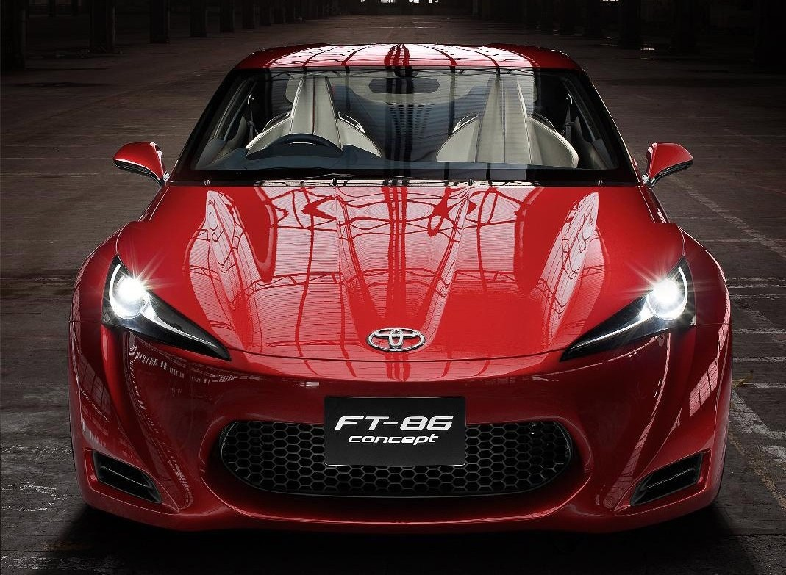
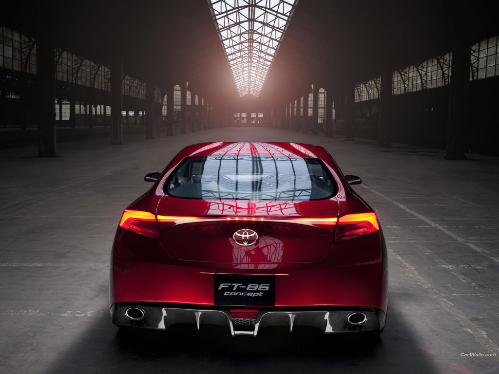
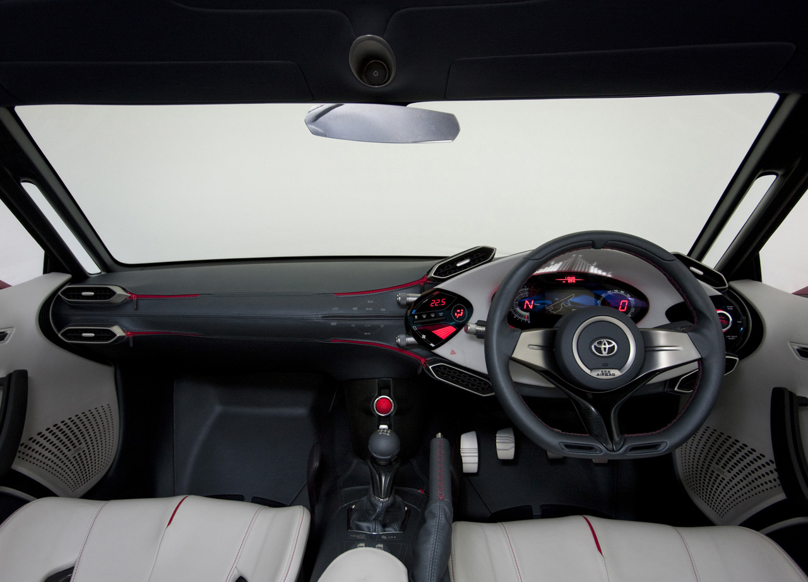
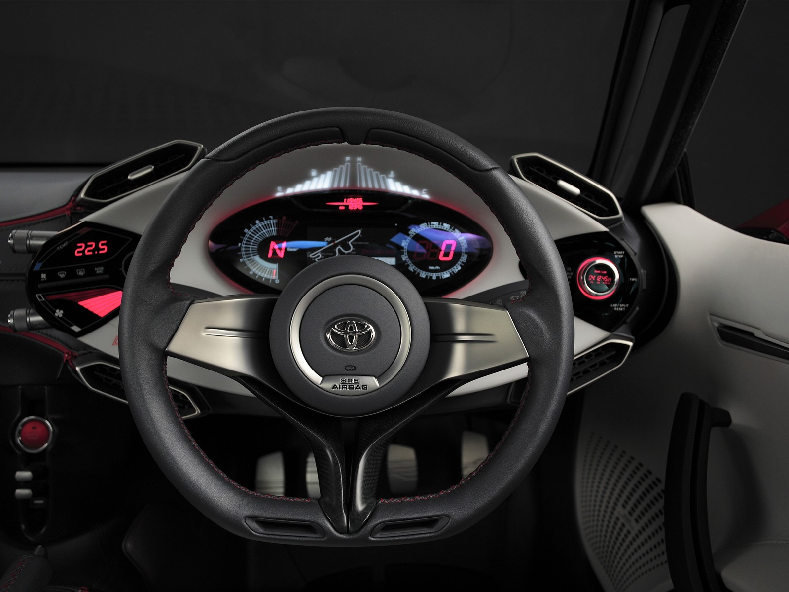
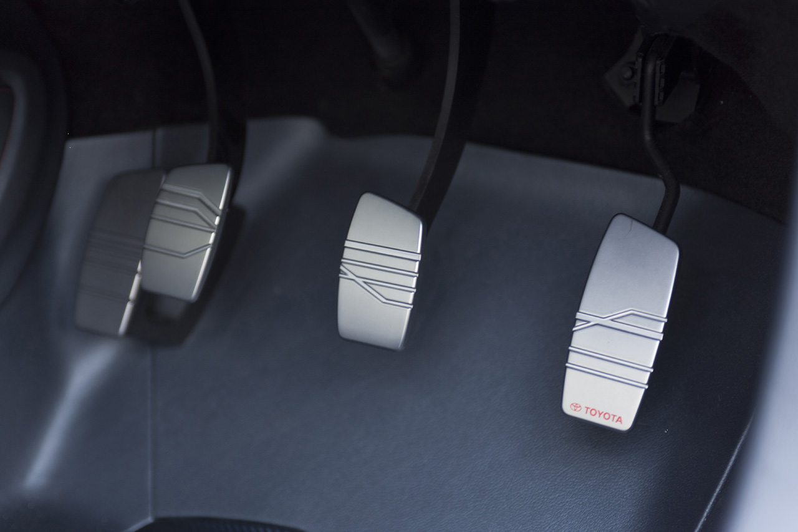

## Drift için yeni adres

Yeni otomobilin nüfus kağıdına göz atmadan önce, nasıl bir karakterle ortaya çıktığına bakmakta fayda var. Günümüzden yaklaşık yirmi yıl önce Japonya’nın dağlık ve yağmurlu yollarında başlatılan drift, bugün otomobil sporları içerisinde “D1”  adı ile yer alan bir disiplin. Diğer dillerde “sürüklenme” anlamına gelen drift sözcüğü, bizde “yanlama” olarak anılıyor. Japon işçilerin, işten çıktıktan sonra evlerine bir an önce yetişebilmek için ülkenin dağlık ve yağmurlu yollarında geliştirdikleri sürüş tekniği zaman içerisinde tüm dünyaya yayıldı. Teknik spin attırmadan otomobilin burnunun yola paralel sürülmesi amacıyla kullanılıyor. “Paralel sürüş” otomobilin üzerinde bulunduğu yol ile oluşturduğu açının, G gücünün ve hızın toplamı anlamına geliyor. Uygulamanın başarısı için olmazsa olmazlar var. Öncelikle otomobilde sınırlı kaydırmalı bir diferansiyel gerekiyor. İkincil önemli husus ise arkadan itiş. Doğru diferansiyel, içerde kalan tekerleğin boşta kalmasını önleyen en önemli unsur. Türbonun gücü ve gerekli modifikasyonların yeterli olması ise sürüş esnasındaki kontra ve kontrollerin yapılabilmesi için son derece önemli. Eğer drift pistte yapılacaksa, pist şartlarına göre ayarların yapılması gerekiyor. Eksi kamber ayarları ve lastik açıları drift için seçilen pistin şartlarına uygun olarak ayarlanırken, torkun arttırılmasını da hesaba katmak şart. Tüm bunlara rağmen drift sırasında oluşacak yıpranmalara, ayarların bozulmasına ya da aşınmalara hazırlıklı olmak lazım. Diğer taraftan aktarma organları ve vites kutusu için de aşınmalarda kurtulmayı düşünmek saflık olur. FT-86’ya bakmadan önce kısaca drift tekniklerinden bazılarını verelim: __a)Handbrake drift__ (El freni ile yanlama) __b)Brake sliding__ (Fren ile yanlama) __c)Powersliding__ (Hız ile yanlama) __d)Power over__ (Güç ile yanlama) __e)Weight transfer sliding__ (Ağırlık transferi ile yanlama) Adı geçen bu tekniklerin nasıl uygulanabileceği ise ayrı bir yazı konusu.

İlk kez yıl içerisinde Tokyo Motor Show’da brandası kaldırılan Toyota FT-86’nın yollarda görülme tarihi olarak 2011 senesi sonları telaffuz ediliyor. Büyük ihtimalle plazalarda görüldüğünde en az Celica kadar heyecanlandırıcı olacak. Toyota Celica üretiminin 2006 senesinde bittiği düşünülürse, markanın ürün yelpazesi içerisinde eksik kalan parça da tamamlanmış olacak. Otomobil şu ana kadar yapılan tüm testlerden başarıyla geçmiş. Tasarımcılar yeni otomobil için ilham aldıkları modelin Celica’dan daha eski olan AE-86 olduğunu belirtiyorlar. Nitekim AE-86 drift kabiliyetiyle kendini kanıtlamış önemli bir modeldi. 80’li yıllarda üretilen arkadan itiş kompakt otomobilin sürücüne yaşattığı keyf tamamen yanlamaya uygunluğundan kaynaklanıyordu. AE-86’nın, kullanılmadığında “ açlık” hissettiren sürüşü, otomobilin arka kısmının tutunma konusundaki yetersizliğindendi. Ancak bu dezavantaj drift için avantaja dönüşüyordu. FT-86 ise, selefinin yerini alacak yeni drift makinesi olarak görülüyor.

Otomobilin motoru Subaru’dan alınma. Subaru’nun boxer motoru 2 litre hacminde ve 4 silindirli. Önde uzunlamasına yerleştirilen motor silindir başına 4 sübaplı ve alüminyum alaşımdan imal. DOCH güç ünitesi, elektronik kontrollü ve çok noktadan enjeksiyonu sahip. Toyota mühendislerinin motor üzerindeki çalışmalarından sonra toplamda 200 HP güç elde edilmiş. Daha sonra yapılacak türbo ve  dört çeker versiyonda ise Impreza motoru kullanılması düşünülüyor. Otomobilin torku henüz açıklanmamış. Diğer ön bilgilere baktığımızda, 0-100 km/s hızlanmanın 6.0 saniye, tahmini son süratin ise 240 km/s olacağı görülüyor. Hız için hazırlanmamış otomobilin niyeti sadece driftten ibaret. 6 ileri manuel şanzımanla sunulan otomobil, Subaru’nun Amerika’daki fabrikasında imal edilirken, tasarımı ise Fransa’daki Toyota Avrupa Ofisi’nde şekillendirilmiş. Bir diğer bilgiye göre ise, markette satışa sunulduğunda büyük bir ihtimalle otomobilin model adı FT-86 olmayacak. Teknik ayrıntıların bir kısmı henüz mevcut olmasa da, (Ağırlık, Güç/Ağırlık ve Tork gibi) daha şimdiden “drift için yeni adres” budur deniliyor. Bay Toyoda’nın birkaç kompakt model içerisinden FT-86’yı beğenip seçmesi, ulaşılması beklenen hedef için önemli bir gerekçe olarak görülüyor.

Spor otomobildeki kabin tasarımı, son derece akılcı tasarlanmış. Zira sürüşün fonksiyonel olması belirgin olan ilk amaç. 2+2 oturma pozisyonuyla hazırlanan koltukların alçak yerleşim planı ve sürücü odaklı materyallerin ergonomisi, başarılı bir sürüş pozisyonu ortaya çıkarmış. Otomobille birlikte sağa/sola savrulurken, sürücünün daha kesin ve bütünlük kazanmış bir oturma pozisyonu için çalışmaların devam ettiği söyleniyor. Yani, konsept otomobilde görünen zarif, beyaz koltukların yerini ne alacak, henüz belli değil. FT-86’nın gösterge paneli ise günlük sürüşün yanı sıra, özellikle pist için tasarlanmış. Nitekim panel üzerinde pist krokisini ve tur zamanlarını bildiren digital göstergeler mevcut. Panel tasarımı eğlenceye son derece açık. Çünkü, sürücü istediği pistin krokisini navigasyonla birlikte entegre edilen sisteme yükleyebiliyor. Tur zamanlarını gösteren kronometre ile birlikte drift zamanlarını tekrar tekrar yenilemek mümkün.

Otomobildeki jant ölçüleri drift için biraz büyük ebat görünse de, mühendisler önde ve arkadaki 20 inç’lik jantların, otomobilin karakteristik sürüşüne engel olmayacağını belirtiyorlar. Jantların üzerindeki lastikler ise, önde ve arkada 225/40 R20 ebadında takılmış. Frenler için otomobilin önünde ve arkasında soğutmalı ve delikli diskler kullanılmış. Gazlı amortisörler, helezon yaylar ve viraj çubukları ise, süspansiyon kombinasyonunun yapılanmasını açıklıyor.

Fizik kurallarını veya güçler bileşkesini ihmal eden ya da bilmeyen sürücülerin, otomobilin istediği sürüşü anlamaları zor. Otomobille olağanüstü zaman geçirmek, olağanüstü çaba ve öğrenme arzusuna bağlı. Drift, otomobil eğlencesinin önsözü ise, FT-86 son söz olabilecek mi? Önümüzdeki sene sonunda anlayacağız.

